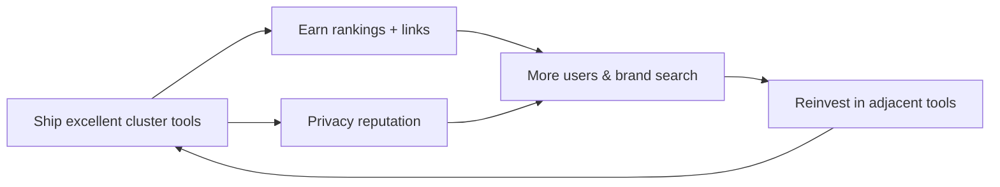
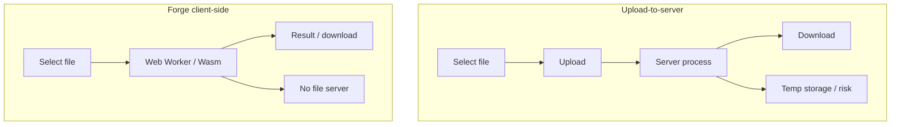
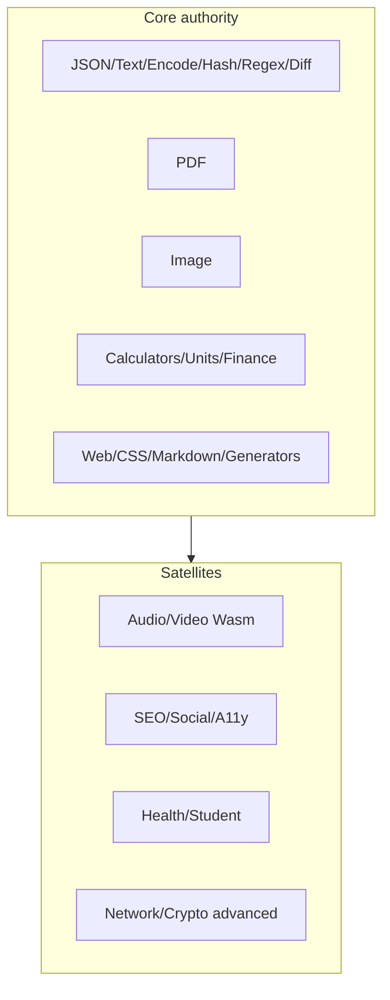
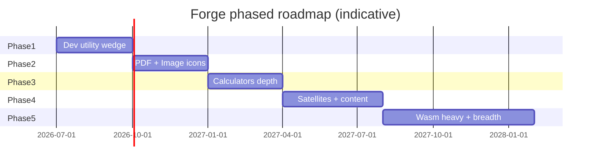
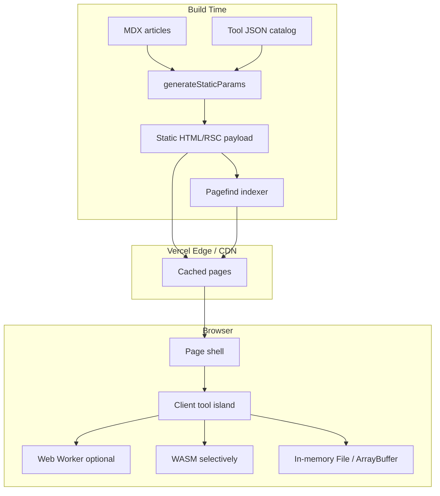
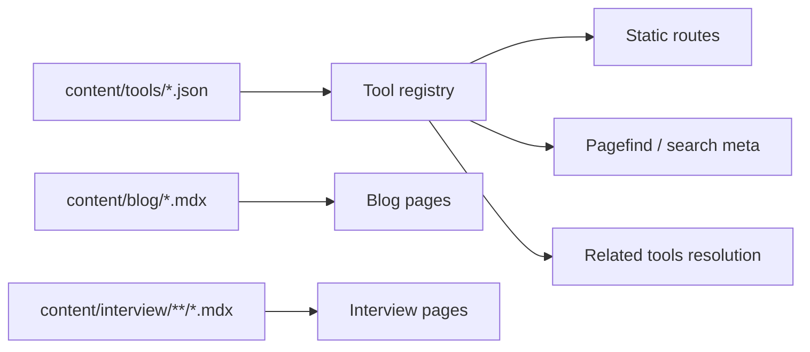
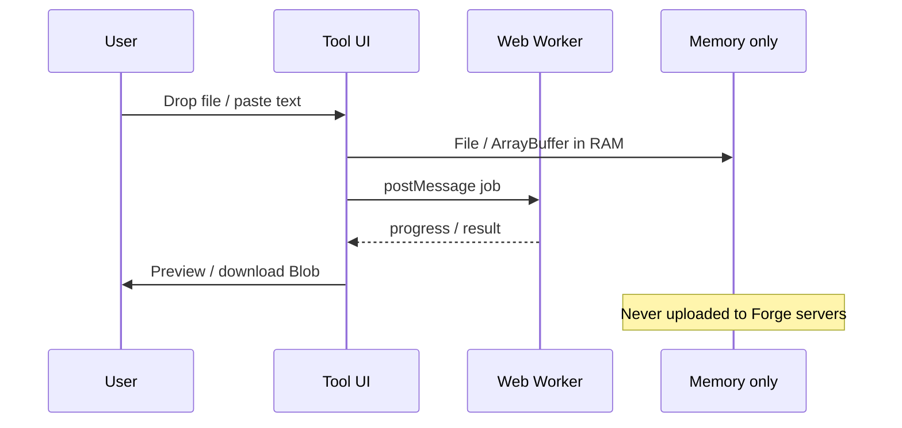
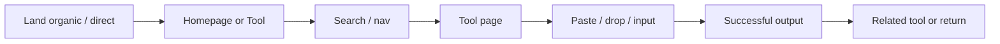

# Forge — Master Implementation Blueprint

**Tagline:** Everything you need. One website.  
**Version:** 1.0 · July 2026  
**Status:** Founder-grade operating document (master blueprint)  
**Folder:** `~/Documents/forge`  
**Audience:** Solo founder / primary developer → eventual small team

---

## Document purpose

This is the **implementation north star** for Forge: a static-first, browser-based multi-category tools platform hosted on **Vercel Free**, with **no paid APIs**, **no AI inference**, **no database for MVP**, and **no authentication for MVP**.

It exists to prevent the two failure modes that kill “everything tools” products:

1. **Category sprawl without authority** — launching dozens of thin categories before Google trusts you for any of them.
2. **Upload-to-server feature addiction** — copying TinyWow/iLovePDF’s server pipeline when your constraint set (free hosting, no paid APIs, privacy narrative) demands the opposite architecture.

Read this as a **sequencing and taste document**. Tool ideas are cheap; shipping them well is expensive. Prioritization, SEO architecture, and the privacy-first moat matter more than raw tool count.

---

## How to use this document

| If you are… | Do this |
|---|---|
| Starting today | Read §1 Vision → §5 Prioritization → build only the first 50 tools |
| Doing SEO / content | Read §6 in full before writing any blog or programmatic page |
| Expanding categories | Re-check §3 sequencing before adding a folder |
| Tempted by a shiny competitor feature | Re-read §2 “mistakes to avoid” and §1 “challenge assumptions” |
| Implementing | Use §10–§12 + §17 tool specification template |
| Planning revenue | Read §14 only after traffic exists; do not monetize prematurely |
| Making hard cuts | §15 Risks + §19 Final Recommendation are the veto power |

**Conventions**

- **Difficulty:** Easy / Medium / Hard for a solo developer shipping browser-only tools.
- **SEO / Traffic / Virality / Monetization:** H / M / L relative to other free utilities.
- **Browser-only preferred:** If it cannot ship client-side in v1, defer it.
- **No application code in this doc** except tiny illustrative snippets.

---

## Master table of contents

1. [Vision](#1-vision)
2. [Competitor Research](#2-competitor-research)
3. [Categories](#3-categories)
4. [Every Tool](#4-every-tool)
5. [Prioritization](#5-prioritization)
6. [SEO Strategy](#6-seo-strategy)
7. [URL Structure](#7-url-structure)
8. [UI/UX](#8-uiux)
9. [Branding](#9-branding)
10. [Technical Architecture](#10-technical-architecture)
11. [Folder Structure](#11-folder-structure)
12. [Component Library](#12-component-library)
13. [Analytics](#13-analytics)
14. [Monetization](#14-monetization)
15. [Risks](#15-risks)
16. [Launch Strategy](#16-launch-strategy)
17. [Tool Specification Template](#17-tool-specification-template)
18. [Future Ideas](#18-future-ideas)
19. [Final Recommendation](#19-final-recommendation)
- [Appendices](#appendices)

---

# 1. Vision

## 1.1 What Forge is

**Forge** is a static-first website where people **finish a job in the browser** — format JSON, merge PDFs, calculate EMI, convert units, beautify CSS, diff text, generate QR codes, compress images — across hundreds of categories and, eventually, **1,000+ tools**, without accounts, without uploading private files when avoidable, and without API quotas.

**Promise:** *Everything you need. One website.*  
**Constraint that makes the promise honest:** everything ships **in the browser** (or as static HTML/JS), on **Vercel Free**, with **no paid APIs**, **no AI inference**, **no DB**, **no auth**.

That constraint is the product thesis. Forge is not “TinyWow but freer.” It is **utility infrastructure that respects the user’s machine and data**.

### What Forge is not (MVP)

| Not this | Why |
|---|---|
| AI chat / LLM wrappers | Paid inference, undifferentiated, policy risk |
| Account-gated cloud processing | Needs auth + DB + servers |
| Collaborative SaaS with persistence | Needs backend state |
| Mobile native apps | Wrong distribution for SEO-led growth |
| Outbound “directory of tools” as the product | Thin affiliate farm pattern |

### Product shape

```
┌─────────────────────────────────────────────────────────────┐
│                     forge.example.com                        │
│  Home/Search → Category hubs → Tool pages → Blog/Compare    │
│         Client-side: pdf-lib · ffmpeg.wasm · Web Crypto     │
└─────────────────────────────────────────────────────────────┘
              static CDN / Vercel Free
```

---

## 1.2 Why people will use it

People want **jobs done**, not platforms:

1. **Fix this file** — merge PDFs before a meeting.  
2. **Check this string** — validate JSON from an API.  
3. **Decide a number** — EMI, BMI, tip, GST.  
4. **Make a small asset** — QR, password, palette.  
5. **Learn while doing** — regex playgrounds; cheatsheets beside tools.

Forge wins when time-to-done beats installing desktop software, fighting SmallPDF paywalls, uploading confidential files to TinyWow, or juggling five bookmarks.

| Job layer | Example | Forge response |
|---|---|---|
| Urgent micro-job | Merge 3 PDFs now | Instant tool, no signup |
| Recurring workflow | Format JSON daily | Bookmarkable, keyboard-friendly |
| Exploration | What else for images? | Category hubs + related tools |
| Trust | Does data leave my machine? | Explicit client-side badge |
| Habit | Always start at Forge | Search + brand |

---

## 1.3 Differentiation

More tools is table stakes TinyWow already won. Forge differentiates on four axes:

### A. Privacy-first client-side processing (moat narrative)

**Opinionated thesis:** Against TinyWow / iLovePDF / SmallPDF, the winning story is not “more free conversions.” It is:

> **Your files never leave your device for core tools.** Processing runs in WebAssembly / Web Workers. We cannot sell or leak what we never receive.

This removes heavy server CPUs (fits Vercel Free), reduces GDPR anxiety, creates brand contrast, and compounds as browsers gain OPFS / WebGPU / Wasm SIMD. Concede niches that truly need servers rather than fake client-side support.

### B. Developer / utility cluster first

Spray-and-pray categories rank for nothing durable. Sequence: (1) developer & text/data utilities, (2) PDF & image client-side, (3) calculators, (4) satellites only after hubs earn links.

### C. Static-first performance as product

A tool that loads fast and works with calm UI beats ad-wall incumbents. CWV is positioning, not hygiene.

### D. One domain, deep topical maps

Not twenty microsites. One brand with ruthless internal linking and real quality.

---

## 1.4 Long-term vision (3–7 years)

| Horizon | “Good” looks like |
|---|---|
| Year 0–1 | 50–150 excellent browser tools; Dev + PDF + Calculator authority; privacy brand known in niches |
| Year 1–3 | 400–800 tools; category hubs that feel definitive; light monetization |
| Year 3–5 | 1,000+ tools; possible PWA; still mostly client-side; brand = honest tools site |
| Year 5–7 | Platform gravity (embeds, offline packs); still refuse AI-wrapper farm |

> Forge becomes the default place to **transform, calculate, and inspect** digital objects — user’s machine as compute plane, website as interface and job library.

---

## 1.5 Business model

**MVP-compatible:** privacy-respecting ads *later*; sparse affiliate on comparison pages; donations; eventual ad-free “Support Forge” only after auth era.

**Never:** selling user files; server processing as the core paid product; fake “free PDF” dark patterns.

```
Trust → Habit → Traffic → Monetization
```

Do not invert this. Monetizing before trust produces the TinyWow experience users hate but tolerate — until a cleaner alternative appears.

---

## 1.6 Why Forge compounds

**Flywheel 1 — Topical authority:** excellent tools → sibling links → stronger hubs → faster ranks for new in-cluster tools.  
**Flywheel 2 — Brand search:** “forge json” / bookmarked hubs survive SERP redesigns.  
**Flywheel 3 — Browser capability curve:** Wasm improves yearly; server competitors’ marginal cost worsens; yours stays near zero.



---

## 1.7 Challenge assumptions: “Everything in one website” dilutes topical authority

Google does not owe rankings for a footer that says “1000+ tools.” Systems akin to **siteFocusScore** reward coherent domains. A site that is 5% PDF, 5% horoscope, 5% fake AI detectors, and 80% thin pages looks like a **content warehouse**.

iLovePDF works because it is *about PDF*. RapidTables is *about reference/calculators*. TinyWow ranks broadly but pays in brand distrust and fragility when quality systems tighten.

### Deliberate sequencing (non-negotiable)

| Stage | Focus | Refuse |
|---|---|---|
| **A — Core wedge** | Dev utilities + text/data + few PDF/image icons | Astrology, fake AI humanizers, random converters |
| **B — Expand core** | PDF, image, calculator templates | Unrelated lifestyle tools |
| **C — Satellites** | Color, audio Wasm, units, student calcs | Server OCR farms |
| **D — Careful breadth** | Only after hubs have engagement + backlinks | 20 empty categories for URL capture |

**Rule:** A new category must share technical substrate with an existing cluster **or** ship ≥10 real tools in 60 days. Else it is URL cosplay.

```
YEAR 0                         YEAR 1                        YEAR 2+
[Dev/Text/Data]████████████    [Dev]█████████████████████    full mesh
[PDF]███░░░░░░░░░░░░░░░░░░░    [PDF]████████████░░░░░░░░░
[Image]██░░░░░░░░░░░░░░░░░░    [Image]██████░░░░░░░░░░░░░
[Calc]████░░░░░░░░░░░░░░░░░    [Calc]████████████░░░░░░░░
[Audio]░░░░░░░░░░░░░░░░░░░░    [Audio]███░░░░░░░░░░░░░░░░
[Satellites]░░░░░░░░░░░░░░░    [Satellites]████░░░░░░░░░░
```

---

## 1.8 Opinionated thesis: privacy-first client-side is the moat

2015–2022 utilities optimized for cheap VPS and weak privacy norms. 2026+ is different: file-sensitive users, capable browsers, regulatory risk for temp files, and ad-heavy free tools that trained distrust. A clean privacy story is differentiating.

**Public claim (use consistently):**

> Files are processed locally in your browser. For tools marked “Client-side,” nothing is uploaded — because those tools have no server-side file pipeline.

If a future tool needs a server, label it. Lying once destroys the moat.



---

## 1.9 Vision summary

You are building a **library of jobs** with a **privacy-native compute model**, sequenced so Google and humans understand what Forge is *about* before it becomes “about everything.”

---

# 2. Competitor Research

Steal mechanics; do not steal soul-destroying UX.

---

## 2.1 iLovePDF

| Dimension | Assessment |
|---|---|
| **Strengths** | Category-defining PDF brand; polished UX; strong brand search; excellent related-tool IA; mobile apps |
| **Weaknesses** | Free-tier friction; upload-to-server; privacy anxiety; upsell pressure |
| **Opportunities** | Client-side PDF subset (merge, split, rotate, light compress, metadata strip) with explicit privacy |
| **UX** | Task-first pages; big dropzones; related tools below — steal this |
| **Monetization** | Freemium + desktop |
| **SEO** | Owns PDF modifiers; deep backlink profile |
| **Borrow** | Related-tools modules; verb H1s; trust badges (yours = local processing) |
| **Avoid** | Mid-task paywalls; accounts for basic jobs |

---

## 2.2 TinyWow

| Dimension | Assessment |
|---|---|
| **Strengths** | Extreme breadth; aggressive long-tail; fast shipping |
| **Weaknesses** | Trust issues; ad density; inconsistent quality; topical dilution |
| **Opportunities** | Be the trusted alternative: fewer ads early, honest client-side labels, better CWV |
| **UX** | Utilitarian/cluttered; search compensates for sprawling IA |
| **Monetization** | Ads-heavy |
| **SEO** | Wins long-tail via URL count; vulnerable to thin-page crackdowns |
| **Borrow** | Breadth as *backlog*, not day-one dump; internal linking volume |
| **Avoid** | 500 thin stubs; dark-pattern downloads; fake tool counts |

---

## 2.3 SmallPDF

| Dimension | Assessment |
|---|---|
| **Strengths** | Clean, premium aesthetic; strong brand; marketing craft |
| **Weaknesses** | Tight free limits; server processing; student price sensitivity |
| **Opportunities** | Users blocked by limits or privacy concerns |
| **UX** | Visual calm — aspire to this polish |
| **Monetization** | Subscription |
| **SEO** | Strong core PDF + content support |
| **Borrow** | Design restraint; clarity of free vs paid |
| **Avoid** | Copying limit-driven funnels before you have something to sell |

---

## 2.4 FreeConvert

| Dimension | Assessment |
|---|---|
| **Strengths** | Massive A↔B converter matrix; programmatic SEO |
| **Weaknesses** | Quality variance; server dependence; templated feel |
| **Opportunities** | Client-side converters where codecs allow (image; some audio via ffmpeg.wasm) |
| **UX** | Clear converter form; matrix aids discovery |
| **Monetization** | Premium / ads |
| **SEO** | Powerful when unique; dangerous when thin |
| **Borrow** | Conversion matrix *within clusters you can support* |
| **Avoid** | 10,000 empty X→Y pages with no engine |

---

## 2.5 RapidTables

| Dimension | Assessment |
|---|---|
| **Strengths** | Ancient domain trust; simple/fast HTML; calculator SEO; educational adjacency |
| **Weaknesses** | Dated design; limited app-like tools |
| **Opportunities** | Modern UX + same reference depth under one brand with dev tools |
| **UX** | Users forgive ugliness for speed — don’t ship ugly in 2026, keep the speed |
| **Monetization** | Ads |
| **SEO** | Textbook topical maps for units/math |
| **Borrow** | Evergreen tables; lightweight pages; clear titles |
| **Avoid** | React bloat that kills the speed advantage |

---

## 2.6 CodeBeautify

| Dimension | Assessment |
|---|---|
| **Strengths** | Huge formatter catalog; junior mindshare; “beautify X” SEO |
| **Weaknesses** | Dated UI; ads; mixed trust; some tools stale |
| **Opportunities** | Monaco/CodeMirror UX; hash permalinks (no DB); dark mode; keyboard-first |
| **UX** | Functional but noisy |
| **Monetization** | Ads |
| **SEO** | Long-tail formatters |
| **Borrow** | Catalog breadth inside data formats; “load example” buttons |
| **Avoid** | Nav that screams every format equally loud |

---

## 2.7 Regex101

| Dimension | Assessment |
|---|---|
| **Strengths** | Gold-standard playground; explanations; flavors; community; brand = category |
| **Weaknesses** | Narrow scope (feature, not platform) |
| **Opportunities** | Don’t claim to “kill” it; ship a strong v1 or wait — never ship a pathetic textbox |
| **UX** | Best-in-class teaching UI — study obsessively |
| **Monetization** | Sponsors / pro |
| **SEO** | Owns “regex tester” |
| **Borrow** | Live explain; test cases; flavor switch; URL-hash permalinks |
| **Avoid** | Fake parity |

---

## 2.8 Diffchecker

| Dimension | Assessment |
|---|---|
| **Strengths** | Clear job; clean diff UX; brand search |
| **Weaknesses** | Limited adjacency; some server flows |
| **Opportunities** | Client-side text/JSON diff inside Forge text cluster |
| **UX** | Side-by-side clarity |
| **Monetization** | Pro |
| **SEO** | “diff checker” / “compare text” |
| **Borrow** | Highlight quality bar |
| **Avoid** | Ignoring huge-file performance / word-wrap |

---

## 2.9 JSONLint

| Dimension | Assessment |
|---|---|
| **Strengths** | Canonical validator; simple; immortal single-intent rank |
| **Weaknesses** | Single-tool gravity |
| **Opportunities** | JSON hub: lint + format + YAML/CSV + tree + schema |
| **UX** | Minimal — proof one job wins |
| **Monetization** | Light ads |
| **SEO** | Owns json validator intent |
| **Borrow** | Error line pointing; instant validate |
| **Avoid** | Overcomplicating primary validate UX |

---

## 2.10 Browserling

| Dimension | Assessment |
|---|---|
| **Strengths** | Unique live-browser infra; quirky tools; historic mindshare |
| **Weaknesses** | VM infra expensive — opposite of Forge constraints |
| **Opportunities** | Ignore VMs; note playful developer brand energy |
| **Monetization** | SaaS for live browsers |
| **Borrow** | Playful builder brand |
| **Avoid** | Any remote-browser plan on Vercel Free |

---

## 2.11 DevDocs

| Dimension | Assessment |
|---|---|
| **Strengths** | Speed; keyboard UX; multi-doc search; beloved |
| **Weaknesses** | Not a tools product; docs licensing complexity |
| **Opportunities** | Short cheatsheets beside tools — not full docs mirrors |
| **Borrow** | Instant search; offline-cache mindset |
| **Avoid** | Scraping full documentation sites |

---

## 2.12 W3Schools

| Dimension | Assessment |
|---|---|
| **Strengths** | Mass traffic; beginner funnel; Tryit editors |
| **Weaknesses** | Senior reputation; ad density |
| **Opportunities** | Try-it pattern for HTML/CSS/JS; tutorials deep-linking into tools |
| **Monetization** | Ads + certs |
| **SEO** | Dominates beginner queries |
| **Borrow** | Interactive examples; simple language; tutorial → tool CTAs |
| **Avoid** | Pretending Forge is a full curriculum |

---

## 2.13 GeeksforGeeks

| Dimension | Assessment |
|---|---|
| **Strengths** | Content machine; student traffic; DSA brand |
| **Weaknesses** | Quality inconsistency; tools secondary |
| **Opportunities** | Student calculators + static DSA helpers without becoming a spam farm |
| **Borrow** | Educational adjacency |
| **Avoid** | Mass low-quality articles to “support” thin tools |

---

## 2.14 roadmap.sh

| Dimension | Assessment |
|---|---|
| **Strengths** | Brand; visual learning paths; shareability |
| **Weaknesses** | Not utilities |
| **Opportunities** | “Tools workflow roadmaps” content linking into product |
| **Borrow** | Visual IA for how tools fit a job |
| **Avoid** | Social learning networks before tools work |

---

## 2.15 Other relevant players (brief)

| Player | Takeaway |
|---|---|
| **Omni Calculator** | Editorial rigor per calculator — steal depth, not just formulas |
| **Convertio** | Matrix SEO; server-heavy — compete only where client-side is real |
| **PDF24** | Strong free PDF reputation; study privacy-leaning copy |
| **Toolur** | Long-tail URL patterns — learn structure, avoid thinness |
| **Online-Convert** | Classic converter SEO; dated UX opportunity |
| **Canva tools** | Design polish; don’t compete on full suite |
| **Photopea** | Proof serious creative apps can be browser-only — inspiration ceiling, not clone target |

---

## 2.16 Comparative summary

| Product | Wedge | Uploads? | Breadth | Trust/UX | SEO | Monetization | Forge lesson |
|---|---|---|---|---|---|---|---|
| iLovePDF | PDF | Yes | Narrow-deep | High | Very high | Freemium | Focus + polish |
| TinyWow | Everything | Yes | Extreme | Mixed/low | High long-tail | Ads | Breadth without trust fails brand |
| SmallPDF | PDF | Yes | Narrow-deep | High | High | Sub | Design calm |
| FreeConvert | Converters | Yes | Extreme | Medium | High prog. | Premium/ads | Matrix only if real |
| RapidTables | Calc/ref | Mostly no | Medium | Medium | High evergreen | Ads | Speed + tables |
| CodeBeautify | Formatters | Mixed | High | Medium | High | Ads | Catalog in cluster |
| Regex101 | Regex | Light | Single | Very high | High intent | Pro/sponsor | Depth > width |
| Diffchecker | Diff | Mixed | Narrow | High | High | Pro | One-job excellence |
| JSONLint | JSON | No/light | Single | High | High | Ads | Simplicity |
| Browserling | Live browsers | Infra | Tools side | Mixed | Medium | SaaS | Don’t copy infra |
| DevDocs | Docs | No | Docs set | Very high | Brand | Donations | Keyboard UX |
| W3Schools | Learn web | No | High | Mixed | Extreme | Ads/courses | Try-it pattern |
| GFG | Learn CS | No | Extreme | Mixed | Extreme | Ads/courses | Avoid content spam |
| roadmap.sh | Paths | No | Roadmaps | High | Brand | Evolving | Workflow narrative |
| Omni Calculator | Calculators | No | Deep calc | High | High | Ads | Editorial rigor |
| Photopea | Editor | No | Deep editor | High | Brand | Ads/pro | Wasm ambition ceiling |

---

## 2.17 Competitive synthesis

1. Do not out-TinyWow TinyWow on day one — out-trust and out-focus them.  
2. Do not out-iLovePDF on every PDF feature — out-privacy them on a credible client-side subset.  
3. Steal dropzones, related tools, try-it editors, calculator rigor, regex101 teaching *patterns*.  
4. Avoid thin programmatic matrices, ad walls before value, and category dumps.

---

# 3. Categories

Sequencing labels: **Core** · **Satellite** · **Avoid-for-now**

## 3.1 Category catalog (40+)

| # | Category | Description | SEO rationale | Sequencing |
|---|---|---|---|---|
| 1 | JSON & Data Formats | Format/validate/convert JSON/YAML/XML/CSV/TOML | Extreme dev intent | **Core** |
| 2 | Text & String Utilities | Case, slugify, count, sort, unique, escape | High volume, easy wins | **Core** |
| 3 | Encode / Decode | Base64, URL, HTML entities, Hex, Unicode | Evergreen tool queries | **Core** |
| 4 | Hash & Checksum | MD5, SHA, HMAC, CRC (Web Crypto) | Integrity + security-curious | **Core** |
| 5 | Regex | Tester, explainer, cheatsheet, replace | High engagement; brand-able | **Core** |
| 6 | Diff & Compare | Text/JSON/CSV diff | Strong problem-solution queries | **Core** |
| 7 | JWT & Tokens | Decode/inspect (no server verify) | DevOps/dev intent | **Core** |
| 8 | UUID & ID Generators | UUID, NanoID, ULID | Simple, shareable | **Core** |
| 9 | Code Formatters | JS/HTML/CSS/SQL beautify/minify | CodeBeautify-class SEO | **Core** |
| 10 | Markdown | Preview, MD↔HTML, TOC | Dev/content creators | **Core** |
| 11 | PDF Tools | Merge, split, rotate, metadata, compress-light | Highest commercial intent | **Core** (phased) |
| 12 | Image Tools | Resize, crop, compress, convert, watermark | Huge traffic; canvas/Wasm | **Core** (phased) |
| 13 | Color Tools | Picker, convert, contrast, palettes | Design + a11y | **Satellite→adjacent** |
| 14 | QR & Barcode | Generate/read QR, Code128 | Viral + business micro-jobs | **Core-adjacent** |
| 15 | Password & Secrets | Generator, strength, passphrase | High traffic; easy | **Core** |
| 16 | Unit Converters | Length, mass, temp, data, speed… | RapidTables programmatic SEO | **Core** |
| 17 | Finance Calculators | EMI, SIP, GST, compound, tip | Evergreen money intent | **Core** |
| 18 | Math Calculators | Percentage, GCD, stats | Student + general | **Core** |
| 19 | Date & Time | Timezone, duration, cron, age | Persistent queries | **Core** |
| 20 | Web / HTTP Utilities | Headers, UA parse, status codes | Dev reference hybrid | **Core** |
| 21 | CSS / HTML Tools | Flexbox/grid playgrounds, generators | W3Schools-adjacent | **Core-adjacent** |
| 22 | SEO Utilities | Meta preview, robots, schema builders | Marketer traffic; don’t spam | **Satellite** |
| 23 | Social / Content Cards | OG preview, character counters | Creator traffic | **Satellite** |
| 24 | Audio Tools | Trim/convert via ffmpeg.wasm | Feasible; heavy bundles | **Satellite** |
| 25 | Video Tools | GIF, trim, thumbnail — Wasm | Hard; selective | **Satellite / later** |
| 26 | Document (non-PDF) | Limited DOCX→text, TXT | Partial client-side | **Satellite** |
| 27 | Spreadsheets | CSV↔JSON, column ops | Strong data workflows | **Core-adjacent** |
| 28 | Developer Generators | .gitignore, license, robots stubs | Easy SEO + usefulness | **Core** |
| 29 | Networking References | Subnet, CIDR, DNS explainers | Sysadmin intent | **Satellite** |
| 30 | Encryption Utilities | AES/RSA local (Web Crypto) | Power users; warn clearly | **Satellite** |
| 31 | Image Design Micro-tools | Placeholders, rounded corners | Canva-lite — keep tiny | **Satellite** |
| 32 | Accessibility Tools | Contrast, alt length, ARIA cheats | Ethical + SEO | **Satellite** |
| 33 | Student Calculators | GPA, attendance, grade needed | Regional SEO | **Satellite** |
| 34 | Health Calculators | BMI, BMR, macros | Traffic + YMYL caution | **Satellite (careful)** |
| 35 | Science Converters | Moles, pH, Ohm’s law | Needs editorial depth | **Satellite** |
| 36 | Writing Aids (non-AI) | Readability, density, citations | Avoid “AI writer” | **Satellite** |
| 37 | Randomizers | Dice, picker, teams | Virality / classrooms | **Satellite** |
| 38 | Maps / Geo (static) | Haversine, GeoJSON, DMS | No paid Maps API | **Satellite** |
| 39 | Binary / Bitwise | Bit calc, chmod | Dev niche | **Core-adjacent** |
| 40 | Cron & Scheduling | Cron generator/explainer | DevOps staple | **Core** |
| 41 | Lorem & Placeholder | Lorem, fake names, fake JSON | Dev scaffolding | **Core** |
| 42 | File Naming Patterns | Pattern rename lists | Light OS bridge | **Satellite** |
| 43 | Certificates / SSL | PEM/CSR decode | DevOps | **Satellite** |
| 44 | Ecommerce Micro-calcs | Discount, margin, ROAS | SMB traffic | **Satellite** |
| 45 | Tax / Region Calculators | GST (IN), sales tax templates | Local SEO if accurate | **Satellite** |
| 46 | Game Dev Helpers | Palettes, sprite math | Niche | **Late satellite** |
| 47 | 3D / CAD Converters | Complex formats | Servers / IP | **Avoid-for-now** |
| 48 | Full Online IDE / Compiler | Remote execution | Backend required | **Avoid-for-now** |
| 49 | AI Detectors / Humanizers | Fad + sludge | Authority poison | **Avoid-for-now** |
| 50 | Astrology / Fun Quizzes | Traffic bait | Destroys site focus | **Avoid-for-now** |
| 51 | Streaming / DRM Tools | Legal risk | — | **Avoid-for-now** |
| 52 | Account Cloud Editors | Contradicts MVP | — | **Avoid-for-now** |



**Launch narrative:** developer utilities + essential converters/calculators → privacy-first PDF & image → calculator library → satellites. Never early: astrology, AI spam, remote compilers, fake converter megamatrices.

---


# 4. Every Tool

The inventory below is the **living backlog**, not a ship commitment. Forge succeeds by sequencing (§5), not by publishing 700 stubs.

**Rating legend**

| Field | Scale | Meaning |
|---|---|---|
| Difficulty | Easy / Medium / Hard | Solo-dev, browser-only on the Forge stack |
| SEO | H / M / L | Relative keyword / intent attractiveness |
| Traffic | H / M / L | Relative search volume / demand |
| Virality | H / M / L | Share / screenshot / “wow” potential |
| Monetization | H / M / L | Ads / affiliate / premium fit |

**Rules for using this list**

1. Never open a new category with fewer than **8–12 high-quality tools** plus a real hub page.
2. Prefer **Easy + High SEO** tools in Phase 1 even if they feel “boring.”
3. Mark Hard Wasm tools (full PDF suites, ffmpeg) as Phase 5 unless they are the privacy beachhead (PDF merge/split).
4. Delete or `noindex` tools that never earn impressions after 6–9 months.

## 4.1 Complete tool inventory (rated backlog)

> Ratings: **H** = High, **M** = Medium, **L** = Low. Difficulty: Easy / Medium / Hard.

> Difficulty reflects a solo-developer, browser-only implementation on the Forge stack.

> This catalog is a living backlog, not a commitment to ship everything.


## JSON & Data Formats

| Tool | Difficulty | SEO | Traffic | Virality | Monetization |
|---|---|---|---|---|---|
| JSON Formatter / Beautifier | Easy | H | H | M | H |
| JSON Minifier | Easy | H | H | L | M |
| JSON Validator | Easy | H | H | L | M |
| JSON to CSV | Easy | H | H | M | H |
| CSV to JSON | Easy | H | H | M | H |
| JSON to XML | Easy | H | M | L | M |
| XML to JSON | Easy | H | M | L | M |
| JSON to YAML | Easy | H | M | L | M |
| YAML to JSON | Easy | H | M | L | M |
| JSON to TOML | Easy | M | L | L | L |
| TOML to JSON | Easy | M | L | L | L |
| JSON Path Tester | Medium | M | M | M | M |
| JSON Diff | Medium | H | M | M | M |
| JSON Schema Validator | Hard | M | M | L | M |
| JSON Flatten / Unflatten | Medium | M | M | L | L |
| JSON Escape / Unescape | Easy | M | M | L | L |
| JSON to TypeScript Interface | Medium | H | M | H | M |
| JSON to Go Struct | Medium | M | M | M | L |
| JSON to Python Dataclass | Medium | M | M | M | L |
| JSON to Markdown Table | Easy | M | M | M | L |
| JSON Pretty Print with Tree View | Medium | M | M | M | M |
| NDJSON Viewer | Easy | L | L | L | L |
| JSON Sort Keys | Easy | L | L | L | L |
| JSON Merge | Medium | M | L | L | L |
| JSON Filter by Key | Medium | L | L | L | L |

_25 tools in this category._


## XML & YAML & Config

| Tool | Difficulty | SEO | Traffic | Virality | Monetization |
|---|---|---|---|---|---|
| XML Formatter | Easy | H | M | L | M |
| XML Minifier | Easy | M | L | L | L |
| XML Validator | Medium | M | M | L | M |
| XML to CSV | Medium | M | M | L | M |
| YAML Formatter | Easy | H | M | L | M |
| YAML Validator | Medium | M | M | L | M |
| YAML Diff | Medium | M | L | L | L |
| TOML Formatter | Easy | M | L | L | L |
| INI / ENV Parser | Easy | M | M | L | L |
| .env Diff | Easy | M | L | M | L |
| Kubernetes YAML Explainer (static) | Hard | M | M | M | L |
| Docker Compose Validator (client) | Hard | M | M | L | L |
| Properties File Converter | Easy | L | L | L | L |

_13 tools in this category._


## CSV & Spreadsheets

| Tool | Difficulty | SEO | Traffic | Virality | Monetization |
|---|---|---|---|---|---|
| CSV Viewer / Table | Easy | H | H | M | H |
| CSV to Excel (XLSX) client-side | Medium | H | H | M | H |
| Excel to CSV | Medium | H | H | M | H |
| CSV to JSON (advanced options) | Easy | H | H | M | H |
| CSV Cleaner (trim, dedupe) | Medium | M | M | M | M |
| CSV Column Splitter | Easy | M | M | L | M |
| CSV Merger | Medium | M | M | L | M |
| CSV Diff | Medium | M | M | M | M |
| TSV Converter | Easy | M | L | L | L |
| Delimiter Detector | Easy | L | L | L | L |
| CSV to SQL INSERT | Medium | H | M | M | M |
| CSV to Markdown | Easy | M | M | M | L |
| CSV to HTML Table | Easy | M | M | L | L |
| Pivot Table Generator (simple) | Hard | M | M | M | M |
| Column Type Inferencer | Medium | L | L | L | L |

_15 tools in this category._


## Encoding & Hashing

| Tool | Difficulty | SEO | Traffic | Virality | Monetization |
|---|---|---|---|---|---|
| Base64 Encode / Decode | Easy | H | H | L | H |
| Base64 URL-safe | Easy | M | M | L | M |
| URL Encode / Decode | Easy | H | H | L | H |
| HTML Entity Encode / Decode | Easy | H | M | L | M |
| Unicode Escape / Unescape | Easy | M | M | L | L |
| Hex Encode / Decode | Easy | M | M | L | L |
| Binary Encode / Decode | Easy | M | M | L | L |
| MD5 Hash Generator | Easy | H | H | L | H |
| SHA-1 Hash | Easy | H | M | L | M |
| SHA-256 Hash | Easy | H | H | L | H |
| SHA-512 Hash | Easy | M | M | L | M |
| HMAC Generator | Medium | M | M | L | M |
| CRC32 Calculator | Easy | M | L | L | L |
| File Checksum (browser) | Medium | H | M | M | M |
| Bcrypt Hash (wasm) | Hard | M | M | L | M |
| Password Strength Meter | Easy | H | H | M | H |
| Random Password Generator | Easy | H | H | H | H |
| Passphrase Generator | Easy | M | M | M | M |
| UUID v4 Generator | Easy | H | H | M | H |
| UUID v1 / v7 Generator | Medium | M | M | L | M |
| ULID Generator | Easy | M | M | L | L |
| NanoID Generator | Easy | M | M | L | L |
| CUID Generator | Easy | L | L | L | L |
| JWT Decoder | Easy | H | H | M | H |
| JWT Encoder (unsigned/demo) | Medium | M | M | L | M |
| JWT Debugger with Claims Explain | Medium | H | M | M | M |

_26 tools in this category._


## Regex & Text

| Tool | Difficulty | SEO | Traffic | Virality | Monetization |
|---|---|---|---|---|---|
| Regex Tester | Medium | H | H | H | H |
| Regex Explainer (static rules) | Hard | H | M | H | M |
| Regex Cheatsheet Interactive | Easy | H | H | H | M |
| Regex to Automata Visualizer | Hard | M | M | H | L |
| Find & Replace Batch | Easy | M | M | L | M |
| Grep Online (multiline) | Medium | M | M | M | M |
| Text Diff (side-by-side) | Medium | H | H | M | H |
| Text Diff (inline) | Medium | H | H | M | H |
| Word Diff | Medium | M | M | L | M |
| Patch / Unified Diff Viewer | Medium | M | M | L | L |
| String Similarity (Levenshtein) | Medium | M | M | L | L |
| Fuzzy Match Demo | Medium | L | L | M | L |

_12 tools in this category._


## Text Tools

| Tool | Difficulty | SEO | Traffic | Virality | Monetization |
|---|---|---|---|---|---|
| Word Counter | Easy | H | H | L | H |
| Character Counter | Easy | H | H | L | H |
| Line Counter | Easy | M | M | L | M |
| Reading Time Estimator | Easy | M | M | M | M |
| Case Converter (upper/lower/title/camel/snake/kebab) | Easy | H | H | M | H |
| Slug Generator | Easy | H | M | L | M |
| Lorem Ipsum Generator | Easy | H | H | M | H |
| Dummy Text Generator (paragraphs) | Easy | M | M | L | M |
| Remove Duplicate Lines | Easy | H | M | L | M |
| Sort Lines | Easy | H | M | L | M |
| Reverse Text | Easy | M | M | L | L |
| Remove Extra Spaces | Easy | M | M | L | L |
| Add Line Numbers | Easy | M | L | L | L |
| Text to Binary | Easy | M | M | L | L |
| Binary to Text | Easy | M | M | L | L |
| Text to Morse | Easy | M | M | M | L |
| Morse to Text | Easy | M | M | M | L |
| Palindrome Checker | Easy | L | L | L | L |
| Anagram Finder | Medium | M | M | M | L |
| Word Frequency Counter | Easy | M | M | L | M |
| Keyword Density Checker | Easy | H | M | L | H |
| Text Compare (3-way) | Hard | M | L | L | L |
| Invisible Character Remover | Easy | M | M | L | M |
| Zero-Width Character Detector | Easy | M | M | M | M |
| Unicode Normalizer (NFC/NFD) | Medium | M | L | L | L |
| String Rot13 | Easy | L | L | L | L |
| Caesar Cipher | Easy | M | M | M | L |
| Vigenère Cipher (educational) | Medium | M | L | M | L |
| Markdown Preview | Easy | H | H | M | H |
| Markdown to HTML | Easy | H | H | M | H |
| HTML to Markdown | Medium | H | M | M | M |
| Markdown Table Generator | Easy | H | M | H | M |
| Markdown TOC Generator | Easy | M | M | M | L |
| CommonMark / GFM Diff | Medium | L | L | L | L |

_34 tools in this category._


## Markdown & Docs

| Tool | Difficulty | SEO | Traffic | Virality | Monetization |
|---|---|---|---|---|---|
| MDX Preview (limited) | Hard | M | L | L | L |
| Readme Badges Generator | Easy | H | M | H | M |
| Changelog Formatter | Easy | M | L | L | L |
| ASCII Doc Lite Preview | Medium | L | L | L | L |
| Mermaid Live Editor (embed) | Hard | H | M | H | M |
| PlantUML Client Preview (wasm if avail) | Hard | M | L | M | L |
| Documentation Search Demo | Medium | L | L | L | L |

_7 tools in this category._


## Code Formatters

| Tool | Difficulty | SEO | Traffic | Virality | Monetization |
|---|---|---|---|---|---|
| JavaScript Beautifier | Easy | H | H | L | H |
| JavaScript Minifier | Easy | H | H | L | H |
| TypeScript Formatter | Medium | M | M | L | M |
| HTML Formatter | Easy | H | H | L | H |
| HTML Minifier | Easy | H | M | L | M |
| CSS Formatter | Easy | H | H | L | H |
| CSS Minifier | Easy | H | H | L | H |
| SQL Formatter | Easy | H | H | M | H |
| SQL Minifier | Easy | M | M | L | M |
| Python Formatter (black-like rules subset) | Hard | M | M | L | M |
| Go Formatter (gofmt-like subset) | Hard | M | L | L | L |
| PHP Beautifier | Medium | M | M | L | M |
| Java Beautifier | Medium | M | M | L | M |
| C/C++ Formatter (clang-format subset) | Hard | M | L | L | L |
| GraphQL Formatter | Easy | M | M | L | M |
| Protobuf Formatter | Hard | L | L | L | L |
| SCSS / LESS Formatter | Medium | M | M | L | M |
| SVG Optimizer (SVGO-like) | Hard | H | M | M | H |

_18 tools in this category._


## CSS & Design Dev

| Tool | Difficulty | SEO | Traffic | Virality | Monetization |
|---|---|---|---|---|---|
| CSS Gradient Generator | Easy | H | H | H | H |
| CSS Box Shadow Generator | Easy | H | H | H | H |
| CSS Border Radius Generator | Easy | H | M | M | M |
| CSS Flexbox Playground | Medium | H | H | H | H |
| CSS Grid Playground | Medium | H | H | H | H |
| CSS Clamp Calculator | Easy | M | M | M | M |
| CSS Filter Generator | Easy | M | M | M | M |
| CSS Animation Keyframes Builder | Medium | H | M | H | M |
| CSS Specificity Calculator | Easy | M | M | M | L |
| CSS to Tailwind Converter (heuristic) | Hard | H | M | H | M |
| Tailwind Color Palette Viewer | Easy | M | M | M | L |
| Glassmorphism Generator | Easy | H | M | H | M |
| Neumorphism Generator | Easy | M | M | M | L |
| Clip-path Generator | Medium | H | M | H | M |
| CSS Triangle Generator | Easy | M | L | L | L |
| Scrollbar Styler | Easy | M | M | M | L |
| CSS Reset Diff Viewer | Easy | L | L | L | L |
| Responsive Font Scale Calculator | Easy | M | M | M | M |

_18 tools in this category._


## Colors

| Tool | Difficulty | SEO | Traffic | Virality | Monetization |
|---|---|---|---|---|---|
| Color Picker | Easy | H | H | M | H |
| HEX to RGB | Easy | H | H | L | H |
| RGB to HEX | Easy | H | H | L | H |
| HEX to HSL | Easy | H | M | L | M |
| Color Contrast Checker (WCAG) | Easy | H | H | M | H |
| Accessible Palette Generator | Medium | H | M | H | H |
| Color Blindness Simulator | Medium | H | M | H | M |
| Palette from Image | Medium | H | H | H | H |
| Complementary Color Finder | Easy | H | M | M | M |
| Triadic / Analogous Generator | Easy | M | M | M | M |
| Gradient from Two Colors | Easy | M | M | M | M |
| Tint / Shade Generator | Easy | M | M | M | M |
| Name That Color | Easy | M | M | M | L |
| OKLCH Converter | Medium | M | M | M | L |
| Color Mixer | Easy | L | L | L | L |
| Random Palette Generator | Easy | M | M | H | M |

_16 tools in this category._


## Image Tools

| Tool | Difficulty | SEO | Traffic | Virality | Monetization |
|---|---|---|---|---|---|
| Image Resizer | Medium | H | H | M | H |
| Image Compressor | Medium | H | H | M | H |
| Image Cropper | Medium | H | H | M | H |
| Image to Base64 | Easy | H | H | L | H |
| Base64 to Image | Easy | H | M | L | M |
| PNG to JPG | Easy | H | H | L | H |
| JPG to PNG | Easy | H | H | L | H |
| WebP Converter | Medium | H | H | M | H |
| AVIF Converter (if browser supports) | Medium | H | M | M | H |
| ICO Converter | Medium | M | M | L | M |
| Image Metadata Viewer (EXIF) | Medium | H | M | M | H |
| EXIF Remover | Medium | H | M | M | H |
| Image Rotate / Flip | Easy | M | M | L | M |
| Add Watermark | Medium | H | M | M | H |
| Blur Face Region (manual) | Medium | M | M | M | M |
| Image Color Adjust (brightness/contrast) | Medium | M | M | L | M |
| Favicon Generator from Image | Medium | H | M | M | H |
| App Icon Pack Generator (sizes) | Medium | H | M | M | H |
| Sprite Sheet Slicer | Hard | M | L | L | L |
| Image Diff (pixel) | Hard | M | M | M | L |
| Dominant Color Extractor | Medium | M | M | M | M |
| SVG to PNG | Medium | H | M | M | H |
| PNG to SVG (trace approx) | Hard | H | M | M | H |
| Image to ASCII Art | Medium | M | M | H | L |
| Placeholder Image Generator | Easy | H | M | M | M |
| Social OG Image Size Crops | Easy | M | M | M | M |

_26 tools in this category._


## PDF Tools

| Tool | Difficulty | SEO | Traffic | Virality | Monetization |
|---|---|---|---|---|---|
| PDF Merge | Hard | H | H | M | H |
| PDF Split | Hard | H | H | M | H |
| PDF Compress (basic) | Hard | H | H | M | H |
| PDF Rotate | Medium | H | M | L | H |
| PDF Delete Pages | Hard | H | M | L | H |
| PDF Extract Pages | Hard | H | M | L | H |
| PDF Reorder Pages | Hard | H | M | L | H |
| Images to PDF | Medium | H | H | M | H |
| PDF to Images | Hard | H | H | M | H |
| PDF Page Number Add | Hard | M | M | L | M |
| PDF Watermark | Hard | H | M | L | H |
| PDF Metadata Viewer | Medium | M | M | L | M |
| PDF Metadata Editor | Hard | M | M | L | M |
| PDF Unlock (password known, client) | Hard | H | M | L | H |
| PDF Protect (encrypt) | Hard | H | M | L | H |
| PDF Text Extract | Hard | H | M | L | H |
| PDF Form Filler (basic AcroForm) | Hard | M | M | L | M |
| PDF Signature Place (draw) | Hard | H | M | M | H |
| PDF Flatten Annotations (limited) | Hard | M | L | L | L |
| PDF Compare (page images) | Hard | M | M | M | M |

_20 tools in this category._


## Converters (Units & Misc)

| Tool | Difficulty | SEO | Traffic | Virality | Monetization |
|---|---|---|---|---|---|
| Unit Converter (length) | Easy | H | H | L | H |
| Unit Converter (weight) | Easy | H | H | L | H |
| Unit Converter (temperature) | Easy | H | H | L | H |
| Unit Converter (volume) | Easy | H | M | L | H |
| Unit Converter (speed) | Easy | H | M | L | M |
| Unit Converter (area) | Easy | H | M | L | M |
| Unit Converter (data storage) | Easy | H | H | L | H |
| Unit Converter (pressure) | Easy | M | M | L | M |
| Unit Converter (energy) | Easy | M | M | L | M |
| Unit Converter (power) | Easy | M | M | L | M |
| Angle Converter | Easy | M | M | L | L |
| Number Base Converter (2/8/10/16) | Easy | H | H | L | H |
| Roman Numerals Converter | Easy | H | M | M | M |
| Scientific Notation Converter | Easy | M | M | L | L |
| Timezone Converter | Medium | H | H | M | H |
| Unix Timestamp Converter | Easy | H | H | M | H |
| Epoch to Date | Easy | H | H | L | H |
| Date to Epoch | Easy | H | H | L | H |
| ISO 8601 Parser | Easy | M | M | L | M |
| Cron Expression Explainer | Medium | H | H | H | H |
| Cron Generator (UI) | Medium | H | H | H | H |
| Cron Next Runs Calculator | Medium | H | M | M | M |

_22 tools in this category._


## Date & Time

| Tool | Difficulty | SEO | Traffic | Virality | Monetization |
|---|---|---|---|---|---|
| World Clock | Easy | H | M | L | M |
| Time Duration Calculator | Easy | H | M | L | M |
| Age Calculator | Easy | H | H | L | H |
| Date Difference Calculator | Easy | H | H | L | H |
| Add / Subtract Dates | Easy | H | M | L | M |
| Business Days Calculator | Medium | H | M | L | H |
| Week Number Calculator | Easy | M | M | L | M |
| Calendar Generator (print) | Medium | M | M | M | M |
| Meeting Time Planner (multi-TZ) | Medium | H | M | H | H |
| Countdown Timer Builder | Easy | M | M | M | M |
| Stopwatch | Easy | L | L | L | L |
| Pomodoro Timer | Easy | H | M | M | M |
| Leap Year Checker | Easy | L | L | L | L |
| Day of Week Finder | Easy | M | M | L | L |

_14 tools in this category._


## Math & Calculators

| Tool | Difficulty | SEO | Traffic | Virality | Monetization |
|---|---|---|---|---|---|
| Scientific Calculator | Medium | H | H | L | H |
| Percentage Calculator | Easy | H | H | L | H |
| Percentage Change | Easy | H | H | L | H |
| Fraction Calculator | Medium | H | M | L | M |
| Ratio Calculator | Easy | M | M | L | M |
| Average / Mean Calculator | Easy | H | M | L | M |
| Median / Mode Calculator | Easy | M | M | L | M |
| Standard Deviation | Easy | H | M | L | M |
| Permutation / Combination | Easy | H | M | L | M |
| Factorial Calculator | Easy | M | M | L | L |
| GCD / LCM Calculator | Easy | H | M | L | M |
| Prime Checker | Easy | M | M | L | L |
| Prime Factors | Easy | M | M | L | L |
| Quadratic Equation Solver | Easy | H | M | L | M |
| Linear Equation Solver (2 var) | Medium | M | M | L | M |
| Matrix Calculator (2x2/3x3) | Medium | H | M | L | M |
| Determinant Calculator | Medium | M | M | L | L |
| Vector Calculator | Medium | M | M | L | L |
| Logarithm Calculator | Easy | M | M | L | L |
| Exponent Calculator | Easy | M | M | L | L |
| Square Root / Nth Root | Easy | M | M | L | L |
| Trigonometry Calculator | Easy | H | M | L | M |
| Degree / Radian Converter | Easy | H | M | L | M |
| Random Number Generator | Easy | H | H | L | H |
| Dice Roller | Easy | M | M | M | L |
| Number to Words | Easy | H | M | M | M |
| Words to Number | Medium | M | M | L | L |
| Big Number Arithmetic | Medium | L | L | L | L |
| Graphing Calculator (simple) | Hard | H | M | H | H |
| Equation Plotter | Hard | H | M | H | M |

_30 tools in this category._


## Finance Calculators

| Tool | Difficulty | SEO | Traffic | Virality | Monetization |
|---|---|---|---|---|---|
| EMI / Loan Calculator | Easy | H | H | L | H |
| Mortgage Calculator | Easy | H | H | L | H |
| Compound Interest | Easy | H | H | L | H |
| Simple Interest | Easy | H | M | L | M |
| SIP Calculator | Easy | H | H | L | H |
| Lumpsum Investment | Easy | H | M | L | H |
| FD / RD Calculator | Easy | H | M | L | H |
| Retirement Calculator | Medium | H | M | L | H |
| Inflation Calculator | Easy | H | M | L | H |
| GST / Sales Tax Calculator | Easy | H | H | L | H |
| VAT Calculator | Easy | H | M | L | H |
| Income Tax Estimator (static slabs demo) | Medium | H | H | L | H |
| Salary Take-Home Estimator | Medium | H | H | L | H |
| Tip Calculator | Easy | H | M | L | M |
| Discount Calculator | Easy | H | M | L | M |
| Profit Margin Calculator | Easy | H | M | L | H |
| Break-even Calculator | Easy | M | M | L | M |
| ROI Calculator | Easy | H | M | L | H |
| CAGR Calculator | Easy | H | M | L | H |
| Currency Converter (static rates snapshot) | Medium | H | H | L | H |
| Currency Exchange Table (snapshot) | Easy | H | M | L | H |
| Amortization Schedule | Medium | H | M | L | H |
| Credit Card Payoff Calculator | Medium | H | M | L | H |
| Budget Splitter (50/30/20) | Easy | M | M | M | M |
| Hourly to Salary Converter | Easy | H | M | L | M |
| Freelance Rate Calculator | Easy | M | M | M | H |

_26 tools in this category._


## Health & Everyday

| Tool | Difficulty | SEO | Traffic | Virality | Monetization |
|---|---|---|---|---|---|
| BMI Calculator | Easy | H | H | L | H |
| BMR Calculator | Easy | H | M | L | H |
| Calorie Needs (TDEE) | Easy | H | M | L | H |
| Ideal Weight Calculator | Easy | H | M | L | M |
| Body Fat Estimator (formula) | Easy | M | M | L | M |
| Pregnancy Due Date | Easy | H | H | L | H |
| Ovulation Calculator | Easy | H | M | L | H |
| Sleep Cycle Calculator | Easy | H | M | M | M |
| Pace Calculator (running) | Easy | H | M | L | M |
| Heart Rate Zone Calculator | Easy | M | M | L | M |
| Water Intake Estimator | Easy | M | M | L | L |
| Macro Split Calculator | Easy | M | M | L | M |

_12 tools in this category._


## Networking & HTTP

| Tool | Difficulty | SEO | Traffic | Virality | Monetization |
|---|---|---|---|---|---|
| HTTP Status Code Reference | Easy | H | H | M | M |
| HTTP Header Parser | Easy | M | M | L | M |
| User-Agent Parser | Easy | H | M | L | M |
| MIME Type Lookup | Easy | M | M | L | L |
| IP Address Explainer (v4/v6 educational) | Medium | H | M | L | M |
| CIDR Calculator | Medium | H | M | L | H |
| Subnet Calculator | Medium | H | M | L | H |
| Port Number Reference | Easy | H | M | L | M |
| DNS Record Types Cheatsheet | Easy | H | M | L | M |
| URL Parser / Builder | Easy | H | M | L | M |
| Query String Builder | Easy | M | M | L | M |
| cURL to Fetch Converter | Medium | H | M | H | M |
| Fetch to cURL Converter | Medium | H | M | H | M |
| HTTP Request Builder (client-only mock) | Hard | M | M | M | M |
| WebSocket Message Frame Explainer | Hard | L | L | L | L |
| SSL Certificate Decoder (paste PEM) | Medium | H | M | L | H |
| CSR Decoder | Medium | M | L | L | M |
| Whois-like Educational (no live lookup) | Easy | L | L | L | L |

_18 tools in this category._


## Security & Crypto (educational, client)

| Tool | Difficulty | SEO | Traffic | Virality | Monetization |
|---|---|---|---|---|---|
| Password Generator (advanced options) | Easy | H | H | H | H |
| Hash Identifier (heuristic) | Medium | M | M | L | M |
| AES Encrypt / Decrypt (demo WebCrypto) | Hard | H | M | M | H |
| RSA Keypair Generator (WebCrypto) | Hard | H | M | M | H |
| PGP Message Explainer (structure) | Hard | M | L | L | L |
| OTP / TOTP Generator (local secret) | Hard | H | M | M | H |
| QR Code for OTP Setup | Medium | H | M | M | H |
| Security Headers Checker (paste response) | Easy | M | M | L | M |
| CSP Builder | Medium | H | M | M | M |
| CORS Explainer Simulator | Medium | H | M | H | M |
| XSS Payload Encoder (educational) | Easy | M | M | L | L |
| SQL Injection Pattern Detector (educational) | Medium | M | M | L | L |
| Certificate Fingerprint SHA256 | Easy | M | L | L | L |
| Secure Random Bytes Generator | Easy | M | M | L | M |

_14 tools in this category._


## QR & Barcodes

| Tool | Difficulty | SEO | Traffic | Virality | Monetization |
|---|---|---|---|---|---|
| QR Code Generator | Easy | H | H | H | H |
| QR Code Reader (camera/file) | Medium | H | H | H | H |
| WiFi QR Generator | Easy | H | M | H | H |
| vCard QR Generator | Easy | H | M | M | H |
| Barcode Generator (Code128) | Medium | H | M | M | H |
| EAN / UPC Generator | Medium | M | M | L | M |
| Barcode Scanner (camera) | Hard | H | M | M | H |

_7 tools in this category._


## Generators

| Tool | Difficulty | SEO | Traffic | Virality | Monetization |
|---|---|---|---|---|---|
| Lorem Picsum Alternative Placeholder | Easy | M | M | L | L |
| Fake Name Generator | Easy | H | M | M | M |
| Fake Address Generator | Easy | H | M | M | M |
| Fake Email Generator (local) | Easy | H | M | L | M |
| Fake Credit Card (test numbers only) | Easy | H | M | M | H |
| Fake User JSON Generator | Easy | H | M | H | M |
| Open Graph Meta Generator | Easy | H | M | M | H |
| Twitter Card Meta Generator | Easy | M | M | L | M |
| robots.txt Generator | Easy | H | M | L | M |
| Sitemap XML Generator (manual URLs) | Easy | H | M | L | M |
| htaccess Redirect Generator | Easy | H | M | L | M |
| Nginx Config Snippet Generator | Medium | M | M | L | M |
| Dockerfile Generator (templates) | Medium | H | M | M | M |
| Gitignore Generator | Easy | H | M | M | M |
| License Text Generator | Easy | H | M | L | M |
| README Generator | Easy | H | M | H | M |
| Commit Message Helper | Easy | M | M | M | L |
| Conventional Commit Builder | Easy | M | M | M | L |
| UUID Bulk Generator | Easy | M | M | L | M |
| API Key Style Token Generator | Easy | M | M | L | L |
| Colorful Avatar Generator (SVG) | Medium | M | M | H | M |
| Identicon Generator | Medium | M | M | M | L |
| Waveform SVG Generator | Medium | L | L | M | L |
| Noise Texture Generator | Medium | L | L | M | L |

_24 tools in this category._


## Git & DevOps

| Tool | Difficulty | SEO | Traffic | Virality | Monetization |
|---|---|---|---|---|---|
| Git Command Explorer | Easy | H | H | H | M |
| Git Cheat Sheet Interactive | Easy | H | H | H | M |
| Gitignore Builder (advanced) | Easy | H | M | M | M |
| .gitattributes Helper | Easy | L | L | L | L |
| Semantic Version Bumper | Easy | M | M | L | L |
| Changelog Diff Helper | Easy | L | L | L | L |
| SSH Public Key Fingerprint | Easy | M | M | L | M |
| Docker Run to Compose Converter | Medium | H | M | H | M |
| Kubernetes Resource Calculator (requests) | Medium | M | M | L | M |
| Env Var Reference Linter | Easy | M | M | L | L |
| CI Workflow Template Picker | Easy | M | M | M | L |

_11 tools in this category._


## SQL & Databases

| Tool | Difficulty | SEO | Traffic | Virality | Monetization |
|---|---|---|---|---|---|
| SQL Formatter (advanced) | Easy | H | H | M | H |
| SQL Query Explainer (static heuristics) | Hard | M | M | M | M |
| CREATE TABLE Builder | Medium | M | M | M | M |
| SQL JOIN Visualizer | Medium | H | M | H | H |
| ERD from SQL (simple) | Hard | M | M | H | M |
| CSV to SQL INSERT Bulk | Medium | H | M | M | H |
| JSON to SQL | Medium | M | M | L | M |
| SQL Injection Playground (safe mock) | Hard | M | M | H | L |
| Index Recommendation Heuristic | Hard | M | L | L | L |
| Mongo Query to SQL (limited) | Hard | M | L | M | L |
| Regex for SQL LIKE Converter | Easy | L | L | L | L |

_11 tools in this category._


## Web & HTML

| Tool | Difficulty | SEO | Traffic | Virality | Monetization |
|---|---|---|---|---|---|
| HTML Preview Sandbox (sandboxed iframe) | Medium | H | M | M | M |
| HTML Entity Reference | Easy | H | M | L | M |
| Meta Tags Preview (SERP) | Easy | H | M | M | H |
| Open Graph Preview | Medium | H | M | M | H |
| Favicon & App Manifest Preview | Medium | M | M | L | M |
| Viewport Tester Sizes | Easy | M | M | M | L |
| Responsive Breakpoint Preview | Medium | M | M | M | L |
| Canonical URL Checker (paste HTML) | Easy | M | L | L | L |
| Schema Markup Generator (FAQ/HowTo) | Medium | H | M | M | H |
| JSON-LD Formatter | Easy | H | M | L | M |
| AMP Remover / HTML Cleaner | Easy | L | L | L | L |
| HTML Table Generator | Easy | H | M | M | M |
| Form Builder HTML Export | Medium | M | M | M | M |
| Button CSS Generator | Easy | M | M | M | L |

_14 tools in this category._


## Interview & DSA

| Tool | Difficulty | SEO | Traffic | Virality | Monetization |
|---|---|---|---|---|---|
| Big-O Cheatsheet Interactive | Easy | H | H | H | M |
| Time Complexity Calculator (input size) | Easy | H | M | M | M |
| Sorting Visualizer | Medium | H | H | H | M |
| Pathfinding Visualizer (A*/Dijkstra) | Hard | H | M | H | M |
| Binary Search Visualizer | Medium | H | M | H | M |
| BST Visualizer | Hard | H | M | H | M |
| Heap Visualizer | Hard | M | M | H | L |
| Graph Traversal Visualizer | Hard | H | M | H | M |
| Recursion Tree Visualizer | Hard | M | M | H | L |
| DP Grid Visualizer | Hard | M | M | H | L |
| Linked List Visualizer | Medium | M | M | H | L |
| Stack / Queue Visualizer | Easy | M | M | H | L |
| Bitwise Operations Playground | Easy | H | M | H | M |
| Two's Complement Visualizer | Easy | M | M | M | L |
| System Design Component Glossary | Easy | H | H | M | H |
| Load Balancer Explainer | Easy | H | M | M | H |
| CAP Theorem Explorer | Easy | H | M | M | M |
| Latency Numbers Reference | Easy | H | M | H | M |
| Interview Question Timer | Easy | M | M | M | L |
| Behavioral STAR Answer Template | Easy | M | M | M | M |
| Resume Bullet Rewriter (rules-based, no AI) | Medium | M | M | M | H |
| LeetCode Pattern Finder (static map) | Easy | H | M | H | H |

_22 tools in this category._


## Education & Reference

| Tool | Difficulty | SEO | Traffic | Virality | Monetization |
|---|---|---|---|---|---|
| Periodic Table Interactive | Medium | H | H | H | H |
| Country Codes Lookup (ISO) | Easy | H | M | L | M |
| Currency Codes Lookup | Easy | H | M | L | M |
| Language Codes (ISO 639) | Easy | M | M | L | L |
| Timezone Database Browser | Medium | H | M | L | M |
| Keyboard Shortcut Cheatsheets | Easy | H | M | M | M |
| ASCII Table Interactive | Easy | H | H | L | M |
| Unicode Character Search | Medium | H | M | L | M |
| Emoji Search / Picker | Easy | H | H | H | H |
| Phonetic Alphabet Converter | Easy | M | M | L | L |
| Flight Phonetics / NATO | Easy | M | M | L | L |
| Braille Translator (basic) | Medium | M | M | M | L |
| Sign Language Alphabet (images) | Easy | M | M | M | L |
| World Capitals Quiz | Easy | M | M | H | L |
| Flag Quiz | Easy | M | M | H | L |
| Typing Speed Test | Medium | H | H | H | H |
| WPM Accuracy Test | Medium | H | H | H | H |
| Memory Match Game | Easy | L | L | H | L |
| Multiplication Practice | Easy | M | M | M | L |

_19 tools in this category._


## Statistics & Charts

| Tool | Difficulty | SEO | Traffic | Virality | Monetization |
|---|---|---|---|---|---|
| Descriptive Stats Calculator | Easy | H | M | L | M |
| Correlation Calculator | Medium | M | M | L | M |
| Linear Regression (2D) | Medium | H | M | L | M |
| Z-Score Calculator | Easy | H | M | L | M |
| P-Value from Z (tables) | Medium | H | M | L | M |
| Confidence Interval Calculator | Medium | H | M | L | M |
| Sample Size Calculator | Medium | H | M | L | H |
| A/B Test Significance Calculator | Medium | H | M | M | H |
| Chi-Square Calculator | Medium | M | M | L | M |
| Box Plot from Data | Medium | M | M | M | M |
| Histogram Generator | Medium | H | M | M | M |
| Pie Chart Maker | Easy | H | M | M | H |
| Bar Chart Maker | Easy | H | M | M | H |
| Line Chart Maker | Easy | H | M | M | H |
| Scatter Plot Maker | Easy | M | M | M | M |
| CSV to Chart | Medium | H | M | H | H |

_16 tools in this category._


## Diagrams

| Tool | Difficulty | SEO | Traffic | Virality | Monetization |
|---|---|---|---|---|---|
| Flowchart Maker (simple) | Hard | H | M | H | H |
| Sequence Diagram (Mermaid) | Medium | H | M | H | H |
| ER Diagram Builder | Hard | H | M | H | H |
| Mind Map (basic) | Hard | H | M | H | H |
| Org Chart Builder | Hard | M | M | M | M |
| Wireframe Blocks (low-fi) | Hard | M | M | M | M |
| Architecture Box Diagram | Hard | M | M | H | M |
| Venn Diagram Maker | Medium | H | M | M | M |
| Timeline Maker | Medium | H | M | M | M |
| Gantt Lite | Hard | H | M | M | H |

_10 tools in this category._


## Compression & Files

| Tool | Difficulty | SEO | Traffic | Virality | Monetization |
|---|---|---|---|---|---|
| ZIP Creator (client) | Hard | H | M | M | H |
| ZIP Extractor (client) | Hard | H | M | M | H |
| Gzip Compress Text | Easy | M | M | L | M |
| File Size Converter Display | Easy | M | M | L | L |
| MIME from Extension | Easy | M | M | L | L |
| File Hash (drag-drop) | Medium | H | M | M | H |
| Duplicate File Finder (hash local) | Hard | M | M | M | M |
| Text Compression Ratio Demo | Medium | L | L | H | L |
| Huffman Coding Visualizer | Hard | M | M | H | L |
| LZW Demo Visualizer | Hard | L | L | H | L |

_10 tools in this category._


## Media (light)

| Tool | Difficulty | SEO | Traffic | Virality | Monetization |
|---|---|---|---|---|---|
| Audio Waveform from File | Hard | M | M | M | M |
| Audio Trim (WebAudio) | Hard | H | M | M | H |
| Audio Format Info | Medium | M | M | L | M |
| Video Metadata Viewer | Medium | H | M | L | H |
| Video Thumbnail Capture | Medium | H | M | M | H |
| GIF Frame Viewer | Hard | M | M | M | M |
| Color from Video Frame | Hard | L | L | M | L |
| Subtitle SRT Editor | Medium | H | M | L | H |
| SRT to VTT Converter | Easy | H | M | L | H |
| VTT to SRT | Easy | H | M | L | H |

_10 tools in this category._


## AI Prompts (no inference)

| Tool | Difficulty | SEO | Traffic | Virality | Monetization |
|---|---|---|---|---|---|
| Prompt Template Library | Easy | H | H | H | H |
| Prompt Improver Checklist | Easy | H | M | H | H |
| System Prompt Builder | Easy | H | M | H | H |
| Few-shot Example Formatter | Easy | M | M | M | M |
| Token Count Estimator (heuristic) | Medium | H | H | M | H |
| Prompt Diff | Easy | M | M | M | M |
| Jailbreak Pattern Educators (safe) | Easy | L | L | L | L |
| RAG Chunk Size Estimator | Easy | M | M | M | M |
| Prompt Variable Filler | Easy | M | M | M | M |
| Chat Transcript Cleaner | Easy | M | M | L | M |

_10 tools in this category._


## Games & Fun

| Tool | Difficulty | SEO | Traffic | Virality | Monetization |
|---|---|---|---|---|---|
| Tic Tac Toe | Easy | L | L | H | L |
| Snake | Medium | L | L | H | L |
| 2048 | Medium | M | M | H | L |
| Sudoku Generator / Solver | Hard | H | M | H | M |
| Minesweeper | Medium | L | L | H | L |
| Wordle Clone (daily static) | Medium | M | M | H | L |
| Hangman | Easy | L | L | H | L |
| Rock Paper Scissors | Easy | L | L | M | L |
| Coin Flip / Decision Wheel | Easy | M | M | H | L |
| Name Picker Wheel | Easy | H | M | H | M |
| Yes/No Oracle | Easy | L | L | M | L |
| Meme Text Overlay (image) | Medium | M | M | H | M |

_12 tools in this category._


## Accessibility Tools

| Tool | Difficulty | SEO | Traffic | Virality | Monetization |
|---|---|---|---|---|---|
| WCAG Contrast Checker (advanced) | Easy | H | H | M | H |
| Focus Order Visualizer (paste HTML) | Medium | M | M | L | M |
| ARIA Role Reference | Easy | H | M | L | M |
| Screen Reader Announcement Simulator | Hard | M | L | M | L |
| Font Size Readability Checker | Easy | M | M | L | M |
| Color Blind Safe Palette Test | Medium | H | M | M | H |
| Reduced Motion Preview Toggle | Easy | L | L | L | L |

_7 tools in this category._


## Writing & Content

| Tool | Difficulty | SEO | Traffic | Virality | Monetization |
|---|---|---|---|---|---|
| Headline Analyzer (heuristic) | Easy | H | M | M | H |
| Readability Score (Flesch) | Easy | H | M | L | H |
| Passive Voice Detector (rules) | Medium | M | M | L | M |
| Sentence Length Visualizer | Easy | M | M | L | L |
| Keyword Stuffing Checker | Easy | M | M | L | M |
| Meta Description Length Checker | Easy | H | M | L | H |
| Title Tag Length Checker | Easy | H | M | L | H |
| Content Outline Generator (rules) | Medium | M | M | M | M |
| Paraphrase Distance Meter | Medium | L | L | L | L |
| Quote Case Formatter | Easy | L | L | L | L |

_10 tools in this category._


## Legal / Docs Utilities

| Tool | Difficulty | SEO | Traffic | Virality | Monetization |
|---|---|---|---|---|---|
| Word to Minutes Estimator | Easy | M | M | L | L |
| NDA Clause Checklist (educational) | Easy | M | M | L | M |
| Privacy Policy Section Outline | Easy | H | M | L | H |
| Cookie Policy Outline | Easy | H | M | L | H |
| Terms Outline Generator | Easy | M | M | L | M |
| Invoice PDF Generator (client) | Hard | H | M | M | H |
| Receipt Generator | Medium | M | M | L | M |
| Business Card Designer (print CSS) | Hard | M | M | M | M |

_8 tools in this category._


## Countries & Geo

| Tool | Difficulty | SEO | Traffic | Virality | Monetization |
|---|---|---|---|---|---|
| Country Info Lookup | Easy | H | M | L | M |
| Dialing Codes Lookup | Easy | H | M | L | M |
| Country to Currency Map | Easy | H | M | L | M |
| Distance Between Cities (static coords) | Medium | H | M | L | H |
| Bounding Box Calculator | Medium | M | L | L | L |
| GeoJSON Viewer | Medium | H | M | M | M |
| GeoJSON to CSV Points | Medium | M | M | L | M |
| Lat/Long Converter (DMS) | Easy | H | M | L | M |
| Map Tile Coordinate Converter | Medium | L | L | L | L |

_9 tools in this category._


## Programming Language Tools

| Tool | Difficulty | SEO | Traffic | Virality | Monetization |
|---|---|---|---|---|---|
| JavaScript Playground (sandboxed) | Hard | H | M | H | M |
| TypeScript Playground (lite) | Hard | H | M | H | M |
| Regex → JS Code Generator | Easy | M | M | M | L |
| JSON → Zod Schema | Medium | H | M | H | M |
| OpenAPI Snippet Viewer | Medium | M | M | L | M |
| GraphQL Query Formatter | Easy | M | M | L | M |
| Bytecode / Opcode Reference | Easy | L | L | L | L |
| Regex Cheatsheet by Language Flavor | Easy | H | M | M | M |
| Escape Sequence Tester | Easy | M | M | L | L |
| String Template Interpolator | Easy | L | L | L | L |

_10 tools in this category._


## PDF Advanced & Office

| Tool | Difficulty | SEO | Traffic | Virality | Monetization |
|---|---|---|---|---|---|
| PDF Crop Margins | Hard | M | M | L | M |
| PDF Grayscale Convert | Hard | M | M | L | M |
| PDF Combine Images Mixed | Hard | H | M | L | H |
| PDF Booklet Imposition | Hard | M | L | L | M |
| Office MIME Detector | Easy | L | L | L | L |
| DOCX Text Extract (client mammoth) | Hard | H | M | L | H |
| DOCX to HTML (mammoth) | Hard | H | M | L | H |
| PPTX Text Extract | Hard | M | M | L | M |
| XLSX Sheet Lister | Medium | M | M | L | M |
| EPUB Metadata Viewer | Hard | M | L | L | L |

_10 tools in this category._


## Image Advanced

| Tool | Difficulty | SEO | Traffic | Virality | Monetization |
|---|---|---|---|---|---|
| Image Upscale (simple bilinear) | Medium | H | M | M | H |
| Pixelate Region Tool | Medium | M | M | M | M |
| Background Remover (manual mask) | Hard | H | H | H | H |
| Chroma Key Simple | Hard | M | M | M | M |
| Image Collage Maker | Hard | H | M | H | H |
| Polaroid Frame Generator | Medium | M | M | H | M |
| Round Avatar Crop | Easy | H | M | M | H |
| Nine-patch Preview | Hard | L | L | L | L |
| Image Histogram | Medium | M | M | M | L |
| Glitch Art Generator | Medium | L | L | H | L |
| Dithering Converter | Medium | M | M | H | L |
| Pixel Art Scaler (nearest) | Easy | M | M | H | L |
| HEIC to JPG (if support) | Hard | H | H | L | H |
| TIFF to PNG (limited) | Hard | M | M | L | M |
| Animated WebP Split | Hard | M | M | L | M |

_15 tools in this category._


## Developer Advanced

| Tool | Difficulty | SEO | Traffic | Virality | Monetization |
|---|---|---|---|---|---|
| Source Map Consumer Viewer | Hard | M | M | L | M |
| Bundle Size Analyzer (upload stats.json) | Medium | H | M | M | M |
| Package.json Dependency Visualizer | Medium | M | M | H | M |
| Semver Range Explainer | Easy | H | M | M | M |
| Lockfile Diff (package-lock) | Medium | M | M | L | L |
| Import Cost Estimator (heuristic) | Medium | M | M | L | L |
| Tree-shaking Demo | Medium | L | L | H | L |
| Event Loop Visualizer | Hard | H | M | H | M |
| Promise Timeline Visualizer | Hard | M | M | H | L |
| CSS Cascade Layers Explainer | Medium | M | M | M | L |
| Specificity Battle | Easy | M | M | H | L |
| Box Model Visualizer | Easy | H | M | H | M |
| z-index Stacking Context Demo | Medium | M | M | H | L |
| HTTP Caching Header Builder | Medium | H | M | M | H |
| Cache-Control Playground | Medium | H | M | M | H |
| ETag Simulator | Medium | L | L | L | L |
| Content-Type Sniffer Educational | Easy | M | L | L | L |
| Multipart Form Data Builder | Medium | M | M | L | M |
| Web Vitals Score Explainer | Easy | H | M | M | H |
| Lighthouse Metric Glossary | Easy | H | M | L | M |

_20 tools in this category._


## Crypto Markets Static

| Tool | Difficulty | SEO | Traffic | Virality | Monetization |
|---|---|---|---|---|---|
| Position Size Calculator | Easy | H | H | L | H |
| Risk/Reward Calculator | Easy | H | M | L | H |
| Liquidation Price Estimator | Medium | H | M | L | H |
| Funding Rate PnL Estimator | Medium | M | M | L | M |
| DCA Schedule Calculator | Easy | H | M | L | H |
| Impermanent Loss Calculator | Medium | H | M | L | H |
| APY to APR Converter | Easy | H | M | L | H |
| Gas Fee Unit Converter (Gwei) | Easy | H | M | L | H |
| Wallet Address Checksum (ETH) | Easy | H | M | L | H |
| Bech32 Address Viewer (educational) | Medium | M | M | L | M |

_10 tools in this category._


## Electronics & Engineering

| Tool | Difficulty | SEO | Traffic | Virality | Monetization |
|---|---|---|---|---|---|
| Ohm's Law Calculator | Easy | H | H | L | H |
| Resistor Color Code | Easy | H | H | H | H |
| LED Resistor Calculator | Easy | H | M | L | H |
| Voltage Divider | Easy | H | M | L | H |
| Power Calculator (V/I/R) | Easy | H | M | L | M |
| RC Time Constant | Easy | M | M | L | M |
| dB Converter | Easy | H | M | L | M |
| Frequency Wavelength | Easy | H | M | L | M |
| Wire Gauge Calculator | Easy | M | M | L | M |
| Battery Life Estimator | Easy | M | M | L | M |
| Three-Phase Power Calculator | Medium | M | M | L | M |
| Transformer Turns Ratio | Easy | M | M | L | M |

_12 tools in this category._


## Construction & DIY

| Tool | Difficulty | SEO | Traffic | Virality | Monetization |
|---|---|---|---|---|---|
| Paint Coverage Calculator | Easy | H | M | L | H |
| Tile Calculator | Easy | H | M | L | H |
| Concrete Volume Calculator | Easy | H | M | L | H |
| Roof Pitch Calculator | Easy | H | M | L | H |
| Stair Stringer Calculator | Medium | H | M | L | H |
| Board Feet Calculator | Easy | M | M | L | M |
| Mulch Calculator | Easy | M | M | L | M |
| Fence Post Calculator | Easy | M | M | L | M |
| HVAC BTU Estimator | Medium | H | M | L | H |
| Wattage to Amps | Easy | H | M | L | M |

_10 tools in this category._


## Cooking & Lifestyle

| Tool | Difficulty | SEO | Traffic | Virality | Monetization |
|---|---|---|---|---|---|
| Recipe Scaler | Easy | H | M | H | H |
| Cooking Unit Converter | Easy | H | M | L | H |
| Oven Temperature Converter | Easy | H | M | L | M |
| Air Fryer Converter | Easy | H | M | M | H |
| Coffee Ratio Calculator | Easy | H | M | M | H |
| Baking Pan Size Converter | Easy | M | M | L | M |
| Macro from Recipe Estimator | Medium | M | M | L | M |
| Grocery Split Calculator | Easy | M | M | M | L |
| Tip Split with Tax | Easy | H | M | L | M |
| Countdown to Event Page | Easy | M | M | M | M |

_10 tools in this category._


## Student Tools

| Tool | Difficulty | SEO | Traffic | Virality | Monetization |
|---|---|---|---|---|---|
| GPA Calculator | Easy | H | H | L | H |
| CGPA Converter | Easy | H | H | L | H |
| Grade Percentage Calculator | Easy | H | M | L | H |
| Weighted Grade Calculator | Easy | H | M | L | H |
| Study Schedule Generator | Medium | M | M | M | M |
| Flashcard App (localStorage) | Medium | H | M | H | H |
| Citation Generator (APA/MLA static) | Medium | H | H | L | H |
| Bibliography Formatter | Medium | H | M | L | H |
| Essay Word Target Tracker | Easy | M | M | L | M |
| Periodic Table Quiz | Easy | M | M | H | L |
| Multiplication Table Generator | Easy | H | M | L | M |
| Long Division Visualizer | Medium | H | M | H | M |
| Fraction Visualizer | Medium | H | M | H | M |
| Algebra Step Checker (limited) | Hard | H | M | M | H |

_14 tools in this category._


## Music

| Tool | Difficulty | SEO | Traffic | Virality | Monetization |
|---|---|---|---|---|---|
| Metronome | Medium | H | M | M | M |
| Tuner (mic WebAudio) | Hard | H | M | M | H |
| Chord Finder | Medium | H | M | M | H |
| Scale Generator | Easy | H | M | M | H |
| BPM Tap Tempo | Easy | H | M | M | M |
| Circle of Fifths Interactive | Medium | H | M | H | H |
| Interval Calculator | Easy | M | M | L | M |
| Guitar Capo Transposer | Easy | H | M | M | H |
| Piano Chord Diagram | Medium | H | M | M | H |
| MIDI Note Number Converter | Easy | M | M | L | L |

_10 tools in this category._


## Sports

| Tool | Difficulty | SEO | Traffic | Virality | Monetization |
|---|---|---|---|---|---|
| Pace to Finish Time | Easy | H | M | L | M |
| Race Predictor (Riegel) | Medium | H | M | L | M |
| BMI for Athletes Note | Easy | L | L | L | L |
| One-Rep Max Calculator | Easy | H | M | L | H |
| Plate Calculator (barbell) | Easy | H | M | M | H |
| Heart Rate Training Zones | Easy | H | M | L | M |
| Cricket Run Rate Calculator | Easy | H | M | L | H |
| Net Run Rate Calculator | Easy | H | M | L | H |
| Football Score Probability (simple) | Medium | M | M | M | L |
| March Madness Bracket Printer | Easy | M | M | H | L |

_10 tools in this category._


## Printing & Paper

| Tool | Difficulty | SEO | Traffic | Virality | Monetization |
|---|---|---|---|---|---|
| DPI / PPI Calculator | Easy | H | M | L | H |
| Print Size Calculator | Easy | H | M | L | H |
| Paper Size Reference (A4/Letter) | Easy | H | M | L | M |
| Bleed & Margin Guide Generator | Medium | M | M | L | M |
| CMYK to RGB Approx | Easy | H | M | L | H |
| RGB to CMYK Approx | Easy | H | M | L | H |
| Pixels to Inches | Easy | H | M | L | H |
| Business Card Size Templates | Easy | M | M | L | M |

_8 tools in this category._


## Privacy Utilities

| Tool | Difficulty | SEO | Traffic | Virality | Monetization |
|---|---|---|---|---|---|
| Canvas Fingerprint Demo | Medium | M | M | H | L |
| WebRTC Leak Demo (local) | Hard | M | M | H | L |
| Local Storage Inspector UI | Easy | M | M | L | L |
| Cookie String Parser | Easy | H | M | L | M |
| Tracking Parameter Stripper (URL) | Easy | H | M | M | H |
| UTM Builder | Easy | H | M | L | H |
| UTM Parser | Easy | H | M | L | H |
| Referrer Policy Explainer | Easy | M | L | L | L |
| Permissions API Demo | Easy | L | L | L | L |
| Clipboard History (session only) | Medium | M | M | M | L |

_10 tools in this category._


## Miscellaneous High-SEO

| Tool | Difficulty | SEO | Traffic | Virality | Monetization |
|---|---|---|---|---|---|
| WhatsApp Link Generator | Easy | H | H | H | H |
| Telegram Link Generator | Easy | M | M | M | M |
| mailto Link Generator | Easy | M | M | L | M |
| SMS Link Generator | Easy | M | M | L | M |
| Google Maps Link Builder | Easy | H | M | M | H |
| Calendar .ics Generator | Medium | H | M | M | H |
| vCard Generator | Medium | H | M | M | H |
| Bitcoin URI Generator | Easy | M | M | L | M |
| PayPal.me Link Builder | Easy | M | M | L | M |
| Amazon Affiliate Link Cleaner | Easy | M | M | L | H |
| YouTube Thumbnail Downloader (client URL parse) | Easy | H | H | M | H |
| YouTube Timestamp Link Builder | Easy | H | M | M | M |
| Instagram Username Checker Style | Easy | L | L | L | L |
| Hashtag Counter | Easy | M | M | L | M |
| Social Bio Character Counter | Easy | H | M | L | M |
| Tweet Length Counter | Easy | H | M | L | M |
| LinkedIn Post Formatter | Easy | M | M | M | M |
| Markdown Resume to PDF | Hard | H | M | H | H |
| Invoice Number Generator | Easy | L | L | L | L |
| Random Team Generator | Easy | M | M | H | M |
| Secret Santa Shuffler | Easy | M | M | H | L |
| Bracket Generator | Medium | M | M | H | M |
| Wheel of Names Advanced | Medium | H | M | H | H |
| Decision Matrix Maker | Medium | M | M | M | M |
| Eisenhower Matrix | Easy | H | M | M | H |
| Pomodoro + Task List | Medium | H | M | M | H |
| Habit Tracker (local) | Medium | H | M | M | H |
| Simple Kanban (local) | Hard | M | M | M | M |
| Markdown Notes (local) | Medium | M | M | M | M |
| Whiteboard Lite | Hard | M | M | H | M |

_30 tools in this category._


---

**Catalog total: 755 tools** (base + expansion).


> Use this catalog for prioritization workshops. Ship only tools that fit the current topical phase and browser-only constraint.

---

# 5. Prioritization

## 5.1 Guiding principles

1. **Authority before inventory** — 40 great tools in one cluster beat 400 stubs.  
2. **Client-side feasibility gate** — paid API or fat server ⇒ not Phase 1–2.  
3. **SEO compounding** — each tool strengthens a hub you already own.  
4. **Solo throughput** — ~2–5 tools/week; plan in months.  
5. **Demo moments** — always have PDF Merge, Image Compress, Regex Tester for screenshots.



---

## 5.2 Phases

| Phase | When | Why | Themes |
|---|---|---|---|
| **1 — Dev wedge** | Mo 0–3 | Fast quality + builder shareability; Easy tools; JSONLint/Regex/Diff adjacency | JSON/YAML/CSV, encode, hash, text, UUID, JWT, cron, MD, 2–3 formatters, password, QR |
| **2 — PDF & Image** | Mo 3–6 | Commercial intent + privacy differentiation; learn Wasm/pdf-lib early | Merge/split/rotate/images↔PDF; resize/compress/convert/EXIF strip; favicon |
| **3 — Calc engine** | Mo 6–9 | Programmatic SEO via shared templates; non-dev audience | EMI/SIP/GST/tip/%; units matrix; age/timezone/unix; GPA/BMI w/ disclaimers |
| **4 — Satellites** | Mo 9–13 | Reinforce existing users | Color, contrast, SERP preview, social counters, student, CIDR |
| **5 — Heavy Wasm** | Mo 13–24 | Only after code-splitting giants is solid | Audio/video; advanced PDF; BG removal experiments; regional variants with unique copy; light monetization |

**Phase 4–5 still avoid:** astrology, AI detectors, remote IDEs, empty category sprawl.

---

## 5.3 Explicit build order — first 50 tools

| # | Tool | Phase | Why this order |
|---|---|---|---|
| 1 | JSON Formatter | 1 | Iconic, Easy, SEO H, template pioneer |
| 2 | JSON Validator | 1 | Pair with #1; JSONLint intent |
| 3 | Base64 Encode/Decode | 1 | Evergreen |
| 4 | URL Encode/Decode | 1 | Same encode cluster |
| 5 | UUID v4 Generator | 1 | Viral among devs |
| 6 | JWT Decoder | 1 | High intent, Easy |
| 7 | Hash SHA-256 / MD5 | 1 | Security-curious traffic |
| 8 | Case Converter | 1 | Broad audience |
| 9 | Word / Character Counter | 1 | Huge traffic |
| 10 | Slug Generator | 1 | SEO + content users |
| 11 | Password Generator | 1 | Traffic + trust |
| 12 | QR Code Generator | 1 | Virality |
| 13 | Unix Timestamp Converter | 1 | Daily driver |
| 14 | Cron Explainer/Generator | 1 | DevOps staple |
| 15 | Text Diff Checker | 1 | Diffchecker intent |
| 16 | Markdown Preview | 1 | Content + dev |
| 17 | HTML Beautifier | 1 | Formatter cluster |
| 18 | CSS Beautifier / Minifier | 1 | Same cluster |
| 19 | SQL Formatter | 1 | High SEO |
| 20 | YAML ↔ JSON | 1 | Data hub |
| 21 | CSV ↔ JSON | 1 | Data hub |
| 22 | Lorem Ipsum Generator | 1 | Classic |
| 23 | Color Contrast Checker | 1 | A11y + design bridge |
| 24 | HEX ↔ RGB Converter | 1 | Color seed |
| 25 | .gitignore Generator | 1 | Generator seed |
| 26 | Chmod Calculator | 1 | Sysadmin evergreen |
| 27 | Number Base Converter | 1 | Student + dev |
| 28 | Percentage Calculator | 1 | Calc template pioneer |
| 29 | Tip Calculator | 1 | Viral calc |
| 30 | EMI Calculator | 1 | Finance beachhead |
| 31 | Age Calculator | 1 | Traffic |
| 32 | Timezone Converter | 1 | Iconic Medium |
| 33 | Regex Tester (strong v1) | 1 | Never ship weak |
| 34 | Image Resizer | 2 | Image beachhead |
| 35 | Image Converter WEBP/PNG/JPG | 2 | High intent |
| 36 | Image Compressor | 2 | Commercial intent |
| 37 | Image EXIF Remover | 2 | Privacy narrative |
| 38 | Favicon Generator | 2 | Dev+design |
| 39 | Images to PDF | 2 | Bridge to PDF |
| 40 | PDF Merge | 2 | Flagship privacy tool |
| 41 | PDF Split | 2 | Pair with merge |
| 42 | PDF Rotate | 2 | PDF win |
| 43 | PDF to Images | 2 | High intent Hard |
| 44 | Length/Mass/Temp converters | 3 | Matrix start |
| 45 | Data Storage Converter | 3 | Dev-adjacent units |
| 46 | GST Calculator | 3 | Regional finance |
| 47 | SIP Calculator | 3 | Finance depth |
| 48 | BMI Calculator | 3 | Traffic w/ disclaimer |
| 49 | GPA Calculator | 3 | Student cluster |
| 50 | SERP Snippet Preview | 4 | Marketing satellite |

---

## 5.4 What NOT to build early

| Do not build early | Reason |
|---|---|
| 500 empty category pages | Dilutes siteFocus; thin content |
| Full ffmpeg video suite | Bundle size, polish, support |
| AI wrappers / chat | Breaks constraints |
| Account system | Out of MVP scope |
| Server-side OCR farm | Cost + privacy conflict |
| Exotic CAD/video X→Y matrices | Can’t deliver client-side |
| Astrology / quiz farms | Authority poison |
| Photopea clone | Years of wrong scope |
| Live browser testing | Infra ≠ Vercel Free |
| User-tool marketplace | Needs DB/auth/moderation |

**Capacity:** Easy 0.5–1.5d · Medium 2–4d · Hard 1–3w. Protect one day/week for SEO/internal links or Google ignores the factory.

---

# 6. SEO Strategy

## 6.1 Strategic intent

Forge SEO is **topical authority in sequenced clusters**, with tools as primary content and editorial pages as multipliers — not “write 10,000 pages.”

Google evaluates utility sites via useful interaction, helpful-content systems, E-E-A-T (especially YMYL calcs), **site focus / domain coherence**, CWV, and classic relevance. Treat notions like **siteFocusScore** as a design metaphor: look like a specialist that grew, not a random generator.

---

## 6.2 Topical authority model

```
                    [Forge Home]
                         |
        +----------------+----------------+
        |                |                |
   [Dev Tools Hub]  [PDF Hub]      [Calculators Hub]
        |                |                |
   JSON / Encode     Merge/Split      Finance
   Regex / Diff      Image→PDF        Units / Math
```

**Rules:** Every new tool attaches to a hub with ≥3 siblings within 60 days. Hubs need unique intros, FAQs, curated “start here” lists. Do not open a hub until you can stock it.

---

## 6.3 Page types & internal linking

| Page type | Role | Example |
|---|---|---|
| Home | Brand + search + featured jobs | `/` |
| Category hub | Authority node | `/pdf`, `/json` |
| Tool page | Primary ranking target | `/pdf/merge` |
| Blog / how-to | Informational → tool | `/blog/merge-pdfs-privately` |
| Comparison | Commercial intent | `/compare/forge-vs-ilovepdf` |
| Intent landing | Long-tail | `/merge-pdf-in-browser` |
| Cheatsheet | Evergreen support | `/regex/cheatsheet` |
| Programmatic variant | Only if unique value | `/calculators/gst/india` |

```
Hub ↔ Tools · Tool → 6–12 related · Blog → primary tool CTA
Comparison → honest table + CTAs · Footer → top hubs only
```

Prefer natural anchors (“Merge PDF files”). Prevent orphans — no tool ships without hub + related links.

---

## 6.4 On-page template for tools

1. Unique H1 = primary job + privacy angle when relevant  
2. 2–3 sentence problem statement  
3. Working tool above the fold  
4. Client-side badge when true  
5. How-it-works steps  
6. FAQ (3–8) → FAQ schema  
7. Related tools  
8. Honest limitations (size, browser)  
9. Last updated  

**Meta:** title ~60 chars; description ~155; self canonical; OG/Twitter tags.

---

## 6.5 Schema · technical · images · CWV

| Schema | Where |
|---|---|
| `WebApplication` / `SoftwareApplication` | Tools (accurate only) |
| `FAQPage` | Tools/hubs with real FAQs |
| `BreadcrumbList` | Nested pages |
| `HowTo` | Only genuine step guides |
| `Organization` / `Article` / `ItemList` | Sitewide / blog / hubs |

**Technical:** split sitemaps (tools/blog/categories); robots → sitemap; one trailing-slash policy; SSG/SSR so FAQs exist in HTML; noindex param junk; honest 404/410.

**Images:** descriptive filenames; purposeful alt; compressed assets; width/height for CLS; don’t break LCP with lazy-load.

**CWV policy:** code-split per tool (especially Wasm); light chrome; no third-party scripts in Phases 1–3; subset fonts; workers for heavy work; measure real tool pages.

---

## 6.6 Intent · keywords · links · topical maps

| Intent | Page | Example query |
|---|---|---|
| Utility | Tool | “merge pdf” |
| Informational | Blog + CTA | “merge pdf without uploading” |
| Comparative | Comparison | “ilovepdf alternative privacy” |
| Navigational | Home/hub | “forge json formatter” |
| Mixed | Hub | “pdf tools online” |

**Keyword process:** seeds from competitors + autocomplete + PAA → cluster by hub → score Relevance × Feasibility × Competition × Business → primary + 2–3 secondaries → revisit quarterly (don’t churn URLs). Free GSC + autocomplete is enough for MVP discipline.

**Backlinks:** usefulness in the wild; honest alternatives roundups; cheatsheets (regex, HTTP status, chmod); optional OSS of engines. Avoid PBNs, farms, directory spam.

**Example JSON topical map:** Hub → Formatter★, Validator★, Minifier, YAML/CSV bridges, Diff, to TypeScript, Tree viewer, blog “fix invalid JSON,” compare “JSONLint alternative.” Publish hub only after stars ship.

---

## 6.7 Evergreen · programmatic · kill list

~95% evergreen. Don’t newsjack AI fads. Update tax/EMI FAQs when laws change.

**Programmatic allowed only when:** real tool or unique params; unique guidance; capped indexation until engagement proves value; no near-duplicate blurbs.

**Forbidden:** 5,000 identical “convert A to B” stubs with dead dropzones.

**Kill list:** doorway pages; scraped definitions; thin tag farms; auto-blogs without edit; cloaking; interstitials before tools; keyword cannibalization; 30 categories with 1 tool each; affiliate-only pages; fake review schema.

---

## 6.8 How Google evaluates utility sites (practical)

| Signal family | What to do |
|---|---|
| Helpful content / satisfaction | Fast success; related tools reduce pogo-sticking |
| E-E-A-T | Org page later; health/finance disclaimers; accurate math |
| Site focus | §1.7 sequencing — non-negotiable |
| Utility intent | Tool works without account wall |
| Page experience | CWV + mobile + no intrusive interstitials |
| Link graph | Earn cluster-relevant links |
| Uniqueness | Privacy + performance + honest limits |

**Founder warning:** Category sprawl is the silent killer. TinyWow breadth needs massive existing authority; a new domain copying it stagnates. Forge’s edge is **focus + privacy + speed**, then breadth.

---

## 6.9 Measurement & cadence (no DB MVP)

| Channel | Metric |
|---|---|
| Search Console | Impressions, CTR, queries, coverage |
| Privacy-light analytics | Tool start/complete (client events) |
| CWV | CrUX when eligible |
| Qualitative | Failure reports |

Define “complete” per tool (download/copy/valid=true).

| Cadence | Actions |
|---|---|
| Weekly | Ship tools; fix cannibalization; internal links |
| Monthly | Hub refresh; 1–2 how-tos; GSC triage |
| Quarterly | Cluster expansion decision; prune thin pages |
| Yearly | Reassess site focus; sunset failed satellites |

---

## 6.10 Closing doctrine

Forge wins by being the **most trustworthy place to finish a digital job in the browser**, not by claiming the largest footer list. Sequence categories. Prefer client-side. Ship the first 50 with obsessive quality. Let SEO compound inside coherent topical maps. Expand toward 1,000 tools only as fast as authority and engineering quality allow.


---

# 7. URL Structure

## 7.1 Design philosophy

URLs are product surface area. On a multi-category tools platform that will grow to hundreds or thousands of pages, every path must answer three questions instantly:

1. **What kind of thing is this?** (tool, calculator, PDF utility, blog post, interview guide)
2. **Where does it live in the hierarchy?** (category → subcategory → page)
3. **Is this the one canonical address Google and users should remember?**

Forge commits to a **single canonical pattern**:

```
https://forge.tools/{family}/{slug}
https://forge.tools/{family}/{subfamily}/{slug}   # only when hierarchy is real
```

Where `{family}` is a stable top-level product family, not a marketing vanity word. We do **not** invent parallel URL schemes for “pretty” vs “SEO” pages. One URL per page. Redirects absorb mistakes and legacy paths. Trailing slashes are forbidden. Localization, when it arrives, is a prefix — never a rewrite of the slug language mid-flight.

**Opinionated rule:** If you cannot say the URL out loud and a stranger understands the page type, the URL is wrong.

## 7.2 The canonical pattern (ONE choice)

| Rule | Decision | Rationale |
|------|----------|-----------|
| Path shape | `/{family}/{slug}` or `/{family}/{sub}/{slug}` | Clear taxonomy; scales without query params |
| Case | lowercase kebab-case only | Avoid duplicate content from case variants |
| Trailing slash | **Never** — strip with 301 | One canonical form; Vercel redirect easy |
| Query params | Never for identity; OK for ephemeral UI state (`?tab=diff`) | Identity must be path-stable |
| Hash | Client-only (anchors, editor focus) | Not in sitemap |
| Domain | Single apex + `www` → apex | One brand home |
| Locale (later) | `/{locale}/{family}/...` with default locale unprefixed | SEO-friendly; default URLs stay short |
| Vanity URLs | Rejected for tools | Short vanity (`/jf`) creates alias debt |

**Rejected alternatives:**

| Pattern | Why rejected |
|---------|--------------|
| `/t/json-formatter` | Cryptic; hurts shareability and brand recall |
| `/tools/json/formatter` | Over-nested for flat tool inventory |
| Query-driven (`/?tool=json-formatter`) | Unindexable mess; no shareable mental model |
| Subdomain per category (`pdf.forge.tools`) | Cookie/CORS/CDN complexity; brand fragmentation |
| Numeric IDs (`/tools/1042`) | Opaque; no SEO value |

## 7.3 Families (top-level URL namespaces)

| Family | Path prefix | Purpose | Example |
|--------|-------------|---------|---------|
| Tools (general) | `/tools` | Text, data, converters, validators, generators | `/tools/json-formatter` |
| Calculators | `/calculators` | Numeric / financial / unit math | `/calculators/emi` |
| PDF | `/pdf` | PDF merge, split, compress, metadata | `/pdf/merge` |
| Image | `/image` | Resize, compress, convert, color tools | `/image/compress` |
| Units / convert | `/convert` | Cross-type converters that aren’t “tools” | `/convert/px-to-rem` |
| Blog / guides | `/blog` | Long-form SEO content | `/blog/how-json-works` |
| Interview | `/interview` | Prep content with real hierarchy | `/interview/system-design/load-balancer` |
| Learn (optional later) | `/learn` | Structured curricula | `/learn/http/status-codes` |
| Meta | `/about`, `/privacy`, `/terms`, `/sitemap` | Trust & legal | `/privacy` |

**Category vs tool:** A **category** is an index page that lists tools (`/tools`, `/tools/json`). A **tool** is a leaf page that *does work* (`/tools/json-formatter`). Categories never pretend to be tools. Tools never sit at the root without a family — root is reserved for homepage and meta pages.

### Hierarchy depth rules

1. **Depth 1:** Family index — `/tools`
2. **Depth 2:** Either a tool leaf *or* a subcategory index — `/tools/json-formatter` or `/tools/json`
3. **Depth 3:** Only when the domain has genuine taxonomy (interview tracks, nested learning paths) — `/interview/system-design/load-balancer`
4. **Depth 4+:** Forbidden in MVP. Flatten or split families instead.

If a tool could live in two families, pick **one primary** URL. Cross-link from the other category pages. Do not publish two canonical tool URLs.

## 7.4 Full URL map (MVP + near-term)

### Core & meta

| URL | Type | Notes |
|-----|------|-------|
| `/` | Homepage | Instant utility + discovery |
| `/about` | Meta | Origin story, constraints, privacy stance |
| `/privacy` | Legal | Browser-only processing claim |
| `/terms` | Legal | Soft terms for free tools |
| `/contact` | Meta | Form → mailto or static email (no backend) |
| `/sitemap.xml` | Machine | Generated at build |
| `/robots.txt` | Machine | Allow all public content |
| `/search` | App | Optional dedicated search results (Pagefind UI can be overlay) |
| `/404` | System | Soft 404 page with search + popular tools |

### Tools family

| URL | Type |
|-----|------|
| `/tools` | Category index |
| `/tools/json` | Subcategory index (optional) |
| `/tools/json-formatter` | Tool |
| `/tools/json-validator` | Tool |
| `/tools/json-to-csv` | Tool |
| `/tools/base64-encode` | Tool |
| `/tools/url-encode` | Tool |
| `/tools/uuid-generator` | Tool |
| `/tools/hash-generator` | Tool |
| `/tools/regex-tester` | Tool |
| `/tools/diff-checker` | Tool |
| `/tools/markdown-preview` | Tool |
| `/tools/lorem-ipsum` | Tool |
| `/tools/password-generator` | Tool |
| `/tools/cron-explainer` | Tool |
| `/tools/jwt-decoder` | Tool (client-side decode only; no verify secrets server-side) |

### Calculators

| URL | Type |
|-----|------|
| `/calculators` | Index |
| `/calculators/emi` | Tool |
| `/calculators/sip` | Tool |
| `/calculators/percentage` | Tool |
| `/calculators/bmi` | Tool |
| `/calculators/age` | Tool |
| `/calculators/discount` | Tool |
| `/calculators/compound-interest` | Tool |
| `/calculators/gst` | Tool (region-agnostic params; document assumptions) |

### PDF

| URL | Type |
|-----|------|
| `/pdf` | Index |
| `/pdf/merge` | Tool |
| `/pdf/split` | Tool |
| `/pdf/rotate` | Tool |
| `/pdf/extract-pages` | Tool |
| `/pdf/metadata` | Tool |
| `/pdf/compress` | Tool (browser heuristics; set expectations) |

### Image

| URL | Type |
|-----|------|
| `/image` | Index |
| `/image/compress` | Tool |
| `/image/resize` | Tool |
| `/image/convert` | Tool |
| `/image/crop` | Tool |
| `/image/color-picker` | Tool |

### Convert

| URL | Type |
|-----|------|
| `/convert` | Index |
| `/convert/px-to-rem` | Tool |
| `/convert/timestamp` | Tool |
| `/convert/color` | Tool |
| `/convert/csv-to-json` | Tool |

### Blog

| URL | Type |
|-----|------|
| `/blog` | Index |
| `/blog/how-json-works` | Article |
| `/blog/emi-formula-explained` | Article |
| `/blog/client-side-pdf-privacy` | Article |
| `/blog/choosing-a-hash-algorithm` | Article |

### Interview

| URL | Type |
|-----|------|
| `/interview` | Index |
| `/interview/system-design` | Track index |
| `/interview/system-design/load-balancer` | Article |
| `/interview/system-design/caching` | Article |
| `/interview/dsa` | Track index |
| `/interview/dsa/two-pointers` | Article |
| `/interview/behavioral` | Track index |

## 7.5 Localization (later, designed now)

Default locale: English, **unprefixed**.

When adding locales:

```
/es/tools/json-formatter
/hi/calculators/emi
/de/blog/how-json-works
```

Rules:

- Slugs may be translated **or** kept English initially; pick one policy per launch and stick to it. Recommendation for v1 i18n: **English slugs**, translated UI chrome and MDX body — fewer alias collisions.
- `hreflang` + canonical per locale.
- Do not put locale in subdomain for MVP i18n.
- Redirect unknown locales to default.

## 7.6 Trailing slashes, redirects, and aliases

**Canonical:** no trailing slash.

| Incoming | Action |
|----------|--------|
| `/tools/json-formatter/` | 301 → `/tools/json-formatter` |
| `/Tools/JSON-Formatter` | 301 → `/tools/json-formatter` |
| `/tool/json-formatter` | 301 → `/tools/json-formatter` (common typo family) |
| `/json-formatter` | 301 → `/tools/json-formatter` (legacy vanity absorb) |
| `/t/jf` | 301 → `/tools/json-formatter` (if ever published) |

Maintain a single `redirects` table in repo (JSON or `vercel.json`) as source of truth. Every redirect needs an owner comment: why it exists.

## 7.7 Canonical strategy & SEO

- Every page emits `<link rel="canonical" href="https://forge.tools/...">` pointing to itself (or primary if duplicate content intentionally exists — should be rare).
- Category pages are indexable; thin subcategory pages should not ship until they have ≥6 quality children.
- Blog posts that target a tool keyword must **not** compete with the tool page for the same primary keyword. Blog = educational intent; tool = transactional utility intent. Cross-link both ways.
- Sitemap includes all canonical public URLs; excludes redirects, drafts, and experimental routes behind feature flags.
- Open Graph URL must match canonical.

## 7.8 Vanity vs SEO URLs

| Approach | Verdict |
|----------|---------|
| SEO-descriptive paths (`/tools/json-formatter`) | **Canonical — always** |
| Ultra-short vanity (`/jf`) | Only as **temporary redirect**, never as primary |
| Keyword stuffing (`/best-free-online-json-formatter-tool-2026`) | Banned |
| Date-prefixed blog (`/blog/2026/07/how-json-works`) | Rejected — dates age content and lengthen URLs |

**Share buttons** always copy the canonical path. Campaign UTMs may be appended for analytics but stripped from displayed “Copy link” when possible.

## 7.9 URL ownership checklist (before shipping a page)

1. Family correct?
2. Slug unique across *entire* site (not just family)?
3. Redirects from near-misses listed?
4. Canonical self-referential?
5. Related tools use same family conventions?
6. Title tag ≈ slug meaning (no bait)?

---

# 8. UI/UX

## 8.1 Design principles (opinionated)

Forge is a **workshop**, not a SaaS dashboard. Users arrive with a job: format JSON, merge PDFs, calculate EMI. The first viewport must deliver **instant utility**, not marketing theater.

### Principles

1. **Tool-first.** Above the fold: input → action → output. Headline is secondary to the working surface.
2. **One composition.** The first viewport is one clear job, not a card grid of competing offers.
3. **Privacy as product.** A persistent, quiet privacy badge: “Runs in your browser. Files never leave your device.”
4. **Density with calm.** Power-user density without dashboard chrome (no KPI strips, no sidebar app shells).
5. **Discover without clutter.** Related tools and categories live *below* the fold or in restrained secondary rails.
6. **Motion with purpose.** 2–3 intentional motions sitewide; no perpetual glow or confetti.
7. **Consistency over novelty.** Same tool chrome everywhere; only the working surface changes.
8. **Accessible by default.** Keyboard, focus, contrast, screen-reader labels are non-negotiable.

### Explicitly challenge dashboard layouts

Reject:

- Multi-column “command center” home with widgets
- Stat strips (“12M users”, “4.9★”) in the hero
- Floating promo badges on the tool canvas
- Card forests where every tool is a rounded rectangle shouting equally
- Persistent left nav that steals 240px from the editor on desktop

Prefer:

- Full-width tool stage
- Top nav with search + categories
- Content that scrolls *into* explanation and SEO copy after utility

## 8.2 Information architecture & navigation

```
[Logo Forge]  Tools ▾  Calculators ▾  PDF  Image  Convert  Blog  Interview    [Search ⌘K]  [Theme]
```

- Mega-menu for Tools/Calculators: grouped lists, not giant image cards.
- Mobile: bottom sheet or full-screen nav; search prominent.
- Breadcrumbs on every non-home page: `Tools / JSON / JSON Formatter`.

### Search

- **Primary:** Command palette (`⌘K` / `Ctrl+K`) powered by Pagefind index.
- **Secondary:** Dedicated `/search` for crawlers and users who prefer a results page.
- Results show: title, family badge, short description, keyboard highlight.
- Empty search: popular tools + recent (localStorage only).

## 8.3 Homepage

**Job of homepage:** Prove the product in 5 seconds, then route intent.

### Above the fold (budget)

| Element | Allowed? |
|---------|----------|
| Brand wordmark | Yes — hero-level |
| One short line (tagline) | Yes |
| Global search / command affordance | Yes |
| One featured “try now” mini-tool or category chips (max ~6) | Yes, restrained |
| Dominant atmospheric workshop visual (background/texture) | Yes |
| Stats, schedules, promo cards, blog teasers | **No** — below fold only |

### Below the fold

1. Category lanes (Tools, PDF, Calculators…) with 4–8 exemplars each  
2. “Why browser-only” trust strip  
3. Popular this week (static curated list at MVP; later build-time analytics)  
4. Latest blog / interview (optional)  
5. Footer

### Homepage ASCII wireframe

```
┌──────────────────────────────────────────────────────────────────────────┐
│ FORGE                                              Search… ⌘K    ☾      │
│ Tools  Calculators  PDF  Image  Convert  Blog  Interview                 │
├──────────────────────────────────────────────────────────────────────────┤
│                                                                          │
│   FORGE                                                                  │
│   Everything you need. One website.                                      │
│                                                                          │
│   ┌──────────────────────────────────────────────────────────────────┐   │
│   │  Find a tool…                                         ⌘K         │   │
│   └──────────────────────────────────────────────────────────────────┘   │
│                                                                          │
│   JSON Formatter · EMI · Merge PDF · Image Compress · UUID · Diff        │
│                                                                          │
│   ░░░░░░░░░░░ forged metal / workshop atmosphere ░░░░░░░░░░░░░░░░░░░░░ │
│                                                                          │
├──────────────────────────────────────────────────────────────────────────┤
│  TOOLS                                                                   │
│  JSON Formatter     Diff Checker      Regex Tester      Base64           │
│  …                                                                       │
│  PDF                                                                     │
│  Merge              Split             Compress                           │
└──────────────────────────────────────────────────────────────────────────┘
```

## 8.4 Tool page layout (canonical)

```
┌─ Breadcrumb ─────────────────────────────────────────────────────────────┐
│ Tools / JSON / JSON Formatter                                            │
├─ Title row ──────────────────────────────────────────────────────────────┤
│ JSON Formatter                    [Privacy: browser-only]  [Share] [★?]  │
│ Format, validate, and beautify JSON in your browser.                     │
├─ Tool stage (primary) ───────────────────────────────────────────────────┤
│ ┌─ Toolbar: Paste · Format · Minify · Copy · Download · Clear ─────────┐ │
│ │ ┌──────────────────────┐  ┌──────────────────────────────────────┐   │ │
│ │ │  Editor (CodeMirror) │  │  Output / Preview                    │   │ │
│ │ │                      │  │                                      │   │ │
│ │ └──────────────────────┘  └──────────────────────────────────────┘   │ │
│ └──────────────────────────────────────────────────────────────────────┘ │
├─ Secondary ──────────────────────────────────────────────────────────────┤
│ How it works · FAQ · Related tools · Blog deep-dive                      │
└──────────────────────────────────────────────────────────────────────────┘
```

**Rules:**

- Tool stage min-height ~60–70vh on desktop so utility dominates.
- SEO copy and FAQ never push the editor below the fold on typical laptop viewports.
- File tools: large dropzone *is* the stage; results panel appears after processing.
- No ads in the tool stage for MVP (ad slots only in designated secondary regions — see §12).

## 8.5 Category pages

Category pages are **indexes**, not tools:

- H1 = category name  
- 1–2 sentence scope  
- Filter chips (All / Popular / New) — client-side only  
- Flat list or compact grid — prefer **list with icon + title + one-liner** over heavy cards  
- If using a grid, no shadows-as-identity; spacing does the work  

## 8.6 Dark mode

- Default: respect `prefers-color-scheme`; remember override in `localStorage`.
- Tokens swap via CSS variables (see §9). Never ship a “dark mode” that is merely inverted purple.
- Charts/editors: theme-aware syntax highlighting.
- Avoid pure `#000` backgrounds; use charcoal workshop tones to reduce eye strain.

## 8.7 Accessibility

| Area | Requirement |
|------|-------------|
| Focus | Visible focus rings on all interactive elements |
| Keyboard | Full tool workflows without mouse where feasible |
| Labels | Every input labeled; icon buttons have `aria-label` |
| Live regions | Errors and success announced (`aria-live`) |
| Contrast | WCAG AA minimum for text and UI chrome |
| Motion | Honor `prefers-reduced-motion` |
| Skip link | “Skip to tool” on tool pages |

## 8.8 Responsive behavior

| Breakpoint | Behavior |
|------------|----------|
| <640px | Stack editor/output; sticky compact toolbar; bottom nav optional |
| 640–1024px | Split panes with collapse toggle |
| >1024px | Side-by-side editors; generous stage |

Touch: dropzones need large hit targets; avoid hover-only affordances.

## 8.9 States: empty, loading, error

| State | UX |
|-------|----|
| Empty | Clear prompt (“Paste JSON or drop a `.json` file”); sample data button |
| Loading | Deterministic progress for known work; indeterminate only when unknown; never block entire app shell |
| Error | Inline, specific (“Invalid JSON at line 12”), recoverable; no blame |
| Success | Subtle check / toast; prefer in-place confirmation over modal |
| Large file | Warn before processing; offer cancel; memory guidance |

## 8.10 Animations (intentional set)

Ship only:

1. Command palette open/close (short fade + slight rise)  
2. Result panel appear after first successful run  
3. Theme cross-fade on token swap  

No: parallax heroes, infinite shimmer skeletons on static pages, bouncing CTAs.

## 8.11 Discoverability & cross-linking

Every tool page includes:

- **Related tools** (same family + complementary jobs) — 4 to 8 links  
- **Up-link** to category  
- **Blog / interview** link when an educational companion exists  
- **“People also use”** curated statically in tool JSON (not ML)

Internal links are a first-class SEO and retention system. Treat relatedness as data, not afterthought.

## 8.12 Consistency system

- Same navbar/footer everywhere  
- Same tool chrome (toolbar patterns, copy button placement)  
- Same typography scale  
- Same empty/error components  
- Icon style locked (see §9)  

Deviation requires a written exception in the tool’s content metadata.

---

# 9. Branding

## 9.1 Brand idea

**Forge** evokes a workshop where raw material becomes something useful — heat, metal, precision, repeatable craft. The brand should feel:

- Professional and trustworthy (especially for file tools)  
- Crisp and technical without startup gimmickry  
- Warm enough (copper) to avoid sterile enterprise gray  

**Tagline:** Everything you need. One website.

**Positioning line (internal):** Browser workshop for everyday digital jobs.

## 9.2 Logo ideas

| Concept | Description | Notes |
|---------|-------------|-------|
| Wordmark | “FORGE” in tight grotesque / industrial sans, slight metal cut on F or G | Primary mark |
| Monogram | Stylized “F” as anvil silhouette or tongs-negative space | Favicon / app icon |
| Emblem | Small anvil + copper spark (1px highlight) | Optional; use sparingly |
| Lockup | Monogram left + wordmark | Nav |

**Avoid:** gradients on the logo, purple sparks, playful mascots for MVP, 3D chrome mockups.

## 9.3 Color system (CSS variables)

Forged-metal / workshop palette — charcoal + copper. **Not** purple-on-white. **Not** cream/terracotta broadsheet.

```css
:root {
  /* Surfaces */
  --bg: #f4f2ef;           /* warm paper, not cream cliché — cooler stone */
  --bg-elevated: #ffffff;
  --bg-muted: #e8e4df;
  --bg-inverse: #1a1c1e;   /* charcoal forge */

  /* Text */
  --fg: #1a1c1e;
  --fg-muted: #5c6166;
  --fg-inverse: #f4f2ef;

  /* Brand accent — copper */
  --accent: #b87333;
  --accent-hover: #9a5f2a;
  --accent-subtle: rgba(184, 115, 51, 0.12);

  /* Metal neutrals */
  --steel: #6b7280;
  --steel-strong: #3f4550;
  --border: #d4d0ca;
  --ring: #b87333;

  /* Feedback */
  --success: #2f6f4e;
  --warning: #a16207;
  --danger: #9b2c2c;
  --info: #3d5a80;
}

[data-theme="dark"] {
  --bg: #141618;
  --bg-elevated: #1c1f23;
  --bg-muted: #262a30;
  --fg: #eceae6;
  --fg-muted: #9aa0a6;
  --border: #2e333a;
  --accent: #d4894a;
  --accent-hover: #e0a06a;
  --accent-subtle: rgba(212, 137, 74, 0.16);
}
```

**Accent usage:** CTAs, focus rings, active nav indicator, privacy badge underline. Not large fills.

## 9.4 Typography

Avoid Inter, Roboto, Arial, system-ui as brand voice.

| Role | Recommendation | Fallback |
|------|----------------|----------|
| Display / brand | **Syne** or **Space Grotesk** | `ui-sans-serif` |
| Body | **Source Serif 4** *or* **IBM Plex Sans** | Georgia / system |
| UI / tools | **IBM Plex Sans** | system-ui |
| Code / editors | **IBM Plex Mono** or **JetBrains Mono** | ui-monospace |

**Opinion:** Pair **Syne** (display) + **IBM Plex Sans** (UI) + **IBM Plex Mono** (code). Distinctive, technical, not trendy-serif-on-cream.

Scale (example):

| Token | Size | Use |
|-------|------|-----|
| `--text-xs` | 12px | Meta, badges |
| `--text-sm` | 14px | Secondary UI |
| `--text-base` | 16px | Body |
| `--text-lg` | 18px | Lead |
| `--text-xl` | 24px | Section titles |
| `--text-2xl` | 32px | Page H1 |
| `--text-display` | 48–64px | Homepage brand |

## 9.5 Icons & illustration

- **Icons:** Lucide or Phosphor, 1.5–1.75 stroke, consistent optical size. Monochrome with copper on active.  
- **Illustration:** Sparse line/workshop motifs — tools, metal grain, blueprint grid. Prefer CSS/SVG patterns over heavy raster heroes.  
- **Photography:** Optional later; if used, real desks/workshops — not stock “AI purple glow laptop.”

## 9.6 Voice & writing style

| Trait | Do | Don’t |
|-------|----|-------|
| Clarity | Short verbs: “Merge PDFs in your browser.” | “Unleash seamless synergy…” |
| Honesty | “Large videos aren’t supported yet.” | Fake feature breadth |
| Privacy | State it once clearly, reinforce quietly | Fear-mongering |
| Humor | Dry, rare | Meme voice |
| Docs | Precise; show examples | Wall of theory before the tool |

**Microcopy examples:**

- Button: `Format JSON` not `Submit`  
- Empty: `Paste JSON or drop a file`  
- Error: `Invalid JSON at line 12, column 4`  
- Privacy badge: `Processed on your device`  

## 9.7 Trust & professional feel

Trust stack (visible):

1. Privacy badge on every file/tool page  
2. `/privacy` written in plain language  
3. Open explanation: no upload servers for MVP tools  
4. Consistent chrome (sloppy UI destroys trust faster than missing features)  
5. Accurate limitation copy (compression ratios, max file guidance)

---

# 10. Technical Architecture

## 10.1 Goals

- Static-first hosting on **Vercel Free**  
- Zero paid APIs, zero AI inference, zero DB/auth for MVP  
- One developer can ship and maintain  
- Client-side processing for sensitive files  
- Thousands of pages via SSG + content collections  

## 10.2 Recommended stack (opinionated)

| Layer | Choice | Rejected alternatives | Why |
|-------|--------|----------------------|-----|
| Framework | **Next.js App Router** | Remix, Astro-only, plain Vite | SSG + routing ecosystem; Vercel-native; still allows static export mindset |
| Language | **TypeScript** | JS | Safety at scale of many tools |
| Styling | **Tailwind CSS** + CSS variables | CSS Modules-only, styled-components | Speed for one dev; tokens in CSS vars |
| Content | **MDX** + **JSON catalogs** | CMS (Contentful etc.) | No CMS cost; git-based workflow |
| Search | **Pagefind** | Algolia, Fuse-only | Static index at build; excellent for SSG; Fuse OK as tiny in-tool filter only |
| Editors | **CodeMirror 6** | Monaco | Far lighter; good enough for JSON/text tools |
| PDF | **pdf-lib** (+ pdf.js for preview if needed) | Server PDF APIs | Browser-only |
| Image | **browser-image-compression**, Canvas, `createImageBitmap` | Cloudinary | Browser-only |
| Video/audio heavy | **Defer** | **ffmpeg.wasm in MVP** | Bundle size / UX disaster on Free tier budgets |
| Analytics | Cloudflare Web Analytics (+ optional beacon) | GA4 as primary | Privacy; no cookie banner if possible |
| Hosting | Vercel Free | Netlify/CF Pages also fine | Fast path; stay within limits |

### On Next.js vs Astro

Astro is excellent for content sites. Forge is content **plus** interactive tool islands. Next.js App Router with client components for tool stages is the pragmatic single-framework choice for one developer. If the site becomes 90% articles, revisit Astro — not now.

## 10.3 Rendering model



- **SSG by default** for all tool pages, categories, blog, interview.  
- **ISR** only if a page must refresh without full rebuild *and* data source is build-time external — rare on MVP. Prefer rebuild via CI on content change.  
- **Dynamic routes:** `app/tools/[slug]/page.tsx` etc., params from catalog.  
- **No server actions** that persist user data. Server Components for layout/content composition only.  
- **No database.**

## 10.4 Data & content architecture



Tool definitions live in JSON (see §11). MDX for narrative. Components map `tool.component` key → dynamic `import()` so heavy libraries load only on that tool’s page.

## 10.5 Client-side processing model



Rules:

- Files stay in memory (`File`, `ArrayBuffer`, `Blob`).  
- Downloads via `URL.createObjectURL` + revoke after use.  
- Cap file sizes per tool; show clear errors.  
- Use **Web Workers** for CPU-heavy parse/format/compress to keep UI responsive.  
- **WASM:** allow pdf-lib’s dependencies as needed; treat large WASM as a budget item.  

### ffmpeg.wasm — MVP ban

**Do not ship ffmpeg.wasm for MVP.** Reasons:

- Multi‑MB download before first use  
- Poor mobile experience  
- Memory spikes  
- Support burden  

Prefer: image compression libraries, Canvas, pdf-lib. Video tools wait for a deliberate later phase with lazy UX and size warnings.

## 10.6 Search architecture

**Primary recommendation: Pagefind.**

- Runs at build; indexes static HTML.  
- Subresource-friendly; works with static hosting.  
- Command palette queries Pagefind API.  

**Fuse.js:** optional for tiny client lists (e.g., filter within one category already loaded). Not sitewide search of record.

## 10.7 Offline / PWA

MVP stance:

- **Optional lightweight PWA:** cache shell + critical CSS/JS; do not promise offline PDF merge of huge files.  
- Service worker: network-first for HTML, cache-first for hashed assets.  
- Avoid aggressive offline claims in marketing until tested.

## 10.8 Caching & performance

| Asset | Strategy |
|-------|----------|
| HTML pages | CDN cache; immutable content hashed assets |
| JS chunks | Per-tool dynamic import; shared vendor chunk carefully |
| Fonts | Subset; `font-display: swap`; self-host |
| Images | Few; AVIF/WebP; decorative SVG preferred |
| Pagefind | Static assets alongside site |

**Budgets (targets):**

- Tool page LCP < 2.5s on mid cable  
- Initial JS for a text tool < ~150–200KB gzipped excluding editor  
- CodeMirror loaded with tool island, not on homepage  

## 10.9 Bundle optimization

1. `next/dynamic` for each heavy tool  
2. No monolith `tools/index` that imports all libraries  
3. Tree-shake lodash-style utilities; prefer small local helpers  
4. Analyze with `@next/bundle-analyzer` in CI occasionally  
5. Reject dependencies that pull Node polyfills into client  

## 10.10 Code splitting & lazy loading

```text
Homepage → minimal JS
/tools/json-formatter → CodeMirror + json tool module
/pdf/merge → pdf-lib (+ worker)
/image/compress → browser-image-compression
```

Route-level and component-level splitting are mandatory as catalog grows.

## 10.11 Vercel Free limits — stay inside

Be aware of typical Free constraints (verify current numbers at ship time):

| Concern | Strategy |
|---------|----------|
| Bandwidth | Static assets; compress; don’t host user files |
| Build minutes | Incremental mindset; don’t rebuild world unnecessarily; efficient Pagefind |
| Serverless invocations | Prefer pure static; avoid SSR on hot paths |
| Image Optimization | Use sparingly or self-optimize static images |
| Cron / backends | Don’t need them for MVP |

**Architecture rule:** If a feature needs a persistent server, it is not MVP.

## 10.12 Security & privacy (technical)

- CSP hardened for static + required WASM/workers  
- No third-party scripts except chosen analytics  
- `noopener` on external links  
- Dependency audit periodically  
- Never log file contents  

## 10.13 Alternatives consciously rejected

| Idea | Rejected because |
|------|------------------|
| Supabase/Firebase auth | Out of MVP scope; trust story is browser-only |
| Upload-to-process API | Breaks privacy positioning; cost |
| Edge AI formatting | Paid/rate-limited; not needed |
| Monorepo microservices | One developer overhead |
| ffmpeg.wasm MVP | Size/UX |
| Monaco everywhere | Weight |
| Algolia | Paid; overkill |

---

# 11. Folder Structure

Ideal tree for a site that can grow to thousands of pages while remaining navigable for one developer.

```text
forge/
├── README.md
├── package.json
├── tsconfig.json
├── next.config.ts
├── tailwind.config.ts
├── postcss.config.js
├── vercel.json                 # redirects, headers
├── public/
│   ├── favicon.ico
│   ├── icon.svg
│   ├── og/
│   │   └── default.png
│   ├── fonts/                  # self-hosted font files
│   └── pagefind/               # generated search index (build output committed or CI artifact)
├── content/
│   ├── tools/
│   │   ├── _schema.md          # human docs for schema
│   │   ├── json-formatter.json
│   │   ├── emi.json            # or live under calculators catalog
│   │   └── ...
│   ├── calculators/
│   ├── pdf/
│   ├── image/
│   ├── convert/
│   ├── blog/
│   │   ├── how-json-works.mdx
│   │   └── ...
│   ├── interview/
│   │   ├── system-design/
│   │   │   ├── load-balancer.mdx
│   │   │   └── caching.mdx
│   │   └── dsa/
│   ├── categories/
│   │   ├── tools.json
│   │   ├── pdf.json
│   │   └── ...
│   └── redirects.json
├── src/
│   ├── app/
│   │   ├── layout.tsx
│   │   ├── page.tsx                 # homepage
│   │   ├── not-found.tsx
│   │   ├── robots.ts
│   │   ├── sitemap.ts
│   │   ├── about/page.tsx
│   │   ├── privacy/page.tsx
│   │   ├── terms/page.tsx
│   │   ├── search/page.tsx
│   │   ├── tools/
│   │   │   ├── page.tsx             # /tools index
│   │   │   └── [slug]/page.tsx
│   │   ├── calculators/
│   │   │   ├── page.tsx
│   │   │   └── [slug]/page.tsx
│   │   ├── pdf/
│   │   │   ├── page.tsx
│   │   │   └── [slug]/page.tsx
│   │   ├── image/
│   │   ├── convert/
│   │   ├── blog/
│   │   │   ├── page.tsx
│   │   │   └── [slug]/page.tsx
│   │   └── interview/
│   │       ├── page.tsx
│   │       └── [...slug]/page.tsx   # nested tracks
│   ├── components/
│   │   ├── layout/
│   │   ├── tool/
│   │   ├── search/
│   │   ├── content/
│   │   ├── ui/                      # primitives
│   │   └── ads/                     # empty slots for later
│   ├── tools/                       # actual tool implementations
│   │   ├── json-formatter/
│   │   │   └── Tool.tsx
│   │   ├── pdf-merge/
│   │   │   ├── Tool.tsx
│   │   │   └── worker.ts
│   │   └── _registry.ts             # maps id → dynamic import
│   ├── lib/
│   │   ├── content.ts               # loaders for JSON/MDX
│   │   ├── seo.ts
│   │   ├── urls.ts
│   │   ├── cn.ts
│   │   └── analytics.ts
│   ├── styles/
│   │   └── globals.css              # CSS variables / tokens
│   └── types/
│       └── tool.ts
├── scripts/
│   ├── validate-content.ts          # schema + unique slug checks
│   └── generate-related.ts          # optional
└── docs/
    └── plan.md                      # this master blueprint
```

## 11.1 Explain every top-level folder

| Path | Purpose |
|------|---------|
| `public/` | Static binaries, fonts, OG images, Pagefind output |
| `content/` | Source of truth for pages: JSON tool meta + MDX articles |
| `src/app/` | Next.js routes only — thin pages that compose data + components |
| `src/components/` | Reusable UI (no tool business logic) |
| `src/tools/` | One folder per interactive tool implementation |
| `src/lib/` | Shared pure utilities, content loaders, SEO helpers |
| `src/styles/` | Global CSS + design tokens |
| `src/types/` | Shared TS types |
| `scripts/` | Build/CI validators (slug uniqueness, schema) |
| `docs/` | Product blueprint & ADRs |

## 11.2 Tool JSON schema (description, not full code)

Each tool catalog entry should describe:

| Field | Type | Purpose |
|-------|------|---------|
| `id` | string | Stable key; matches folder / registry |
| `slug` | string | URL slug within family |
| `family` | enum | `tools` \| `calculators` \| `pdf` \| `image` \| `convert` |
| `title` | string | H1 / nav title |
| `shortDescription` | string | 1 line for cards/search |
| `description` | string | Longer SEO description |
| `keywords` | string[] | Search + meta |
| `category` | string | Subcategory id (e.g. `json`) |
| `related` | string[] | Tool ids for cross-links |
| `component` | string | Registry key for dynamic import |
| `features` | string[] | Bullets for UI |
| `faq` | `{q,a}[]` | Optional structured FAQ |
| `privacy` | `{ processesFiles: boolean, notes?: string }` | Badge behavior |
| `limits` | `{ maxBytes?: number, maxItems?: number }` | Client guards |
| `status` | `ga` \| `beta` \| `draft` | Publish control |
| `updatedAt` | ISO date | Sitemap / freshness |
| `ogImage` | optional path | Social preview |

Categories JSON lists order, labels, and featured tool ids.

**Validation script** must fail CI when:

- Duplicate slugs across site  
- `related` points to missing ids  
- `draft` tools referenced in featured lists  
- Missing required SEO fields  

## 11.3 Scaling to thousands of pages

- Keep **one JSON file per tool** (or per family chunk if tooling demands) — avoid a single 5MB catalog file.  
- Nested interview MDX maps cleanly to catch-all routes.  
- `generateStaticParams` reads catalog; build time grows linearly — monitor Vercel build minutes; split into multiple jobs only if necessary later.  
- Do not put tool implementations in MDX.

---

# 12. Component Library

Design tokens live in CSS variables (§9). Components consume tokens; they do not hardcode copper hex values.

## 12.1 Layout & chrome

| Component | Purpose | Key props (high level) |
|-----------|---------|------------------------|
| `Navbar` | Global nav + theme + search trigger | `families`, `onSearchOpen` |
| `Footer` | Links, legal, privacy stance | `columns` |
| `Breadcrumbs` | Hierarchy path | `items[{label,href}]` |
| `SkipToTool` | A11y skip link | `targetId` |
| `ThemeToggle` | Light/dark/system | `mode` |
| `Container` | Max-width page shell | `width: default\|wide\|tool` |
| `Section` | One-job section wrapper | `title`, `description` |

## 12.2 Navigation & discovery

| Component | Purpose | Key props |
|-----------|---------|-----------|
| `CommandPalette` | ⌘K search (cmdk + Pagefind) | `open`, `onOpenChange` |
| `SearchInput` | Inline search field | `placeholder`, `onQuery` |
| `SearchResults` | Result list UI | `hits`, `activeIndex` |
| `CategoryGrid` | Category index listing | `items`, `variant: list\|grid` |
| `CategoryChips` | Quick filters | `options`, `value` |
| `FamilyMegaMenu` | Desktop dropdown | `family`, `groups` |
| `MobileNav` | Full-screen/sheet nav | `open` |
| `RelatedTools` | Cross-links under tool | `toolIds` |
| `PopularTools` | Curated list | `ids` |

**cmdk:** use for palette UX; data from Pagefind, not a hardcoded list of 5,000 routes in memory.

## 12.3 Tool layout system

| Component | Purpose | Key props |
|-----------|---------|-----------|
| `ToolPageShell` | Title, badge, stage, secondary | `tool`, `children` |
| `ToolHeader` | H1, short desc, actions | `title`, `description` |
| `PrivacyBadge` | Browser-only trust mark | `processesFiles` |
| `ToolToolbar` | Action buttons row | `actions[]` |
| `ToolStage` | Primary working region | `layout: split\|stack\|drop` |
| `SplitPane` | Editor \| output | `ratio`, `collapse` |
| `ResultPanel` | Output / download area | `status`, `children` |
| `ToolFaq` | Accordion FAQ | `items` |
| `ToolSeoContent` | Below-fold MD/MDX | `content` |

## 12.4 Editors & inputs

| Component | Purpose | Decision notes |
|-----------|---------|----------------|
| `CodeEditor` | Text/code editing | **CodeMirror 6** wrapper; language packs on demand |
| `JsonEditor` | JSON-specific | CM6 + lint gutter |
| `PlainTextArea` | Simple tools | Native when CM6 is overkill |
| `NumberField` | Calculators | Label, suffix, validation |
| `SelectField` | Options | Accessible select |
| `ToggleGroup` | Mode switches | e.g. encode/decode |
| `FileDropzone` | Drag-drop files | `accept`, `maxBytes`, `multiple` |
| `FileList` | Queued files for merge etc. | reorder, remove |
| `CopyButton` | Copy to clipboard | `value`, `label` |
| `DownloadButton` | Blob download | `blob`, `filename` |
| `ShareButton` | Web Share / copy URL | `url`, `title` |

**Monaco rejected** for default: larger payload, slower on low-end devices. Consider Monaco only if a future IDE-like tool truly needs it — still lazy and isolated.

## 12.5 Feedback & content UI

| Component | Purpose |
|-----------|---------|
| `EmptyState` | First-run prompts + sample data CTA |
| `ErrorCallout` | Recoverable errors |
| `SuccessToast` | Brief confirmations |
| `ProgressBar` | Determinate long jobs |
| `Spinner` | Indeterminate short waits |
| `Accordion` / `FaqAccordion` | FAQ and docs sections |
| `Callout` | Privacy/limitation notes |
| `Prose` | MDX article styles |
| `ArticleHeader` | Blog/interview title block |
| `Toc` | On-page outline for long articles |

## 12.6 Cards — use sparingly

| Component | When allowed |
|-----------|--------------|
| `ToolListItem` | Preferred for indexes (not heavy cards) |
| `ToolCard` | Only if interaction needs a contained hit target; no shadow theater |
| `BlogCard` | Blog indexes only |

**Rule:** Cards are not the homepage language. If removing border/shadow doesn’t hurt understanding, remove them.

## 12.7 Ads (future slots, empty now)

| Component | Purpose |
|-----------|---------|
| `AdSlot` | Reserved region with `slotId`, `size` — renders null in MVP |
| Placement | Never inside `ToolStage`; only below fold or sidebar on article pages |

## 12.8 Design tokens (component-facing)

Expose via Tailwind theme extension mapped to CSS variables:

- Color: `bg`, `fg`, `accent`, `border`, `danger`, …  
- Radius: `sm` 4px, `md` 8px, `lg` 12px — avoid pill-everything  
- Shadow: one subtle elevation max; prefer borders  
- Space: 4px grid  
- Z-index scale: base, dropdown, modal, toast  

---

# 13. Analytics

## 13.1 Goals without selling out privacy

Forge’s brand promise is browser-local processing. Analytics must not become a second product that spies on file contents or demands cookie consent banners for basic traffic counts.

**Ideal:** No cookie banner because no non-essential cookies / no cross-site tracking.

## 13.2 Options compared

| Solution | Cost | Privacy | Cookie banner? | Notes |
|----------|------|---------|----------------|-------|
| **Cloudflare Web Analytics** | Free | Strong (no cookies) | Usually no | Lightweight; limited events |
| **Vercel Analytics (free tier)** | Free quota | Good | Often avoidable | Easy on Vercel; watch quotas |
| **Plausible** (hosted free trial / paid; or self-host) | Free self-host possible | Strong | Usually no | Great UX; self-host = ops cost on free VPS |
| **Umami** | Self-host | Strong | Usually no | DIY; maintenance |
| **GA4** | Free | Weak for privacy story | Often **yes** | Reject as primary; conflicts with brand |

### Recommendation (privacy-first stack)

**Primary:** Cloudflare Web Analytics for pageviews (if DNS/proxy on Cloudflare) **or** Vercel Analytics free for host-native page insights.

**Secondary:** Google Search Console (GSC) for query/CTR — essential, not a tracker on-page.

**Tertiary:** Small **custom event beacon** to a free endpoint (e.g. Cloudflare Worker logging aggregates, or a tiny static-friendly collector) for tool-level events — **no PII, no file payloads, no input text**.

If Plausible’s free tier or a cheap self-host appears later and reduces DIY beacon work, switch events to Plausible — still avoid GA4 as primary.

**Do not** load GA4 “just in case.”

## 13.3 Cookie banner policy

- Prefer analytics that do **not** require consent banners in major jurisdictions when configured cookieless.  
- If a future ad network requires cookies, isolate ads behind consent — never poison the whole site.  
- Document the choice on `/privacy`.

## 13.4 KPIs

| KPI | Why it matters |
|-----|----------------|
| Weekly unique visitors | Top-of-funnel health |
| Pageviews / visitor | Discovery depth |
| Tool completion rate | Did they finish the job? |
| Search usage rate (⌘K) | Findability |
| Bounce on homepage | Messaging/IA quality |
| Organic landing share | SEO engine working |
| CTR from GSC | Snippet quality |
| Return visitor rate (privacy-preserving) | Habit formation |
| Error rate by tool | Quality |
| Performance (CWV) | Ranking + UX |

## 13.5 Funnels (conceptual)



Measure:

1. Land → Tool  
2. Tool → Engage  
3. Engage → Success  
4. Success → Related click  

## 13.6 Event taxonomy (tools)

All events are namespaced, low-cardinality, no free-text user content.

| Event | Props (examples) | When |
|-------|------------------|------|
| `tool_view` | `tool_id`, `family` | Page ready |
| `tool_engage` | `tool_id`, `method: paste\|type\|drop\|sample` | First meaningful input |
| `tool_run` | `tool_id`, `action: format\|merge\|compress…` | User invokes action |
| `tool_success` | `tool_id`, `action` | Output produced |
| `tool_error` | `tool_id`, `error_code` | Recoverable failure |
| `tool_copy` | `tool_id` | Copy clicked |
| `tool_download` | `tool_id` | Download clicked |
| `tool_share` | `tool_id` | Share clicked |
| `related_click` | `from_id`, `to_id` | Related tools |
| `search_open` | `source: hotkey\|button` | Palette opened |
| `search_select` | `tool_id` | Result chosen |
| `theme_toggle` | `to: dark\|light` | Theme change |

**Never send:** raw JSON, file names that may be sensitive, file bytes, calculator personal financial details beyond coarse “ran”.

## 13.7 Traffic & search analytics

- **GSC:** property for `forge.tools`; monitor impressions, CTR, average position for tool titles.  
- **Server/CDN logs** (if Cloudflare): coarse bot vs human, bandwidth.  
- **Pagefind:** optional local metric `search_select` only — Pagefind itself isn’t a SaaS analytics suite.

## 13.8 Implementation principles

1. Load analytics script deferred, after idle.  
2. Single `track(event, props)` wrapper in `lib/analytics.ts`.  
3. Feature-flag analytics off in development.  
4. Sampling allowed if volume threatens free quotas.  
5. Review quarterly: delete unused events; resist taxonomy sprawl.

## 13.9 Success definition for analytics MVP

Within 30 days of launch:

- Know top 20 landing pages  
- Know top 10 tools by `tool_success`  
- Know homepage → tool conversion roughly  
- Know which related links work  
- Zero PII incidents  
- No cookie banner required for core analytics  

---


## 7.10 URL governance for a growing catalog

As Forge scales past a few dozen tools, URL mistakes become permanent SEO debt. Establish lightweight governance even with one developer:

1. **Slug proposal in PR description** — every new tool PR lists proposed canonical URL, rejected aliases, and primary keyword.
2. **Global uniqueness check** — CI script flattens all families and fails on collisions (`emi` cannot exist both as `/tools/emi` and `/calculators/emi` unless intentionally namespaced; prefer `/calculators/emi` only).
3. **Rename policy** — renaming a shipped slug always adds a 301 and keeps the old entry in `redirects.json` for ≥18 months.
4. **Soft launches** — `status: draft` tools are omitted from sitemap and `generateStaticParams` production builds; preview deployments may still render them.
5. **Keyword ownership matrix** — a simple spreadsheet or markdown table mapping primary keyword → canonical URL prevents blog posts from cannibalizing tool pages.

### Example keyword ownership

| Primary keyword | Owner URL | Secondary content |
|-----------------|-----------|-------------------|
| json formatter | `/tools/json-formatter` | `/blog/how-json-works` |
| emi calculator | `/calculators/emi` | `/blog/emi-formula-explained` |
| merge pdf | `/pdf/merge` | `/blog/client-side-pdf-privacy` |
| system design load balancer | `/interview/system-design/load-balancer` | related interview nodes |

## 7.11 Sitemap & robots specifics

`sitemap.ts` should emit:

- All `ga` tools, categories, blog posts, interview articles
- `lastmod` from `updatedAt` / git is optional; static dates from content are enough
- Priority is mostly ignored by Google — still set sensible relative hints if desired, but do not obsess

`robots.txt`:

- Allow `/`
- Disallow only truly private experiment paths if any (prefer not to have them on production)
- Point to sitemap absolute URL

Do not block Pagefind assets. Do not block `/search`.

---

## 8.13 Tool-specific UX patterns

### Text / code tools

- Dual pane when input≠output (format, convert)
- Single pane with live preview when appropriate (markdown)
- Debounced live format is optional; prefer explicit **Format** for expensive operations
- Preserve user scroll position on format when possible

### Calculator tools

- Inputs first, result sticky on mobile
- Show formula + assumptions below result (trust)
- Units labeled inline; avoid ambiguous symbols alone
- Reset clears to defaults, not empty chaos

### File tools (PDF / image)

- Dropzone as hero surface
- List files with size; warn near limits
- Order controls for merge
- After success: preview if cheap; always offer download
- Clear **Remove all** to free memory

### Interview / blog reading UX

- Comfortable measure (~65–75 characters)
- Sticky ToC on desktop for long pieces
- Previous/next within track
- CTA to related hands-on tool when relevant (“Try the hash generator”)

## 8.14 Competitive UX stance

Most “1000 free tools” sites share failure modes Forge must avoid:

| Anti-pattern | Forge response |
|--------------|----------------|
| 15 paragraphs before the tool | Tool stage first |
| Popunders / fake download buttons | Never |
| Forced sign-up for basic use | No auth MVP |
| Auto-upload “for processing” | Browser-only |
| Infinite related-tool card walls | 4–8 curated links |
| Dark patterns around consent | Cookieless analytics |

The UX differentiator is not animation — it is **respect for time and files**.

---

## 9.8 Brand applications

| Surface | Treatment |
|---------|-----------|
| Favicon | Monogram F on charcoal, copper notch |
| Social OG | Charcoal field, copper rule, tool title in Plex/Syne, no clutter |
| 404 | Workshop wit: “This billet doesn’t exist.” + search |
| Loading | Copper progress, not skeleton carnival |
| Email (future) | Same tokens; plain professional |

## 9.9 What Forge is not (brand guardrails)

- Not a neon AI startup
- Not a playful consumer toy brand
- Not a newspaper / editorial lifestyle brand
- Not a purple productivity SaaS clone

When in doubt: **colder metal, warmer copper accent, fewer decorations**.

---

## 10.14 Worker & WASM decision matrix

| Workload | Main thread | Worker | WASM | MVP? |
|----------|-------------|--------|------|------|
| JSON format/validate | OK small | Prefer if large | No | Yes |
| Regex test | OK | Optional | No | Yes |
| PDF merge/split | No for large | Yes | pdf-lib as needed | Yes |
| Image compress | Caution | Yes | Rarely | Yes |
| Video transcode | No | — | ffmpeg.wasm | **No** |
| Diff large text | Caution | Yes | No | Yes |

## 10.15 Environment & config

- `.env` only for public analytics IDs if required — no secrets for MVP tools
- Feature flags via env for experimental tools
- `NEXT_PUBLIC_SITE_URL` for canonical absolute URLs in sitemap/OG

## 10.16 Testing strategy (lightweight)

One developer cannot maintain heavy e2e for every tool. Prioritize:

1. Content validation script (schema, slugs)
2. Unit tests for pure lib functions (EMI math, URL join)
3. A few Playwright smoke tests: homepage, one text tool, one PDF tool
4. Manual checklist for a11y on each new family

---

## 11.4 Content workflow

1. Add JSON catalog entry (`status: draft`)
2. Implement `src/tools/<id>/Tool.tsx`
3. Register dynamic import in `_registry.ts`
4. Write FAQ + related links
5. Validate via `scripts/validate-content.ts`
6. Flip to `ga`, update sitemap implicitly via catalog
7. Add redirects if replacing an old URL

Blog/interview: MDX frontmatter includes `title`, `description`, `canonical` (optional), `relatedTools`, `updatedAt`.

## 11.5 ADR folder (recommended)

Add `docs/adr/` over time for decisions like “CodeMirror not Monaco”, “No ffmpeg MVP”, “Pagefind over Algolia”. Keeps future contributors (or future-you) from relitigating settled choices.

---

## 12.9 Composition examples (conceptual)

**JSON Formatter page** composes:

`Navbar` → `Breadcrumbs` → `ToolPageShell` → `PrivacyBadge` + `ToolToolbar` + `SplitPane(CodeEditor, ResultPanel)` → `RelatedTools` → `FaqAccordion` → `Footer`

**PDF Merge page** composes:

`ToolPageShell` → `FileDropzone` → `FileList` → `ToolToolbar(Merge)` → `ResultPanel(DownloadButton)` → privacy callout → related

**Blog article** composes:

`ArticleHeader` → `Prose` → `Toc` → `RelatedTools` → optional `AdSlot` (null)

Shared primitives prevent each tool from inventing its own button styles and spacing.

## 12.10 Accessibility props convention

All interactive library components accept:

- `aria-label` when visual label absent
- `disabled` with visible state
- `id` hooks for labels
- Focus trap only in modal/palette — never trap focus in tool stage

---

## 13.10 Reporting cadence

| Cadence | Action |
|---------|--------|
| Weekly | Skim top pages + errors |
| Monthly | GSC CTR fixes for underperforming tool titles |
| Quarterly | Event taxonomy prune; dependency/analytics review |
| Per launch | Confirm new tool emits `tool_view` / `tool_success` |

## 13.11 Anti-goals for analytics

- No session replay on tool pages (too invasive for a privacy brand)
- No heatmaps that require invasive scripts on MVP
- No marketing pixels from ad networks until consciously introduced
- No “enrichment” appending personal data from third parties

Analytics exists to improve the workshop — not to profile the craftsperson.

## Closing stance for §§7–13

Forge wins by being ruthlessly simple underneath a wide catalog: **one URL pattern**, **tool-first UI**, **workshop brand**, **static Next.js + client processing**, **scalable content folders**, **a small component system**, and **privacy-respecting analytics**. Every rejected alternative above exists to protect the constraints that make the product trustworthy and shippable by a single founder-developer on Vercel Free.

---

# 14. Monetization

## 14.1 Philosophy: Earn After You Earn Trust

Forge’s competitive advantage is not “we have ads.” It is **fast, private, client-side tools that feel like utilities, not traps**. Monetization that violates that feeling destroys the product that made monetization possible.

**Operating rule:** Revenue is a *consequence* of durable traffic and trust. Traffic is a *consequence* of depth, usefulness, and SEO. Therefore aggressive monetization before durable traffic is not “being business-minded”—it is eating seed corn.

```
Trust → Retention → Return visits → SEO signals → Traffic → Monetization options
   ↑                                                              |
   └────────── poor UX / spammy ads / shady affiliates ←──────────┘
```

If the right side of that loop feeds poison back into trust, the loop collapses. Smallpdf, iLovePDF, and RapidTables all prove you can make serious money from utility SEO—but the ones that survive long-term keep the *tool* primary and the *ask* secondary.

**Non-negotiables for Forge MVP and early growth:**

| Rule | Why |
|---|---|
| No popups | Instant trust destruction; Core Web Vitals / UX signals suffer |
| No interstitials (including “continue to tool”) | Same as above; Google has penalized intrusive interstitials |
| No fake “download” buttons that are ads | Classic PDF-site scam pattern; users remember forever |
| No auto-playing video ads in tool canvas | Breaks the utility mental model |
| Ads never block primary CTA (Upload / Paste / Convert) | Tool must work first-try without hunting for the real button |
| Affiliate links always labeled | Disclosure is law in many jurisdictions and trust insurance everywhere |
| Client-side privacy claim must remain true | Monetization that requires uploading files to *your* servers for “premium” later is a product identity crisis—plan carefully |

---

## 14.2 Ads

### 14.2.1 AdSense (Phase A — earliest paid ads)

**Eligibility reality check (approximate, subject to Google policy changes):**

| Requirement | Practical Forge implication |
|---|---|
| Traffic / activity | Often need meaningful traffic and a content footprint; “empty tool farm” pages struggle |
| Content policy | Thin tool pages with only a widget + 40 words of filler are high-risk for low value content enforcement |
| Original content | Guides, FAQs, comparison pages, and genuine how-tos matter as much as tools |
| Site experience | Intrusive layouts = rejection or limited serving |
| Identity / tax / payment setup | Plan founder paperwork early; do not wait until 50k visits |

**Opinionated timing:** Do **not** rush AdSense at 2–5k monthly visits. The review risk is higher when the site looks unfinished, and the revenue is negligible. Target **clean AdSense application around 30–80k monthly visits**, once you have:

- 40–80 high-quality tools (not 400 stubs)
- Real supporting content (guides + FAQs with substance)
- Privacy policy, terms, about page, contact
- Stable branding and navigation
- CLS-safe reserved ad slots (never inject ads that shove content)

**RPM realism (display ads, mixed geos):**

| Traffic quality | Typical display RPM range (USD) | Notes |
|---|---|---|
| Heavy India / SEA / LATAM | $0.50–$2.50 | High volume, lower RPM |
| Mixed global | $2–$6 | Common for tools sites |
| US/UK/CA/AU heavy | $6–$18+ | Best case; depends on vertical |

Tool pages often convert *worse* than editorial pages for ads (short sessions, task completion bounce). Calculators and “research” pages (unit converters with explanations) often outperform pure “merge PDF → leave.”

### 14.2.2 Mediavine / Raptive (Phase B — premium ad networks)

These networks typically require **high traffic thresholds** (commonly discussed in the ~50k sessions/month ballpark for Mediavine historically; Raptive/AdThrive historically higher—**verify current requirements** before planning). They pay better RPMs but expect:

- Strong content site posture
- Clean UX policies
- Consistent traffic
- Often more “publisher” DNA than “web app” DNA

**Forge strategy:** Build toward Mediavine/Raptive as a *Year 2* possibility if traffic quality and content depth qualify. Do not contort the product into a blog farm just to chase a network. If you never qualify because you stayed a tools product, AdSense + affiliates + premium may be the correct stack.

### 14.2.3 Placement that does not destroy UX

**Allowed placements (recommended):**

```
┌──────────────────────────────────────────────┐
│ Top nav (no ads)                             │
├──────────────────────────────────────────────┤
│ H1 + 1-line privacy promise                  │
├──────────────────────────────────────────────┤
│ TOOL CANVAS (sacred — no ads inside)         │
│  [dropzone / editor / results]               │
├──────────────────────────────────────────────┤
│ Related tools row                            │
├───────────────┬──────────────────────────────┤
│ In-article    │ Optional sidebar ad          │
│ ad AFTER FAQ  │ (desktop only, below fold)   │
│ starts        │                              │
└───────────────┴──────────────────────────────┘
│ Sticky bottom ad? Prefer NO on tool pages    │
└──────────────────────────────────────────────┘
```

**Placement rules:**

1. **Never inside the tool canvas.** The dropzone, code editor, and result pane are sacred.
2. **One leaderboard-style unit above the fold is optional**—but only if it does not push the primary action below the fold on mobile. On mobile, prefer below-tool placement.
3. **In-content ads belong in the guide/FAQ section**, after the user has already succeeded or at least understood the tool.
4. **Sidebar ads:** desktop only; never compete with sticky tool controls.
5. **Anchor / sticky ads:** default **off** for tool pages. They feel like mobile spam. Revisit only at high traffic with A/B evidence that bounce does not spike.
6. **Reserve CSS space** for every ad unit to protect CLS.
7. **Lazy-load ads** below the fold so LCP stays on the tool UI.

### 14.2.4 What never to ship

- Exit-intent popups
- Full-page interstitials
- “Download your file” buttons that are ads
- Countdown timers before download
- Ad walls before processing
- Tabunder / redirect arbitrage
- Auto-download of unrelated APKs / extensions

Those patterns fund shady PDF sites for a while. They also create a brand that can never become *the* trusted utility platform.

---

## 14.3 Affiliate

Affiliate is often **higher RPM than ads** on intentful tool traffic—if the offer matches the job-to-be-done.

### 14.3.1 Natural affiliate categories for Forge

| Vertical | Example offers | Where to place | Trust risk |
|---|---|---|---|
| Hosting / domains | Cloudflare, Namecheap, Vercel (if program), DigitalOcean | Dev tools guides, “deploy static site” content | Low–medium |
| VPN | Mullvad-style privacy brands (prefer ethics-aligned) | Privacy pages, PDF tools privacy FAQ | Medium–high (industry is sketchy) |
| Design tools | Figma alternatives, Affinity, photo editors | Image tools related content | Low |
| Courses | Frontend Masters, educational platforms | Interview prep / learn sections | Medium (quality variance) |
| Productivity / Notion-like | Templates marketplaces | Template pages | Low |
| Security / password managers | Bitwarden affiliates if available | Hash / password generator tools | Low |

### 14.3.2 Trust-preserving affiliate rules

1. **Recommend what you would use.** If you would not put your own tax docs through a VPN brand’s marketing site, do not promote it next to Forge’s privacy promise.
2. **Label clearly:** “Affiliate link — we may earn a commission at no extra cost to you.”
3. **Cap density:** Max 1–2 affiliate CTAs per page. Never carpet-bomb a tool page with “Top 10 VPNs.”
4. **Editorial separation:** Best affiliates live in *guides* and *comparisons*, not as fake buttons inside the tool.
5. **No affiliate in the primary tool CTA.** Ever.
6. **Prefer recurring / high-intent** offers over junk lead-gen.

### 14.3.3 Expected economics (rough)

| Monthly visits | Conservative affiliate revenue | Optimistic (strong intent pages) |
|---|---|---|
| 10k | $0–$50 | $100–$300 |
| 100k | $200–$1,500 | $2,000–$6,000 |
| 1M | $2,000–$15,000 | $20,000–$60,000 |
| 10M | $20,000–$100,000+ | $150,000+ |

Variance is enormous. One ranking “best static hosting for beginners” page can out-earn fifty JSON formatter pages.

---

## 14.4 Premium (ad-free, batch, desktop later)

Premium is the cleanest long-term monetization *if* you can add value without breaking the zero-infra religion too early.

### 14.4.1 MVP-compatible premium (still mostly static)

Early premium can be surprisingly light:

| Feature | How without heavy infra | Notes |
|---|---|---|
| Ad-free | Client flag via license key in `localStorage` + optional static license check | Weak DRM; enough for honest users |
| Higher local batch limits | Unlock UI limits that were artificial | Pure client-side |
| Saved preferences | `localStorage` / `IndexedDB` | No account required |
| Priority templates | Static gated downloads | Simple |
| Desktop app license (later) | Tauri app + license | Year 2+ |

**Hard opinion:** Do **not** build accounts, Stripe customer portals, and sync backends in Year 1 unless revenue clearly demands it. Fake “cloud sync” is how you accidentally become a SaaS with costs.

### 14.4.2 Premium packaging (suggested)

| Tier | Price (indicative) | Includes |
|---|---|---|
| Free | $0 | All core tools, privacy-first, mild ads after threshold |
| Forge Plus (annual) | $24–$48/year | Ad-free, batch unlocks, exclusive templates |
| Forge Desktop | $49–$79 one-time or annual | Offline suite, OS integration, large-file friendly |
| Forge for Teams (future) | Seat pricing | Shared template packs, brand removal on embeds |

### 14.4.3 When to introduce Premium

| Signal | Action |
|---|---|
| Users complain about ads | Introduce ad-free first |
| Power users hit batch ceilings you set | Sell batch unlock |
| Desktop waitlist grows | Prioritize Tauri |
| Support burden from “how do I remove ads” | Productize it |

Do not launch Premium at 5k visits to “feel like a startup.” Launch when unpaid demand is obvious.

---

## 14.5 Donations

Donations are **morale and runway**, not a business model—but for a solo indie tools site they matter.

| Channel | Pros | Cons |
|---|---|---|
| GitHub Sponsors | Dev-native credibility | Needs GitHub presence / open components |
| Buy Me a Coffee | Low friction, casual | Lower average commitment |
| Open Collective (later) | Transparent if OSS | Overhead |

**Placement:** Footer + occasional soft note on About page + end of long guides. Never modal. Never guilt.

**Realistic yield:** At 100k visits/month, donations might be $50–$500/month unless you have a loud indie audience. Treat as bonus.

---

## 14.6 Sponsors (tool sponsorship slots)

High-trust, high-RPM if sold carefully.

**Productized sponsor inventory:**

| Slot | Example | Suggested price band (at 100k–1M visits) |
|---|---|---|
| Category sponsor | “PDF tools presented by X” (tasteful) | $500–$3,000/month |
| Single tool sponsor | Badge under H1 on `/pdf/merge` | $200–$1,500/month |
| Guide sponsor | Sponsored comparison with disclosure | $300–$2,000/post |
| Newsletter / updates (later) | Launch notes | Variable |
| Homepage featured tool (careful) | Only if not confusing | Premium pricing |

**Rules:**

- Written brand guidelines for sponsors (no malware, no fake tools, no dark patterns)
- Forge editorial veto always
- Sponsor ≠ default selected option in the tool
- Public “Sponsors” transparency page eventually

This is how RapidTables-class sites leave money on the table: they show generic ads but never sell *intent adjacency* to relevant B2B tools.

---

## 14.7 Templates / Downloads

Static digital goods are perfect for Forge:

- Resume templates
- Invoice templates
- Notion/Markdown starters
- Design checklists
- Cheat sheets (PDF generated client-side or static files)
- Interview question packs

**Monetization modes:** Free lead magnets (email later—deferred) → paid packs via Gumroad/Lemon Squeezy (external checkout keeps infra light).

**Opinion:** Gumroad/Lemon Squeezy links from static pages beat building your own store on Vercel Free.

---

## 14.8 Courses

Courses fit *after* topical authority exists.

| Course idea | Prerequisite authority | Monetization |
|---|---|---|
| “Practical JSON & APIs for beginners” | Strong JSON/dev tools cluster | One-time or cohort |
| “Privacy-first document workflows” | PDF cluster + privacy brand | Premium positioning |
| “Frontend interview drills” | Interview section traction | High willingness to pay |

Do not film a course in Month 2. Write the guides that *would become* a course outline first; sell when demand is proven.

---

## 14.9 API (Future — defer)

A public API for “format JSON” or “merge PDF” **contradicts** the zero-infra / browser-only thesis:

- Needs servers, abuse controls, billing, SLAs
- Attracts scrapers and crypto-miners of your CPU
- Turns a costless product into an ops product

**Decision:** Defer indefinitely for MVP philosophy. If Year 3 revenue and team exist, consider a *narrow* paid API for business automation—or keep pointing enterprises to the desktop/embed products instead.

**Exception that still fits philosophy:** Publish pure client libraries (npm packages) that run in *their* browser/apps—distribution, not hosting.

---

## 14.10 Future SaaS

Possible SaaS wedges *after* the utility brand is real:

1. **Team template workspaces** (light sync)
2. **White-label tool widgets** for other sites (see §18)
3. **Compliance-oriented private document tooling** for SMBs (careful: liability)
4. **Education institutional licenses** for interview/tool packs

Until then, Forge is an **indie media + software utility hybrid**, not a Series A SaaS narrative. That is a feature.

---

## 14.11 Revenue Potential by Traffic Milestone

Assumptions: mixed global traffic, tools + content site, ethical monetization, improving RPM with better networks and affiliates over time.

| Monthly visits | Ads RPM used | Ads/mo | Affiliates | Premium / other | **Total / mo (band)** | Annualized band |
|---|---|---|---|---|---|---|
| **10k** | $1–$3 | $10–$30 | $0–$100 | $0–$50 | **~$20–$150** | ~$240–$1.8k |
| **100k** | $2–$6 | $200–$600 | $200–$2,000 | $100–$800 | **~$500–$3,500** | ~$6k–$42k |
| **1M** | $3–$10 | $3k–$10k | $2k–$20k | $1k–$8k | **~$6k–$35k** | ~$72k–$420k |
| **10M** | $4–$12 | $40k–$120k | $20k–$150k | $10k–$80k | **~$70k–$300k+** | ~$0.8M–$3.5M+ |

**How to read this table:**

- At **10k**, monetization is almost irrelevant—optimize learning, not revenue.
- At **100k**, Forge can pay a founder’s partial bills if affiliates + ads are competent.
- At **1M**, this is a real indie business (or a small team’s seed).
- At **10M**, you are in premium publisher / multi-product territory—and ops complexity rises even if the tools stay client-side.

```
Revenue maturity curve (opinionated)

10k ──────────── focus: product + SEO quality
100k ─────────── focus: AdSense + selective affiliates + soft donate
1M ───────────── focus: premium ad network attempt + Plus + sponsors
10M ──────────── focus: desktop + embeds + localization + light team SaaS
```

---

## 14.12 Phased Monetization Plan (Does Not Kill Early SEO/Trust)

| Phase | Traffic heuristic | Monetization allowed | Explicitly forbidden |
|---|---|---|---|
| **P0 — Foundation** | 0–20k | None or donate link only | Ads, affiliate carpets, premium paywalls on core tools |
| **P1 — Proof** | 20–80k | AdSense application; 1–2 ethical affiliates in guides | Popups, sticky spam, tool-canvas ads |
| **P2 — Stabilize** | 80–300k | Structured ads; sponsor menu; templates store | Fake download ads |
| **P3 — Expand** | 300k–1M | Plus tier; more sponsors; course experiments | Anything that breaks privacy promise |
| **P4 — Leverage** | 1M+ | Mediavine/Raptive if eligible; desktop; embeds | Reckless API hosting |

**Founder mantra:** *Delay aggressive ads until traffic justifies them; never ship popups or interstitials.*

---

# 15. Risks

## 15.1 SEO Risks

### Thin content
Hundreds of pages that are only a widget + boilerplate FAQ will eventually underperform as Google’s useful-content systems improve. **Mitigation:** Depth-first clusters; every tool ships with genuine explanation, examples, limitations, and related internal links; prune or noindex zombies.

### siteRadius / topical sprawl
If Forge jumps from PDF → crypto pumps → celebrity BMI → random niche calculators with no editorial spine, the site becomes “a directory of whatever,” which is hard to trust and hard to rank as an entity. **Mitigation:** Expand by **adjacent clusters** (PDF → image docs → e-sign explainers), not random keyword grabbing. Maintain a public taxonomy and a kill list.

### Spammy pSEO
Programmatic pages like `/convert/{a}-to-{b}` across thousands of near-duplicate URLs is a classic trap. Some will work short-term; many become a liability. **Mitigation:** Programmatic only where there’s real differentiation (unique examples, formulas, UX). Cap fan-out. Quality bar > URL count.

### Competitor content arms race
iLovePDF/Smallpdf-class players can outspend you on brand SEO and backlinks. **Mitigation:** Win on privacy positioning, UX speed, developer tools depth, and long-tail clusters they ignore; do not try to out-brand them in Year 1 on head terms only.

---

## 15.2 Competition

| Competitor type | Examples | Their strength | Forge counter |
|---|---|---|---|
| PDF giants | Smallpdf, iLovePDF, ILoveIMG | Brand, backlinks, localization | Privacy + no account friction + broader platform narrative |
| Calculator/content hybrids | RapidTables, Calculator.net | Insane long-tail SEO | Better UX + modern design + embeds later |
| Dev utilities | many one-off tools | Niche loyalty | Unified design system + cross-linking |
| AI wrappers | “ChatGPT for PDF” sites | Hype | Explicitly *not* competing; stay offline/local and cheaper to run |
| OS / browser built-ins | Chrome PDF, macOS Preview | Default convenience | Batch workflows, teaching content, cross-platform consistency |

**Strategic risk:** Trying to beat everyone at everything. **Mitigation:** sequential category dominance.

---

## 15.3 Legal

### Trademarks
Do not name tools “Photoshop compressor” or use competitor logos as if endorsed. Comparative mentions in editorial context are different from trademark-as-feature-name.

### PDF patents / proprietary tech
PDF is a complex ecosystem historically associated with patent thickets around certain workflows. Client-side use of well-known open libraries (e.g., pdf-lib and similar) with license compliance is the practical path. **Do not reimplement patented workflows from scratch based on blog posts.** Read licenses; prefer battle-tested OSS.

### Copyright of processed files
Users process copyrighted material constantly. **Client-side processing is a legal and narrative moat:** files never hit Forge servers, reducing (not eliminating) Forge’s role as a processor/host. Still publish clear Terms: users are responsible for rights to files they process.

### Liability for “security” tools
Hash generators, password tools, JWT decoders—avoid claiming cryptographic audit-level guarantees you have not paid for. Accurate, humble copy.

---

## 15.4 Privacy / GDPR

Client-side processing is Forge’s **strongest compliance story**:

- No upload = less personal data processing
- Fewer DPIAs and vendor processors
- Cleaner privacy policy

Still required/recommended:

- Privacy policy that matches reality (analytics choices matter)
- Cookie consent if using non-essential cookies (prefer privacy-friendly analytics)
- Clear statements on localStorage usage
- No silent exfiltration of file contents

**Risk:** Adding a “cloud processing” premium later that quietly breaks the brand promise. If you ever offer server processing, isolate it as a separate product mode with screaming disclosure—not a silent fallback.

---

## 15.5 Hosting (Vercel Free)

| Limit / issue | Risk | Mitigation |
|---|---|---|
| Bandwidth / invocations | Traffic spikes | True static export where possible; cache headers; CDN-friendly assets |
| Build minutes | Large monorepo builds | Incremental tooling; fewer huge WASM blobs per page via code-splitting |
| Serverless temptation | Accidental API routes | Lint/architecture rules: no server routes in MVP |
| Platform dependency | Policy/pricing change | Keep site statically portable (Astro/Next static) so Cloudflare Pages / Netlify migration is possible |

---

## 15.6 Scaling (Traffic, Not Servers)

Ironically, Forge scales on **CDN and browsers**, not your CPU. The real scaling risks are:

- **JS bundle size** (especially PDF/WASM)
- **Memory limits in-browser** for large files
- **Support load** (“why won’t my 800MB PDF merge?”)
- **SEO crawl budget** as URL count grows

Mitigations: lazy-load heavy engines, set honest file-size guidance, progressive enhancement, noindex low-value pages.

---

## 15.7 Maintenance Burden of “1000 Tools”

This is the **existential product risk**.

```
1 founder × 1000 tools ≈ abandoned graveyard
1 founder × 60 excellent tools ≈ credible platform
small team × 300 curated tools ≈ dangerous competitor
```

Every tool has: deps, edge cases, accessibility, SEO copy, screenshots, FAQs, bug reports. **Mitigation:** Tool Specification Template (§17), shared design system, shared parsers, ruthless deprecation policy, depth-first roadmap (§19).

---

## 15.8 Spam / Abuse

Even without a backend, abuse vectors exist:

- Using Forge pages in phishing tutorials (association risk)
- Hotlinking assets
- Scraping content at scale
- Abusing any future forms (contact)

Mitigations: clear acceptable use in Terms; rate-limit any future endpoints; watermark docs carefully; avoid user-generated public pages early.

---

## 15.9 Security (XSS via user-pasted HTML tools)

HTML formatters, Markdown preview, SVG tools, and “render HTML” utilities are **XSS mines**.

**Mandatory controls:**

- Prefer sandboxed `iframe` with strict CSP for previews
- Never use `dangerouslySetInnerHTML` on untrusted input without sanitization
- DOMPurify (or equivalent) where sanitization is required
- Separate origin for untrusted preview if possible later
- CSP headers on all pages
- No `eval` on user content

A single viral XSS on a “HTML previewer” can brand-damage the entire Forge privacy story.

---

## 15.10 Accessibility

Legal risk (ADA/AODA/EAA-style expectations depending on market) + SEO/UX upside.

Minimum bar per tool:

- Keyboard operable primary flows
- Visible focus
- Labels on inputs
- Contrast AA
- Status messages via aria-live for processing results
- Do not rely on color alone for valid/invalid JSON, etc.

---

## 15.11 Brand Dilution

If homepage says “Everything you need” but the product feels like 900 broken toys, the tagline becomes a joke. **Mitigation:** The homepage should feature *clusters you actually dominate*, not a wall of links. “Everything” is aspirational roadmap language; the shipped product must feel curated.

---

## 15.12 Risk Matrix

| Risk | Severity (1–5) | Likelihood (1–5) | Score | Mitigation summary |
|---|---|---|---|---|
| Thin/spammy SEO pages | 5 | 4 | 20 | Depth-first; prune; real content bars |
| Maintenance overload (tool sprawl) | 5 | 5 | 25 | Cap WIP; templates; deprecation |
| Intrusive monetization kills trust | 5 | 3 | 15 | Phased monetization; no popups |
| XSS in preview tools | 5 | 3 | 15 | Sandbox + CSP + sanitize |
| Topical sprawl / weak entity | 4 | 4 | 16 | Cluster expansion rules |
| Vercel/platform limits | 3 | 3 | 9 | Static portability |
| Legal/trademark issues | 4 | 2 | 8 | Naming policy; license review |
| Privacy promise broken by future SaaS | 5 | 2 | 10 | Product mode separation |
| Competitor brand dominance on head terms | 4 | 5 | 20 | Long-tail + UX + privacy wedge |
| Accessibility debt | 3 | 4 | 12 | Template-enforced a11y checks |
| Large-file browser limits = support burden | 3 | 4 | 12 | Honest limits; desktop later |
| Affiliate trust scandals | 4 | 2 | 8 | Ethics allowlist |
| UGC moderation cost (if enabled early) | 4 | 3 | 12 | Defer UGC |
| Bundle size regressions | 3 | 4 | 12 | Budgets in CI |
| Localization half-done | 3 | 3 | 9 | Don’t start until playbook exists |

**Heat interpretation:** Anything scoring ≥15 needs an explicit owner and written mitigation in the quarterly plan—not a vague “we’ll be careful.”

---

# 16. Launch Strategy

## 16.1 Principles

1. **Ship a sharp wedge, not a directory.**
2. **Distribute like an indie hacker; retain like a utility.**
3. **Content and tools launch together** (a tool without explanation underperforms; a guide without a tool wastes intent).
4. **One primary cluster for launch** (recommendation: **Developer Utilities** + a small **PDF** beachhead—not 20 categories).

---

## 16.2 Week 1 — “Credible Seed”

**Goal:** A real site a stranger can respect.

| Workstream | Milestone |
|---|---|
| Tools | **8–12** polished tools (e.g., JSON Formatter, Base64, URL Encode, JWT Decode (local), Hash generator, UUID, Text Diff, Markdown Preview sandboxed, Color converter, EMI calculator *or* PDF Merge if WASM ready) |
| Content | 8–12 matching tool pages with real FAQs; 2 cornerstone guides |
| SEO | `sitemap.xml`, `robots.txt`, canonical tags, Open Graph, basic schema (SoftwareApplication / WebApplication + FAQ where appropriate) |
| Trust | About, Privacy, Terms, contact method |
| Distribution | Soft: personal network, Twitter/X, LinkedIn; **not** Product Hunt yet unless quality is undeniable |
| Metrics | Analytics that respect privacy (e.g., Plausible/Cloudflare/self-ish lightweight)—track tool runs, not stalking |

**Week 1 anti-goals:** AdSense, 100 tools, dark mode marketing gimmicks, AI features.

---

## 16.3 Month 1 — “Cluster Exists”

| Workstream | Milestone |
|---|---|
| Tools | **25–40** in 2 clusters max (Dev + PDF *or* Dev + Calculators) |
| Content | 10+ guides; internal link graph real |
| SEO | Search Console verified; fix CWV issues; keyword mapping spreadsheet |
| Distribution | Dev.to articles (3); relevant subreddits **carefully** (value posts, not spam); Indie Hackers build-in-public thread |
| Design | Shared tool chrome stable; mobile primary flows excellent |
| Metrics targets | 3–10k monthly visits stretch; >40% organic within 6–8 weeks if indexing goes well (highly variable) |

**Reddit rule:** Contribute to `r/webdev`, `r/productivity`, etc. with genuine help. One spammy blast can shadowban your domain’s reputation among power users.

---

## 16.4 Month 3 — “Public Launch Peak”

| Workstream | Milestone |
|---|---|
| Tools | **50–70** high-quality; zero obvious stubs |
| Content | 25–40 guides; 5 comparison pages (“Forge vs X” carefully factual) |
| SEO | First backlinks from launch + guest posts; fix thin pages |
| Distribution | **Product Hunt** launch; Hacker News *Show HN* (expect brutal feedback—earn it); refreshed Indie Hackers |
| Monetization | Still mostly off; maybe donate; prepare AdSense assets |
| Metrics targets | 15–40k monthly visits (wide band); email waitlist for Plus/desktop optional |

**Product Hunt checklist:** Demo GIF of 3 tools, privacy callout, founder story, first-day response discipline.

**HN checklist:** Show something technically interesting (client-side PDF merge, WASM sizes, architecture)—not “another tools directory.”

---

## 16.5 Month 6 — “SEO Compounding”

| Workstream | Milestone |
|---|---|
| Tools | **80–120** curated; start deprecating duds |
| Content | 60+ durable articles; topical maps for 3 clusters |
| SEO | Systematic refreshing of winners; digital PR for 5–10 links |
| Monetization | AdSense live if approved; 2–3 affiliate integrations in guides |
| Metrics targets | 50–150k monthly visits (if execution + luck align); RPM experiments documented |

---

## 16.6 Year 1 — “Default Destination in 1–2 Niches”

| Workstream | Milestone |
|---|---|
| Tools | **120–200** *maintained* tools (not 1000) |
| Authority | Rank top-3 for a basket of medium keywords; own long-tail |
| Product | Forge Plus soft launch; template store; sponsorship one-pager |
| Team | Still solo or +1 contractor for content/design |
| Metrics targets | 200k–800k monthly visits stretch; $1k–$10k/month revenue band depending on geo/RPM |

---

## 16.7 Year 2 — “Platform Leverage”

| Workstream | Milestone |
|---|---|
| Tools | Controlled expansion to **250–400** with shared engines |
| Product | Desktop (Tauri) beta; embeddable widgets; localization for 1–2 languages if data supports |
| Monetization | Premium ad network attempt; sponsors; Plus |
| Team | Founder + engineer + content lead (ideal) |
| Metrics targets | 1M+ monthly visits stretch; diversified revenue |

---

## 16.8 Distribution Channel Playbook

| Channel | Use when | Tone | Cadence |
|---|---|---|---|
| Product Hunt | Month 3-ish once polished | Maker story + demos | 1 major launch; later ship updates sparingly |
| Hacker News | When there’s a technical hook | Humble, specific | Rare |
| Reddit | When answering real problems | Helpful, non-marketing | Weekly presence, not blasts |
| Dev.to / Hashnode | Evergreen tutorials that link naturally | Educational | 2–4 / month early |
| Indie Hackers | Build-in-public metrics | Transparent | Ongoing |
| X/LinkedIn | Shipping cadence | Show UI + privacy | 3–5 / week early |
| YouTube (later) | “How to merge PDF privately” | Tutorial SEO | After Year 1 foothold |

---

## 16.9 Metrics Targets (Scoreboard)

| Phase | Monthly visits | Indexed pages | Tool success rate | LCP (tool pages) | Revenue |
|---|---|---|---|---|---|
| Week 1 | — | 15–30 | Manual QA 100% core flows | <2.5s on mid phone | $0 |
| Month 1 | 3–10k | 40–80 | >95% core | <2.5s | $0 |
| Month 3 | 15–40k | 80–150 | >95% | <2.5s | ~$0 |
| Month 6 | 50–150k | 150–300 | >95% | <2.5s | $100–$1,500 |
| Year 1 | 200–800k | 300–600 | >95% | budgets held | $1k–$10k+/mo |
| Year 2 | 1M+ | 600–1200 (incl. locales carefully) | >95% | budgets held | $10k–$50k+/mo stretch |

**North-star metric:** *Weekly tool completions* (successful format/merge/calculate), not vanity pageviews.

**Counter-metrics:** Bounce on tool pages is not always bad (task completed). Track **completion**, **return rate**, and **pages per issue resolved**.

---

# 17. Tool Specification Template

Every tool merges only when a filled spec exists. This is how one developer avoids entropy death.

## 17.1 Blank Template (Reusable)

```markdown
## Tool Spec: <Tool Name>

## Meta
- Slug: `/<category>/<slug>`
- Cluster: <dev | pdf | image | calc | text | ...>
- Status: planned | in-progress | shipped | deprecated
- Owner: <name>
- Spec version: 1.0
- Last updated: YYYY-MM-DD

## 1. Purpose
- One-sentence user job-to-be-done:
- Primary persona:
- Secondary personas:
- Explicit non-goals:

## 2. Inputs
| Input | Type | Required | Limits | Notes |
|---|---|---|---|---|
| | | | | |

- Input UX (paste / upload / URL fetch?):
- Examples provided in UI:

## 3. Outputs
| Output | Format | Download? | Copy? | Notes |
|---|---|---|---|---|
| | | | | |

## 4. Algorithm
- Library/deps:
- High-level steps:
  1.
  2.
- Runs fully client-side? yes/no (must be yes for MVP)
- Failure modes:

## 5. Edge Cases
| Case | Expected behavior |
|---|---|
| Empty input | |
| Invalid input | |
| Huge input | |
| Binary / unexpected encoding | |
| Browser unsupported APIs | |

## 6. Accessibility
- Keyboard flow:
- ARIA live regions:
- Focus management after action:
- Contrast / non-color status:

## 7. SEO
- Title tag (≤60 chars ideal):
- Meta description (≤155):
- H1:
- Secondary H2 outline:
- FAQ questions (target keywords):
  1.
  2.
  3.
- Internal links out (related tools):
- Schema types:

## 8. Related Tools
| Tool | Relationship | Link placement |
|---|---|---|
| | | |

## 9. Tests
| Test | Type | Cases |
|---|---|---|
| Unit | | |
| Golden file | | |
| Playwright smoke | | |
| a11y axe | | |

## 10. Performance
- Budget: JS for route < ___ KB gzip
- Lazy load strategy:
- Target interaction readiness:

## 11. Privacy Notes
- Data leaves device? No
- Telemetry events (non-content):
- Logging prohibitions:

## 12. Analytics Events
| Event | Payload (no PII / no file contents) | When |
|---|---|---|
| tool_view | { tool_id } | page view |
| tool_run | { tool_id, ok, duration_ms, input_size_bucket } | on process |
| tool_copy | { tool_id } | copy click |
| tool_download | { tool_id } | download |

## 13. Acceptance Criteria
- [ ] Processes happy path correctly
- [ ] Error states understandable
- [ ] Works offline once loaded (if PWA cached)
- [ ] Mobile usable
- [ ] FAQ written by human standards (not pure filler)
- [ ] No ads in canvas
- [ ] CSP / sanitization reviewed if HTML/SVG involved
- [ ] Lighthouse a11y ≥ ___ on staging
```

---

## 17.2 Example A — JSON Formatter

```markdown
## Tool Spec: JSON Formatter

## Meta
- Slug: `/tools/json-formatter`
- Cluster: dev
- Status: shipped (target)
- Owner: founder
- Spec version: 1.0
- Last updated: 2026-07-26

## 1. Purpose
- JTBD: “Make this messy JSON readable (or minified) instantly in my browser without uploading it.”
- Primary persona: Developer debugging API responses
- Secondary: Students learning JSON; QA engineers
- Non-goals: JSON Schema validation suite (separate tool); JSON→YAML (related tool)

## 2. Inputs
| Input | Type | Required | Limits | Notes |
|---|---|---|---|---|
| raw_text | string | yes | warn > 2MB; hard stop > 8MB | paste or file (.json/.txt) |

- Input UX: large textarea + “Load sample” + optional file picker
- Examples: valid nested object; truncated invalid snippet

## 3. Outputs
| Output | Format | Download? | Copy? | Notes |
|---|---|---|---|---|
| formatted | JSON text | yes | yes | indent 2 spaces default |
| minified | JSON text | yes | yes | toggle |
| parse_error | message + position | no | yes | show line/col if possible |

## 4. Algorithm
- Library/deps: native `JSON.parse` / `JSON.stringify`; optional highlight with lightweight tokenizer (no heavy IDE)
- Steps:
  1. Read input string
  2. Parse; on failure, show error with position
  3. Stringify with selected indent or minify
  4. Render in read-only output (or editable dual pane)
- Client-side: yes
- Failure modes: invalid JSON; JS heap on pathological depth (document limit)

## 5. Edge Cases
| Case | Expected behavior |
|---|---|
| Empty input | Soft prompt; do not error angrily |
| Invalid JSON | Point to error position; keep input intact |
| Huge input | Size warning; disable highlight if needed |
| JSON with `undefined`-like non-JSON | Reject as invalid JSON |
| Duplicate keys | Note JS parse last-wins behavior honestly in FAQ |

## 6. Accessibility
- Format/Minify buttons labeled and keyboard reachable
- Error message in `role="alert"`
- Textarea labeled “JSON input”
- Output region `aria-live="polite"` on success

## 7. SEO
- Title: `JSON Formatter & Beautifier — Free, Private, In-Browser | Forge`
- Meta: `Format, beautify, or minify JSON locally in your browser. Free JSON formatter with no upload. Part of Forge.`
- H1: `JSON Formatter`
- H2s: How it works; Examples; FAQ; Related tools
- FAQ keywords: format JSON online, beautify JSON, minify JSON, private JSON formatter, JSON pretty print
- Schema: WebApplication + FAQPage

## 8. Related Tools
| Tool | Relationship | Link placement |
|---|---|---|---|
| JSON Validator | adjacent | related row |
| JSON → YAML | adjacent | related row |
| Base64 Encode | workflow | related row |
| JWT Decoder | workflow | related row |

## 9. Tests
| Test | Type | Cases |
|---|---|---|
| Unit | parse/format | valid, invalid, unicode, large array |
| Playwright | smoke | paste → format → copy |
| a11y | axe | no critical |

## 10. Performance
- Budget: route JS < 80KB gzip excluding shared chrome
- Lazy: syntax highlight only after first successful format if heavy
- Interaction ready: <1s on mid desktop for 50KB input

## 11. Privacy Notes
- Data leaves device? No
- Telemetry: size buckets only (e.g., 0–1kb, 1–10kb…)
- Never send JSON body to analytics

## 12. Analytics Events
| Event | Payload | When |
|---|---|---|
| tool_view | { tool_id: "json-formatter" } | view |
| tool_run | { ok, duration_ms, size_bucket, mode } | format/minify |
| tool_copy | { tool_id } | copy |
| tool_download | { tool_id } | download |

## 13. Acceptance Criteria
- [ ] Formats valid JSON with stable 2-space indent
- [ ] Minify works
- [ ] Invalid JSON shows actionable error
- [ ] Works offline after load
- [ ] Mobile usable
- [ ] FAQ includes privacy statement
- [ ] No canvas ads
- [ ] No `eval`
```

---

## 17.3 Example B — PDF Merge (Client-Side)

```markdown
## Tool Spec: PDF Merge

## Meta
- Slug: `/pdf/merge`
- Cluster: pdf
- Status: shipped (target)
- Owner: founder
- Spec version: 1.0
- Last updated: 2026-07-26

## 1. Purpose
- JTBD: “Combine multiple PDFs into one file without uploading them to a random server.”
- Primary persona: Office worker / student preparing applications
- Secondary: Developers assembling reports
- Non-goals: OCR; PDF editing; cloud storage; e-sign (separate future tools)

## 2. Inputs
| Input | Type | Required | Limits | Notes |
|---|---|---|---|---|
| files | File[] (PDF) | ≥2 for merge | warn > 25MB total; hard stop based on device memory heuristic | reorderable list |
| order | permutation | yes | | drag-and-drop reorder |

- Input UX: multi-file dropzone; per-file remove; clear all
- Examples: link to generate sample PDFs statically for demo mode

## 3. Outputs
| Output | Format | Download? | Copy? | Notes |
|---|---|---|---|---|
| merged.pdf | application/pdf | yes | no | filename `forge-merged.pdf` |
| error | message | no | yes | corrupt PDF, encrypted PDF, etc. |

## 4. Algorithm
- Library/deps: pdf-lib (or equivalent OSS with acceptable license)
- Steps:
  1. Load each PDF into memory via `arrayBuffer`
  2. Create new PDF document
  3. Copy pages in user-specified order
  4. Save bytes; trigger download via Blob URL
  5. Revoke object URLs; encourage GC
- Client-side: yes (mandatory)
- Failure modes: encrypted PDFs unsupported (message); truncated files; out-of-memory

## 5. Edge Cases
| Case | Expected behavior |
|---|---|
| 0–1 files | Disable merge; explain need ≥2 |
| Encrypted/password PDF | Clear unsupported message |
| Mixed page sizes | Allow; preserve pages |
| 100 small PDFs | Allow with progress UI; warn performance |
| Extremely large file | Block with honest browser limit message; hint desktop future |

## 6. Accessibility
- Dropzone operable via file input button
- Reorder controls available without drag (up/down buttons)
- Progress announced via aria-live
- Errors in alert role

## 7. SEO
- Title: `Merge PDF Online Privately — Free Client-Side Tool | Forge`
- Meta: `Merge PDF files in your browser. No upload. Free, private PDF combiner by Forge.`
- H1: `Merge PDF`
- H2s: How private merge works; Limits; FAQ; Related PDF tools
- FAQ keywords: merge PDF online free, combine PDF no upload, private PDF merger, join PDF files
- Schema: WebApplication + FAQPage + HowTo (optional)

## 8. Related Tools
| Tool | Relationship | Link placement |
|---|---|---|
| Split PDF | adjacent | related |
| Compress PDF | adjacent | related |
| PDF→Images | adjacent | related |
| Organize PDF | adjacent | related |

## 9. Tests
| Test | Type | Cases |
|---|---|---|
| Unit | page copy order | 2–3 fixture PDFs |
| Playwright | upload fixtures → merge → download smoke | headless |
| Memory | large fixture optional nightly | |

## 10. Performance
- Budget: pdf engine lazy-loaded; initial page JS without engine < 100KB gzip
- Show loading state while WASM/engine loads
- Target: merge 3×1MB PDFs < 3s on mid desktop after engine load

## 11. Privacy Notes
- Data leaves device? No
- Object URLs revoked after download
- Telemetry: file_count bucket, total_size bucket, duration; never filenames if sensitive—prefer buckets only

## 12. Analytics Events
| Event | Payload | When |
|---|---|---|
| tool_view | { tool_id: "pdf-merge" } | view |
| tool_engine_load | { duration_ms, ok } | engine imported |
| tool_run | { ok, file_count_bucket, size_bucket, duration_ms } | merge |
| tool_download | { tool_id } | download |

## 13. Acceptance Criteria
- [ ] Merges ≥2 valid PDFs preserving order
- [ ] Reorder works keyboard + mouse
- [ ] Encrypted PDF fails gracefully
- [ ] Privacy claim visible near dropzone
- [ ] Engine lazy-loaded
- [ ] Mobile works for small files
- [ ] No uploads in network panel during merge
- [ ] FAQ explains browser memory limits
```

---

# 18. Future Ideas

These are **ordered by strategic fit**, not shiny-factor. Each must justify itself against the browser-only, low-ops religion.

## 18.1 Browser Extensions

**Why:** Meet users inside the workflow (right-click “Format JSON”, “Send selection to Forge tool”).

**Risk:** Store review overhead; duplicate UX; support matrix.

**Opinion:** Year 2, after web brand exists. Extension should *deep-link* into Forge tools or embed the same engines—not become a separate product codebase.

## 18.2 Desktop Apps (Tauri)

**Why:** Large files, OS drag-drop, offline suite, paid license clarity, fewer browser memory walls.

**Opinion:** Highest-leverage “premium” after web SEO engine is working. Tauri keeps Rust/native side thin; reuse JS engines from the web app.

## 18.3 Mobile

**Why:** Many PDF tasks happen on phones.

**Reality:** Mobile browsers are hostile to large WASM/PDF memory. PWA helps; native apps are costly.

**Opinion:** Responsive web + PWA first. Native mobile only if analytics show mobile intent *and* desktop/PWA cannot serve it.

## 18.4 Open-Source Strategy

**Options:**

| Approach | Pros | Cons |
|---|---|---|
| Keep product closed, open selected libraries | Protect differentiation | Less community growth |
| Open core engines, closed brand/content | Trust + contributions | Competitors fork engines (acceptable) |
| Fully open | Max trust | Harder premium story |

**Recommendation:** Open the **tool engine packages** and sanitization helpers; keep the **content, design system polish, and distribution** as the commercial layer. GitHub Sponsors then makes sense.

## 18.5 Community

Discord/forum for feature requests can help—or become a support black hole for a solo founder.

**Opinion:** GitHub Discussions + public roadmap board first. Full community platform later.

## 18.6 UGC (User-Generated Tools / Templates)

**Seductive. Expensive.**

Moderation, XSS, legal takedowns, spam SEO pages—this is how you hire trust & safety prematurely.

**Opinion:** Defer UGC until team exists. If experimenting, start with **founder-reviewed template submissions**, not arbitrary JS tools.

## 18.7 Premium Workspace

Saved pipelines (“OCR later → merge → compress”) with local IndexedDB first; sync later.

**Opinion:** Local workspace is enough for Plus v1.

## 18.8 Embeddable Widgets (RapidTables missed this)

Let other sites embed `forge.dev/embed/emi-calculator` via iframe + paid unbranded option.

```
Publisher site ──iframe──▶ Forge embed (cached static)
                              │
                              ├─ free: small “Forge” credit + maybe ad
                              └─ paid: no credit, CSP-friendly, sponsor-safe
```

**Why this matters:** It turns SEO assets into **B2B distribution**. Calculators especially. This can beat display ads on RPM for certain tools.

## 18.9 White-Label

Sell a packaged subset to schools/companies. High touch—Year 3 only.

## 18.10 Localization (Huge SEO Unlock)

Smallpdf’s multi-language footprint is a major moat.

**Opinion:** Do not localize until:

1. English cluster quality is excellent
2. You have a translation playbook (not raw MT on UI only)
3. You can maintain parity on updates

Start with **Spanish or Hindi** based on traffic data—not founder romance languages.

## 18.11 Offline-First PWA Suite

Cache tool shells + engines for repeat visits. Manifest per cluster to avoid caching megabytes of unused PDF WASM on a JSON user.

**Opinion:** Strong Year 1.5–2 initiative; aligns perfectly with brand.

---

# 19. Final Recommendation

## 19.1 If I Were the Founder

I would **not** build “a thousand tools ASAP.” That impulse is how you create a beautiful sitemap and an ugly business.

I would build Forge as a **depth-first topical authority machine** that expands like a controlled burn:

1. **Pick two clusters for Year 1:** Developer Utilities (fast wins, builder audience, shareable) and PDF (high intent, monetizable, privacy-differentiated).
2. **Make those clusters embarrassingly good**—better UX than dusty incumbents, clearer privacy than upload-based giants, tighter internal linking than random tool farms.
3. **Treat content as product.** Each tool is a landing page product with examples and FAQs that deserve to rank.
4. **Monetize late and politely.** Survive on frugality (Vercel Free, no APIs) until traffic makes AdSense + affiliates meaningful.
5. **Productize discipline** via the Tool Spec Template so the future team inherits a factory, not a junk drawer.
6. **Only then** expand to images, calculators, converters, interview prep—as *adjacent* expansions with shared components.

### What to build first

| Priority | Build | Why |
|---|---|---|
| P0 | Design system + tool chrome + spec template | Without this, every tool is a one-off |
| P0 | JSON Formatter, Base64, URL tools, Hash, UUID, Diff | Fast, useful, indexable, audience-aligned |
| P0 | PDF Merge/Split with lazy engines | Proof of privacy wedge |
| P1 | Cornerstone guides + comparison pages | SEO fuel |
| P1 | Performance budgets + CSP + a11y gates in CI | Prevent silent rot |
| P2 | AdSense prep + ethical affiliates | After traffic |
| P2 | Templates store (Gumroad) | Revenue without infra |
| P3 | Forge Plus (ad-free / batch) | When users ask |
| P3 | Embeds for calculators | B2B channel |
| P4 | Tauri desktop | Large files + paid |
| P4 | Localization | After English dominance |

### What never to build (or not for years)

| Idea | Why reject |
|---|---|
| Account-gated core tools in MVP | Friction kills SEO utilities |
| Server-side file processing as default | Murders privacy brand + costs |
| AI wrappers / ChatGPT features | Costs, commodity, off-mission |
| 500 programmatic thin converters | SEO time bomb |
| Public UGC JS tools | XSS + moderation hell |
| Crypto/token gimmicks | Trust toxin |
| Popups / interstitial ad patterns | Short-term $ , long-term death |
| Native apps before web PWA proof | Premature complexity |
| Broad “everything” homepage wall | Brand dilution |

### Where engineering effort goes

```
 Year 1 effort allocation (opinionated)

 35%  Shared platform (UX chrome, routing, SEO primitives, CI budgets)
 30%  Depth tools in 2 clusters (quality, edge cases, engines)
 20%  Content systems (MDX/guides, internal linking, schema)
 10%  Distribution + analytics + polish
  5%  Monetization plumbing (late)
```

Not: 80% generating new tool stubs.

### Biggest moat

Forge’s moat is **not** “number of tools.” Incumbents can clone features.

The compounding moat is the **intersection** of:

1. **Privacy-credible client-side architecture** (true, demonstrated, marketed without lying)
2. **Topical authority clusters** with dense internal links and human-grade content
3. **Operational discipline** (specs, budgets, deprecation) that lets a small team out-maintain a sprawling farm
4. **Later:** embeds + desktop + localization as distribution layers on top of the same engines

If you only chase tool count, you get RapidTables without their decades of SEO—and you will lose. If you chase depth and trust, tool count becomes a *result*, not a goal.

---

## 19.2 Challenge: “Thousands of Tools ASAP”

The fantasy:

> “If iLovePDF has N tools and RapidTables has M pages, we’ll ship 2×N and win.”

The reality:

- Google does not award trophies for URL count.
- Users punish inconsistency.
- You personally become the bottleneck for bugs in tools you forgot you created.
- Thin pages dilute crawl budget and brand entity.
- Monetization on garbage traffic is garbage RPM.

**Controlled expansion rule:**

> No new category until the current category has (a) ≥15 excellent tools, (b) ≥10 guides, (c) demonstrable organic traction or strategic learning value, (d) shared components that make the next tool cheap.

---

## 19.3 36-Month Roadmap Table

| Month | Theme | Tools (maintained) | Content | SEO / Growth | Monetization | Team |
|---|---|---|---|---|---|---|
| 0–1 | Foundation | 12 → 35 | 15 pages | GSC, CWV, taxonomy | Donate only | Solo |
| 2–3 | Launch | 50–70 | 40 | PH + HN + Dev.to | Prep AdSense | Solo |
| 4–6 | Compound | 80–120 | 70 | Link building light | AdSense + 2 affiliates | Solo |
| 7–9 | Plus experiments | 120–150 | 100 | Refresh winners | Templates store | Solo + contractor |
| 10–12 | Own niches | 150–200 | 140 | Digital PR | Plus soft launch | Solo + contractor |
| 13–18 | Leverage | 200–280 | 200 | Embeds beta; PWA | Sponsors; higher RPM | +1 engineer |
| 19–24 | Desktop | 280–350 | 260 | Locale #1 experiment | Desktop paid; Plus | Engineer + content |
| 25–30 | Multi-locale | 350–420 | 350 incl. locales | Locale #2 | Premium network if eligible | Small team |
| 31–36 | Platform | 420–500 curated | 450 | Partnerships | White-label pilots; embeds scale | Small team |

**Note:** Ending Year 3 at ~500 *maintained* tools beats ending Year 1 at 1000 abandoned ones.

---

## 19.4 One-Page Forge Operating Principles (Checklist)

Print this. Tape it above the monitor.

### Product
- [ ] Browser-first; client-side by default; uploads are a last resort with screaming disclosure
- [ ] Ship depth before breadth; two clusters before twenty
- [ ] Every tool has a filled Tool Spec before merge
- [ ] Homepage showcases excellence, not inventory vanity
- [ ] Deprecate freely; zombies cost more than they earn

### Engineering
- [ ] Static-first; Vercel Free portable; no paid APIs / AI / DB / auth in MVP
- [ ] Performance budgets enforced in CI
- [ ] CSP + sanitization mandatory for HTML/SVG/Markdown preview
- [ ] Lazy-load heavy engines (PDF/WASM)
- [ ] Accessibility is part of done

### SEO & Content
- [ ] No thin pSEO spam
- [ ] Expand by adjacency, not random keywords
- [ ] Guides and tools launch together
- [ ] Measure completions, not just pageviews
- [ ] Prune or noindex underperformers

### Trust & Monetization
- [ ] No popups, no interstitials, no fake download buttons—ever
- [ ] Ads never invade the tool canvas
- [ ] Affiliates labeled and ethics-allowlisted
- [ ] Delay aggressive ads until traffic justifies them
- [ ] Privacy copy matches network-tab reality

### Company
- [ ] Stay infra-cheap until revenue is real
- [ ] Prefer Gumroad/Lemon over custom billing early
- [ ] Open useful engines; keep distribution polished
- [ ] Hire for content/maintenance before vanity features
- [ ] Re-read this checklist quarterly; edit doctrine deliberately, not impulsively

---

<a id="appendices"></a>

# Appendix A: Glossary

| Term | Definition in Forge context |
|---|---|
| **Client-side processing** | File/text transformation runs in the user’s browser; bytes are not uploaded to Forge servers |
| **Cluster** | A topical group of tools + content (e.g., PDF, Dev Utilities) meant to build entity authority |
| **Tool chrome** | Shared UI shell around tools: nav, dropzone patterns, result actions, privacy badge, related tools |
| **RPM** | Revenue per thousand pageviews/sessions (ad context); used loosely for planning bands |
| **pSEO** | Programmatic SEO—generating many pages from templates/data; high risk if thin |
| **siteRadius / sprawl** | Expanding into weakly related topics until the site lacks a coherent expertise signal |
| **CWV** | Core Web Vitals (LCP, INP, CLS)—UX metrics correlated with search performance |
| **CSP** | Content Security Policy—HTTP headers limiting script/frame behavior; critical for XSS defense |
| **WASM** | WebAssembly—used for heavy client engines (often PDF/image); must be lazy-loaded |
| **PWA** | Progressive Web App—installable/offline-capable web app behaviors |
| **Plus** | Proposed paid tier: ad-free + batch unlocks + templates |
| **Embed** | Third-party-iframeable Forge tool widget for publishers |
| **Tauri** | Lightweight desktop app framework; candidate for Forge Desktop |
| **Completion** | Successful tool run (format/merge/calculate)—preferred product metric |
| **Zero-infra MVP** | Architecture goal: no paid APIs, no AI inference, no DB, no auth, static hosting on free tier |
| **Sacred canvas** | The interactive tool region where ads and affiliate CTAs are forbidden |
| **Deprecation** | Deliberate removal/noindex of tools that fail quality/traffic/maintenance bars |
| **Trust tax** | Long-term cost of dark patterns—lower retention, brand aversion, weaker branded search |

---

# Appendix B: Decision Log (Key Architectural Decisions)

| ID | Decision | Choice | Alternatives considered | Rationale | Revisit when |
|---|---|---|---|---|---|
| D001 | Hosting | Vercel Free (static) | Cloudflare Pages, Netlify, GitHub Pages | Excellent DX; keep portable | Pricing/limits pain |
| D002 | Processing model | Browser-only for MVP | Serverless processing | Cost + privacy + brand | Enterprise demand + team |
| D003 | Auth | None for MVP | Magic links, OAuth | Friction + infra | Plus sync features |
| D004 | Database | None for MVP | Supabase, SQLite edge | Violates zero-infra | Workspace sync |
| D005 | AI features | Explicitly out | LLM wrappers | Cost + commodity + off-brand | Never unless strategy changes |
| D006 | Monetization timing | Late / polite | Ads from day one | Protect SEO & trust | ~30–80k visits |
| D007 | Popups/interstitials | Banned permanently | “Everyone in PDF niche does it” | Brand suicide | Never |
| D008 | Expansion strategy | Depth-first clusters | 1000 tools ASAP | Maintainability + SEO quality | After 2 clusters win |
| D009 | PDF engine loading | Lazy per-route | Bundle globally | Performance | Always |
| D010 | HTML preview security | Sandbox + sanitize | Trust user HTML | XSS risk | Always |
| D011 | Premium billing early | External (Gumroad/Lemon) | Custom Stripe app | Less infra | Scale requires otherwise |
| D012 | API product | Defer | Public REST API | Contradicts zero-infra | Year 3+ with team |
| D013 | UGC | Defer | User-submitted tools | Moderation/XSS cost | Team + policy exists |
| D014 | Localization | After English authority | Launch multilingual immediately | Maintenance multiplication | Clear traffic case |
| D015 | Desktop | Tauri after web traction | Electron early | Scope control | Large-file demand |
| D016 | Analytics | Privacy-friendly, no content payloads | Heavy session replay | Matches brand | Compliance needs |
| D017 | Homepage metaphor | Curated composition, not directory wall | Show all tools | Brand strength | Taxonomy maturity |
| D018 | Open source | Open engines, polished product layer | Full closed / full open | Trust + defensibility balance | Community load |

---

# Appendix C: Open Questions for the Founder

Answer these in writing before Month 3 launch. Ambiguity here creates thrash later.

1. **Domain & brand:** Exact domain? Any trademark conflicts with “Forge” in your markets?
2. **Primary launch cluster pair:** Confirm Dev + PDF, or Dev + Calculators?
3. **Privacy absolutism:** Is “never upload, ever” a permanent promise—or soft until Plus cloud?
4. **Analytics vendor:** Which privacy-friendly analytics is acceptable to you ethically and legally?
5. **Content voice:** Dry-technical, friendly-teacher, or minimal UI copy with long FAQs?
6. **Founder distribution strength:** Are you better at PH/HN, SEO writing, or Twitter build-in-public? Bias the plan.
7. **Time budget:** Hours/week realistically available for 12 months?
8. **Revenue necessity:** Is Forge a lifestyle indie, a replacement salary attempt, or a venture-scale bet? (Changes monetization aggression.)
9. **Risk tolerance on PDF libs:** Which OSS licenses are acceptable for commercial use?
10. **Geographic focus:** Optimizing for US RPM vs India volume changes content and affiliate choices.
11. **Name collisions:** Will “Forge” confuse with existing Forge products (games, DevOps, etc.) enough to need a modifier (`ForgeTools`, etc.)?
12. **Support channel:** Email only? GitHub issues? What SLA do you silently owe strangers?
13. **Kill criteria:** At what month/traffic/revenue do you pivot or stop?
14. **Partner red lines:** Any affiliate verticals you refuse (gambling, dating, sketchy VPN)?
15. **Team trigger:** What metric hires contractor #1—revenue, traffic, or burnout?
16. **Localization language #1:** Data-driven choice—what’s your hypothesis today?
17. **Desktop willingness:** Will you learn Tauri, or is desktop a partner/hire track?
18. **Legal entity:** When do you form one for AdSense/affiliates/taxes?
19. **Homepage promise:** How literally should “Everything you need” be interpreted in Year 1 marketing without lying?
20. **Success definition at Month 12:** Pick one primary: traffic, revenue, brand inbound, or learning portfolio?

---

## Document control

| Field | Value |
|---|---|
| Master file | `docs/plan.md` |
| Version | 1.0 · July 2026 |
| Maintainer | Founder / primary developer |
| Update rule | Change this document when strategy changes — not when a single tool ships |
| Word count (approx.) | ~36,580 |

**Forge operating reminder:** Authority before inventory. Privacy before server features. Quality before category count.
